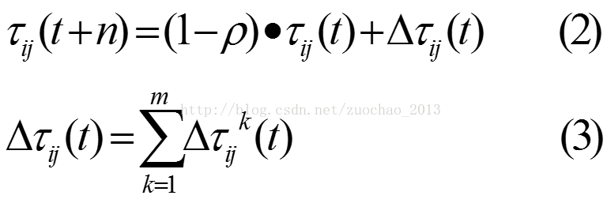
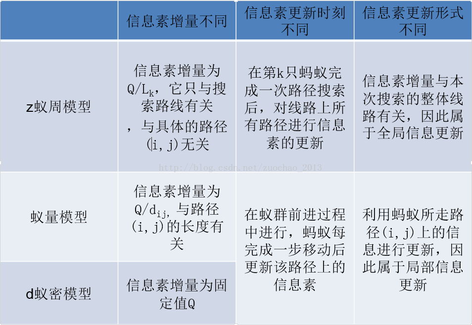
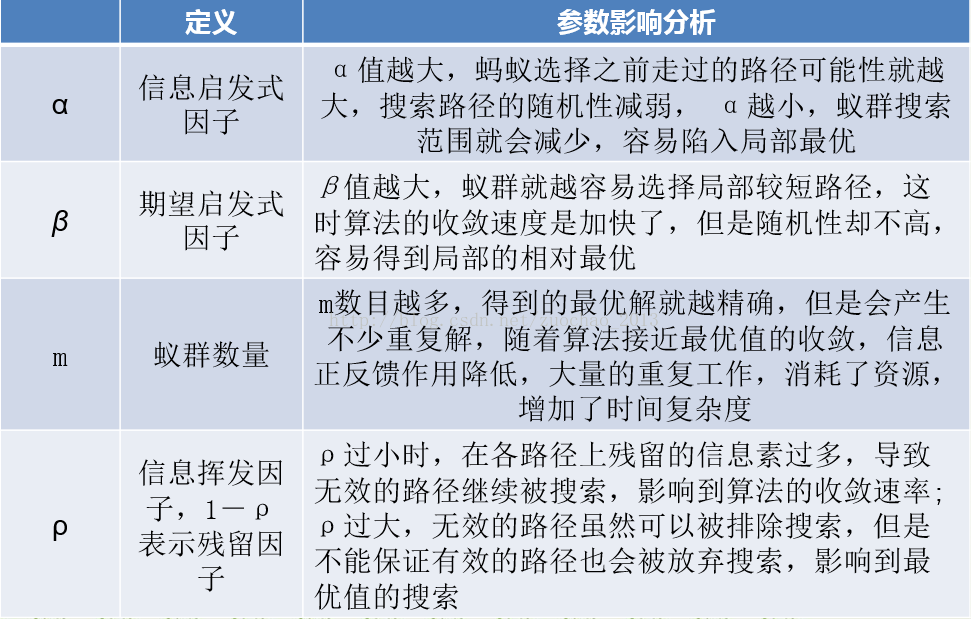
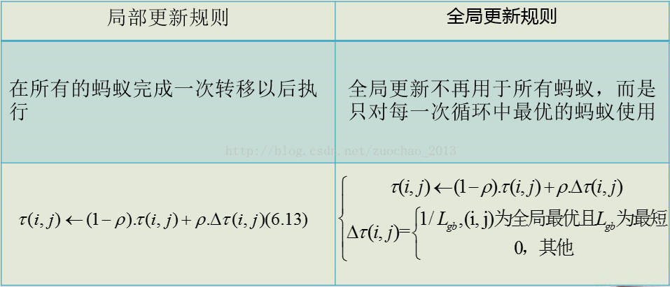
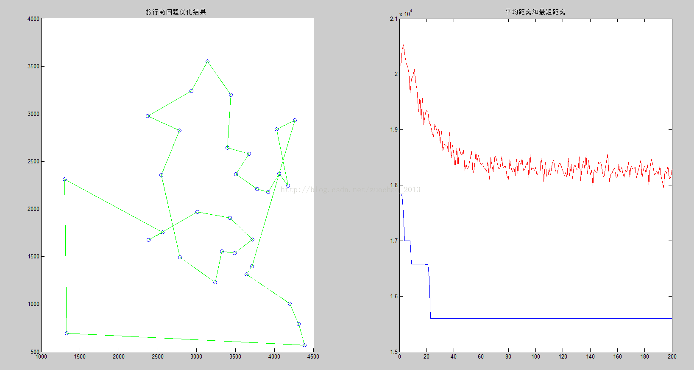
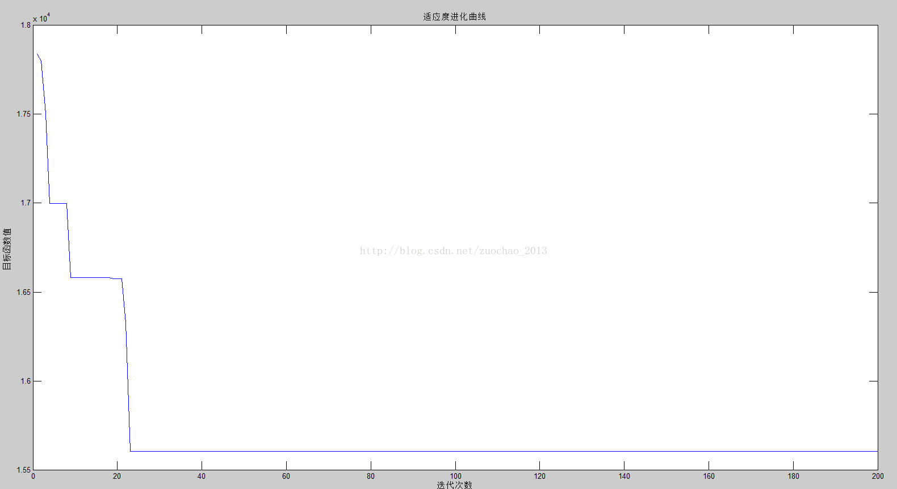

# 非连续可微

## [蚁群算法](https://blog.csdn.net/zuochao_2013/article/details/71872950)

蚁群算法\(AG\)是一种模拟蚂蚁觅食行为的模拟优化算法，它是由意大利学者Dorigo M等人于1991年首先提出，并首先使用在解决TSP（旅行商问题）上。之后，又系统研究了蚁群算法的基本原理和数学模型。

蚁群算法的基本思想：


### 基本原理

1、蚂蚁在路径上释放信息素。 

2、碰到还没走过的路口，就随机挑选一条路走。同时，释放与路径长度有关的信息素。 

3、信息素浓度与路径长度成反比。后来的蚂蚁再次碰到该路口时，就选择信息素浓度较高路径。 

4、最优路径上的信息素浓度越来越大。 

5、最终蚁群找到最优寻食路径。

### 基于旅行商\(TSP\)问题的基本蚁群算法

旅行商\(TSP\)求解中，假设蚁群算法中的每只蚂蚁是具有以下特征的简单智能体：

* 每次周游，每只蚂蚁在其经过的支路 $$(i,j)$$ 上都留下信息素。
* 蚂蚁选择城市的概率与城市之间的距离和当前连接支路上所包含的信息素余量有关。
* 为了强制蚂蚁进行合法的周游，直到一次周游完成后，才允许蚂蚁游走已访问过的城市（这可由禁忌表来控制）。

基本蚁群的两个过程：（1）状态转移（2）信息素更新

#### （1）状态转移

为了避免残留信息素过多而淹没启发信息，在每只蚂蚁走完一步或者完成对所有 $$n$$ 个城市的遍历\(也即一个循环结束\)后，要对残留信息进行更新处理。

由此， $$t+n$$ 时刻在路径 $$(i,j)$$ 上的信息量可按如下规则进行调整：



#### （2）信息素更新模型

* 蚁周模型（Ant-Cycle模型）
* 蚁量模型（Ant-Quantity模型）
* 蚁密模型（Ant-Density模型）

区别： 

* 蚁周模型利用的是全局信息，即蚂蚁完成一个循环后更新所有路径上的信息素。
* 蚁量和蚁密模型利用的是局部信息，即蚂蚁完成一步后更新路径上的信息素。



### 蚁群算法基本流程与参数

#### 蚁群算法基本流程


#### 蚁群算法主要参数



蚁群算法中主要参数的理想选择如下：


### 蚁群系统对基本蚁群算法改进

国内外对于离散域蚁群算法的改进研究成果很多，例如自适应蚁群算法、基于信息素扩散的蚁群算法等，这里仅介绍离散域优化问题的自适应蚁群算法。

自适应蚁群算法：对蚁群算法的状态转移概率、信息素挥发因子、信息量等因素采用自适应调节策略为一种基本改进思路的蚁群算法。

自适应蚁群算法中两个最经典的方法：蚁群系统\(AntColony System, ACS\)和最大-最小蚁群系统\(MAX-MINAnt System, MMAS\)。

（1）蚂蚁的状态转移规则不同


（2） 全局更新规则不同



（3）新增了对各条路径信息量调整的局部更新规则


### 相关例子

用蚁群算法求解TSP问题：一个旅行商人要拜访全国31个省会城市，需要选择最短的路径。

```text
clear all; %清除所有变量
close all; %清图
clc ;      %清屏
m=50;    %% m 蚂蚁个数
Alpha=1;  %% Alpha 表征信息素重要程度的参数
Beta=5;  %% Beta 表征启发式因子重要程度的参数
Rho=0.1; %% Rho 信息素蒸发系数
NC_max=200; %%最大迭代次数
Q=100;         %%信息素增加强度系数

C=[
1304 2312;
3639 1315;
4177 2244;
3712 1399;
3488 1535;
3326 1556;
3238 1229;
4196 1004;
4312 790;
4386 570;
3007 1970;
2562 1756;
2788 1491;
2381 1676;
1332 695;
3715 1678;
3918 2179;
4061 2370;
3780 2212;
3676 2578;
4029 2838;
4263 2931;
3429 1908;
3507 2367;
3394 2643;
3439 3201;
2935 3240;
3140 3550;
2545 2357;
2778 2826;
2370 2975
];                %%31个省会坐标
%%-------------------------------------------------------------------------
%% 主要符号说明
%% C n个城市的坐标，n×2的矩阵
%% NC_max 最大迭代次数
%% m 蚂蚁个数
%% Alpha 表征信息素重要程度的参数
%% Beta 表征启发式因子重要程度的参数
%% Rho 信息素蒸发系数
%% Q 信息素增加强度系数
%% R_best 各代最佳路线
%% L_best 各代最佳路线的长度
%%=========================================================================
%%第一步：变量初始化
n=size(C,1);%n表示问题的规模（城市个数）
D=zeros(n,n);%D表示完全图的赋权邻接矩阵
for i=1:n
    for j=1:n
        if i~=j
            D(i,j)=((C(i,1)-C(j,1))^2+(C(i,2)-C(j,2))^2)^0.5;
        else
            D(i,j)=eps;      %i=j时不计算，应该为0，但后面的启发因子要取倒数，用eps（浮点相对精度）表示
        end
        D(j,i)=D(i,j);   %对称矩阵
    end
end
Eta=1./D;          %Eta为启发因子，这里设为距离的倒数
Tau=ones(n,n);     %Tau为信息素矩阵
Tabu=zeros(m,n);   %存储并记录路径的生成
NC=1;               %迭代计数器，记录迭代次数
R_best=zeros(NC_max,n);       %各代最佳路线
L_best=inf.*ones(NC_max,1);   %各代最佳路线的长度
L_ave=zeros(NC_max,1);        %各代路线的平均长度


while NC<=NC_max        %停止条件之一：达到最大迭代次数，停止
    %%第二步：将m只蚂蚁放到n个城市上
    Randpos=[];   %随即存取
    for i=1:(ceil(m/n))
        Randpos=[Randpos,randperm(n)];
    end
    Tabu(:,1)=(Randpos(1,1:m))';   
    %%第三步：m只蚂蚁按概率函数选择下一座城市，完成各自的周游
    for j=2:n     %所在城市不计算
        for i=1:m
            visited=Tabu(i,1:(j-1)); %记录已访问的城市，避免重复访问
            J=zeros(1,(n-j+1));       %待访问的城市
            P=J;                      %待访问城市的选择概率分布
            Jc=1;
            for k=1:n
                if length(find(visited==k))==0   %开始时置0
                    J(Jc)=k;
                    Jc=Jc+1;                         %访问的城市个数自加1
                end
            end
            %下面计算待选城市的概率分布
            for k=1:length(J)
                P(k)=(Tau(visited(end),J(k))^Alpha)*(Eta(visited(end),J(k))^Beta);
            end
            P=P/(sum(P));
            %按概率原则选取下一个城市
            Pcum=cumsum(P);     %cumsum，元素累加即求和
            Select=find(Pcum>=rand); %若计算的概率大于原来的就选择这条路线
            to_visit=J(Select(1));
            Tabu(i,j)=to_visit;
        end
    end
    if NC>=2
        Tabu(1,:)=R_best(NC-1,:);
    end
    %%第四步：记录本次迭代最佳路线
    L=zeros(m,1);     %开始距离为0，m*1的列向量
    for i=1:m
        R=Tabu(i,:);
        for j=1:(n-1)
            L(i)=L(i)+D(R(j),R(j+1));    %原距离加上第j个城市到第j+1个城市的距离
        end
        L(i)=L(i)+D(R(1),R(n));      %一轮下来后走过的距离
    end
    L_best(NC)=min(L);           %最佳距离取最小
    pos=find(L==L_best(NC));
    R_best(NC,:)=Tabu(pos(1),:); %此轮迭代后的最佳路线
    L_ave(NC)=mean(L);           %此轮迭代后的平均距离
    NC=NC+1                      %迭代继续

    
    %%第五步：更新信息素
    Delta_Tau=zeros(n,n);        %开始时信息素为n*n的0矩阵
    for i=1:m
        for j=1:(n-1)
            Delta_Tau(Tabu(i,j),Tabu(i,j+1))=Delta_Tau(Tabu(i,j),Tabu(i,j+1))+Q/L(i);
            %此次循环在路径（i，j）上的信息素增量
        end
        Delta_Tau(Tabu(i,n),Tabu(i,1))=Delta_Tau(Tabu(i,n),Tabu(i,1))+Q/L(i);
        %此次循环在整个路径上的信息素增量
    end
    Tau=(1-Rho).*Tau+Delta_Tau; %考虑信息素挥发，更新后的信息素
    %%第六步：禁忌表清零
    Tabu=zeros(m,n);             %%直到最大迭代次数
end
%%第七步：输出结果
Pos=find(L_best==min(L_best)); %找到最佳路径（非0为真）
Shortest_Route=R_best(Pos(1),:) %最大迭代次数后最佳路径
Shortest_Length=L_best(Pos(1)) %最大迭代次数后最短距离

figure(1) 
plot(L_best)
xlabel('迭代次数')
ylabel('目标函数值')
title('适应度进化曲线')


figure(2)
subplot(1,2,1)                  %绘制第一个子图形
   %画路线图
%%=========================================================================
%% DrawRoute.m
%% 画路线图
%%-------------------------------------------------------------------------
%% C Coordinate 节点坐标，由一个N×2的矩阵存储
%% R Route 路线
%%=========================================================================
N=length(R);
scatter(C(:,1),C(:,2));
 hold on
 plot([C(R(1),1),C(R(N),1)],[C(R(1),2),C(R(N),2)],'g')
 hold on
for ii=2:N
    plot([C(R(ii-1),1),C(R(ii),1)],[C(R(ii-1),2),C(R(ii),2)],'g')
     hold on
end
title('旅行商问题优化结果 ')

subplot(1,2,2)                  %绘制第二个子图形
plot(L_best)
hold on                         %保持图形
plot(L_ave,'r')
title('平均距离和最短距离')     %标题
```

输出结果如下：






## 模拟退火


## 遗传算法

## Source



