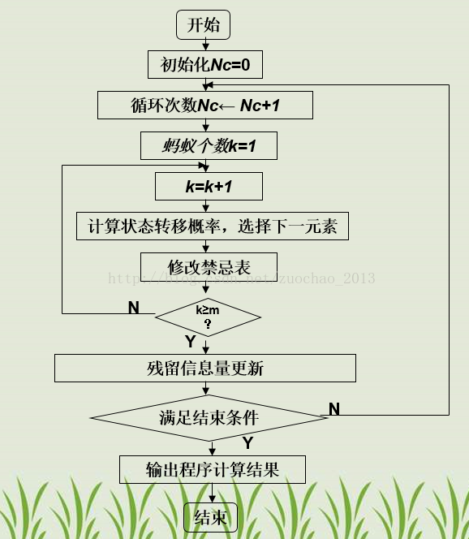
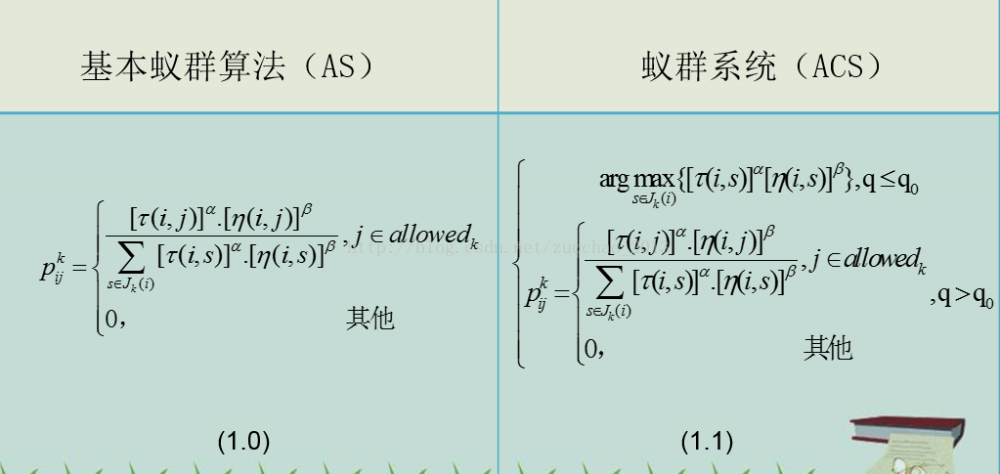

# 非连续可微

## [蚁群算法](https://blog.csdn.net/zuochao_2013/article/details/71872950)

蚁群算法\(AG\)是一种模拟蚂蚁觅食行为的模拟优化算法，它是由意大利学者Dorigo M等人于1991年首先提出，并首先使用在解决TSP（旅行商问题）上。之后，又系统研究了蚁群算法的基本原理和数学模型。

蚁群算法的基本思想：

### 基本原理

1、蚂蚁在路径上释放信息素。 

2、碰到还没走过的路口，就随机挑选一条路走。同时，释放与路径长度有关的信息素。 

3、信息素浓度与路径长度成反比。后来的蚂蚁再次碰到该路口时，就选择信息素浓度较高路径。 

4、最优路径上的信息素浓度越来越大。 

5、最终蚁群找到最优寻食路径。

### 基于旅行商\(TSP\)问题的基本蚁群算法

旅行商\(TSP\)求解中，假设蚁群算法中的每只蚂蚁是具有以下特征的简单智能体：

* 每次周游，每只蚂蚁在其经过的支路 $$(i,j)$$ 上都留下信息素。
* 蚂蚁选择城市的概率与城市之间的距离和当前连接支路上所包含的信息素余量有关。
* 为了强制蚂蚁进行合法的周游，直到一次周游完成后，才允许蚂蚁游走已访问过的城市（这可由禁忌表来控制）。

基本蚁群的两个过程：（1）状态转移（2）信息素更新

#### （1）状态转移

为了避免残留信息素过多而淹没启发信息，在每只蚂蚁走完一步或者完成对所有 $$n$$ 个城市的遍历\(也即一个循环结束\)后，要对残留信息进行更新处理。

由此， $$t+n$$ 时刻在路径 $$(i,j)$$ 上的信息量可按如下规则进行调整：

#### （2）信息素更新模型

* 蚁周模型（Ant-Cycle模型）
* 蚁量模型（Ant-Quantity模型）
* 蚁密模型（Ant-Density模型）

区别： 

* 蚁周模型利用的是全局信息，即蚂蚁完成一个循环后更新所有路径上的信息素。
* 蚁量和蚁密模型利用的是局部信息，即蚂蚁完成一步后更新路径上的信息素。

### 蚁群算法基本流程与参数

#### 蚁群算法基本流程

#### 蚁群算法主要参数

蚁群算法中主要参数的理想选择如下：

### 蚁群系统对基本蚁群算法改进

国内外对于离散域蚁群算法的改进研究成果很多，例如自适应蚁群算法、基于信息素扩散的蚁群算法等，这里仅介绍离散域优化问题的自适应蚁群算法。

自适应蚁群算法：对蚁群算法的状态转移概率、信息素挥发因子、信息量等因素采用自适应调节策略为一种基本改进思路的蚁群算法。

自适应蚁群算法中两个最经典的方法：蚁群系统\(AntColony System, ACS\)和最大-最小蚁群系统\(MAX-MINAnt System, MMAS\)。

（1）蚂蚁的状态转移规则不同

（2） 全局更新规则不同

（3）新增了对各条路径信息量调整的局部更新规则

### 相关例子

## 模拟退火

## 遗传算法

## Source



