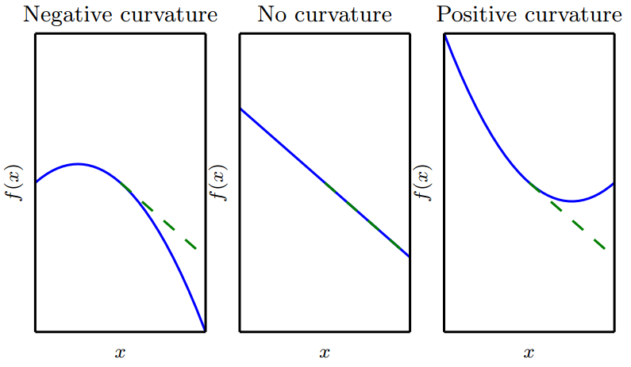
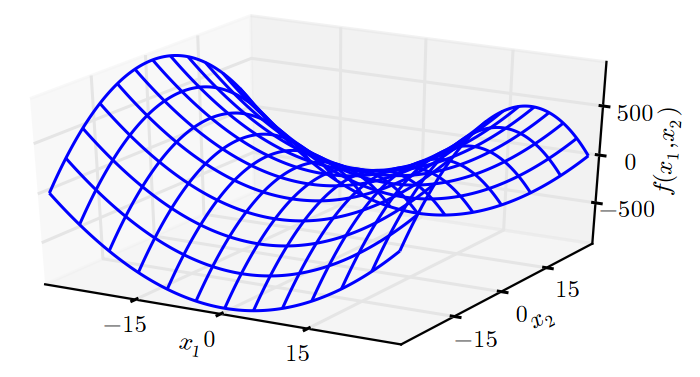

# 泰勒及Jacobian、Hessian

## [泰勒展开式](https://www.zhihu.com/question/25627482)

定义：泰勒公式是一个用函数在某点的信息描述其附近取值的公式。具有局部有效性。

基本形式： $$f(x)=\sum\limits_{n=0}^{\infty}\frac{f^{(n)}(x_0)}{n!}(x-x_0)^n$$ 

    一阶泰勒展开： $$f(x)\approx f(x_0)+f'(x_0)(x-x_0)$$ 

    二阶泰勒展开： $$f(x)\approx f(x_0)+f'(x_0)(x-x_0)+f''(x_0)\frac{(x-x_0)^2}{2}$$ 

迭代形式：假设 $$x^t=x^{t-1}+\Delta x$$ ，将 $$f(x^t)$$ 在 $$x^{t-1}$$ 处进行泰勒展开：

                   $$f(x^t)=f(x^{t-1}+\Delta x) \approx f(x^{t-1})+f'(x^{t-1})\Delta x+f''(x^{t-1})\frac{\Delta x^2}{2}$$ 

 举个例子，例如函数 $$y = x^3$$ ，当自变量有变化时，即 $$\Delta x$$ ，就有：

                   $$\Delta y = (x+\Delta x)^3-x^3 = 3x^2\Delta x+3x(\Delta x)^2+(\Delta x)^3$$ 

当 $$\Delta x \to 0$$ 时，上式的后两项是 $$\Delta x$$ 的高阶无穷小舍去的话上式就变成了 $$\Delta y = 3x^2\Delta x$$ 。也就是说当自变量 $$x$$ 足够小的时候，也就是在某点的很小的邻域内， $$\Delta y$$ 是可以表示成 $$\Delta x$$ 的线性函数的。线性函数计算起来，求导起来会很方便，若进行 $$n$$ 次近似，就得到了泰勒展开的基本形式。

## Jacobian与Hessian

有时我们需要计算输入和输出都为向量的函数的所有偏导数。包含所有这样的偏导数的矩阵被称为Jacobian矩阵。具体来说，如果我们有一个函数： $$f:\mathbb{R}^m\to\mathbb{R}^n$$ ， $$f$$ 的Jacobian矩阵 $$J\in\mathbb{R}^{n\times m}$$ 定义为 $$J_{i,j}=\frac{\partial}{\partial x_j}f(x)_i$$ 。

有时，我们也对导数的导数感兴趣，即二阶导数\(second derivative\)。例如，有一个函数 $$f:\mathbb{R}^m\to \mathbb{R}$$ ， $$f$$ 的一阶导数\(关于 $$x_j$$\)关于 $$x_i$$ 的导数记为 $$\frac{\partial^2}{\partial x_i\partial x_j}f$$ 。在一维的情况下，我们可以将 $$\frac{\partial^2}{\partial x^2}f$$ 为 $$f''(x)$$ 。二阶导数告诉我们，一阶导数将如何随着输入的变化而变化。它表示只基于梯度信息的梯度下降步骤是否会产生如我们预期的那样大的改善，因此它是重要的。我们可以认为，二阶导数是对曲率的衡量。假设我们有一个二次函数\(虽然很多实践中的函数都不是二次的，但至少在局部可以很好地用二次近似\)。如果这样的函数具有零二阶导数，那就没有曲率。也就是一条完全平坦的线，仅用梯度就可以预测它的值。我们使用沿负梯度方向大小为 $$\epsilon$$ 的下降步，当该梯度是 $$1$$ 时，代价函数将下降 $$\epsilon$$ 。如果二阶导数是负的，函数曲线向下凹陷\(向上凸出\)，因此代价函数将下降的比 $$\epsilon$$ 多。如果二阶导数是正的，函数曲线是向上凹陷\(向下凸出\)，因此代价函数将下降的比 $$\epsilon$$ 少。从下图可以看出不同形式的曲率如何影响基于梯度的预测值与真实的代价函数值的关系。

当我们的函数具有多维输入时，二阶导数也有很多。我们可以将这些导数合并成一个矩阵，称为Hessian矩阵。Hessian矩阵 $$H(f)(x)$$ 定义为：

                                                              $$H(f)(x)_{i,j}=\frac{\partial^2}{\partial x_i \partial x_j}f(x)$$ 

Hessian等价于梯度的Jacobian矩阵。

微分算子在任何二阶偏导连续的点处可交换，也就是它们的顺序可以互换：

                                                              $$\frac{\partial^2}{\partial x_i\partial x_j}f(x)=\frac{\partial^2}{\partial x_j\partial x_i}f(x)$$ 

这意味着 $$H_{i,j}=H_{j,i}$$ ，因此Hessian矩阵在这些点上是对称的。在深度学习背景下，我们遇到的大多数函数的Hessian几乎处处都是对称的。因为Hessian矩阵是实对称的，我们可以将其分解成一组实特征值和一组特征向量的正交基。在特定方向 $$d$$ 上的二阶导数可以写成 $$d^\top Hd$$ 。当 $$d$$ 是 $$H$$ 的一个特征向量时，这个方向的二阶导数就是对应的特征值。对于其他的方向 $$d$$ ，方向二阶导数是所有特征值的加权平均，权重在 $$0$$ 和 $$1$$ 之间，且与 $$d$$ 夹角越小的特征向量的权重越大。最大特征值确定最大二阶导数，最小特征值确定最小二阶导数。

#### 我们可以通过（方向）二阶导数预期一个梯度下降步骤能表现得多好。

我们在当前点 $$x^{(0)}$$ 处作函数 $$f(x)$$ 的近似二阶泰勒级数：

                             $$f(x)\approx f(x^{(0)})+(x-x^{(0)})^\top g+\frac{1}{2}(x-x^{(0)})^\top H (x-x^{(0)})$$ 

其中 $$g$$ 是梯度， $$H$$ 是 $$x^{(0)}$$ 点的Hessian。如果我们使用学习率 $$\epsilon$$ ，那么新的点 $$x$$ 将会是 $$x^{(0)}-\epsilon g$$ 。代入上述的近似，可得

                                           $$f(x^{(0)}-\epsilon g)\approx f(x^{(0)})-\epsilon g^\top g+\frac{1}{2}\epsilon^2 g^\top Hg$$ 

其中有 $$3$$ 项：函数的原始值、函数斜率导致的预期改善、函数曲率导致的矫正。当最后一项太大时，梯度下降实际上式可能向上移动的。当 $$g^\top H g$$ 为零或负时，近似的泰勒级数表明增加 $$\epsilon$$ 将永远使 $$f$$ 下降。在实践中，泰勒级数不会在 $$\epsilon$$ 大的时候也保持准确，因此在这种情况下我们必须采取更启发式的选择。当 $$g^\top H g$$ 为正时，通过计算可得，使近似泰勒级数下降最多的最优步长为

                                                                       $$\epsilon^*=\frac{g^\top g}{g^\top Hg}$$ 

最坏的情况下， $$g$$ 与 $$H$$ 最大特征值 $$\lambda$$ 对应的特征向量对齐，则最优步长是 $$\frac{1}{\lambda_{\max}}$$ 。我们要最小化的函数能用二次函数很好地近似的情况下，Hessian的特征值决定了学习率的量级。

#### 二阶导数还可以被用于确定一个临界点是否是局部极大点、局部极小点或鞍点。

回想一下，在临界点处 $$f'(x)=0$$ 。而 $$f''(x)>0$$ 意味着 $$f'(x)$$ 会随着我们移向右边而增加，移向左边而减小，也就是 $$f'(x-\epsilon)<0$$ 和 $$f'(x+\epsilon)>0$$ 对足够小的 $$\epsilon$$ 成立。换句话说，当我们移向右边，斜率开始指向右边的上坡，当我们移向左边，斜率开始指向左边的上坡。因此我们得出结论，当 $$f'(x)=0$$ 且 $$f''(x)>0$$ 时， $$x$$ 是一个局部极小点。同样，当 $$f'(x)=0$$ 且 $$f''(x)<0$$ 时， $$x$$ 是一个局部极大点。这就是所谓的二阶导数测试。不幸的是，当 $$f''(x)=0$$ 时测试是不准确的。在这种情况下， $$x$$ 可以是一个鞍点或平坦区域的一部分。

在多维情况下，我们需要检测函数的所有二阶导数。利用Hessian的特征值分解，我们可以将二阶导数测试扩展到多维情况。在临界点处 $$(\nabla_xf(x)=0)$$ ，我们通过检测Hessian的特征值来判断该临界点是一个局部极大点、局部极小点还是鞍点。当Hessian是正定的（所有特征值都是正的），则该临界点是局部极小点。同样，当Hessian是负定的（所有特征值都是负的），这个点就是局部极大点。在多维情况下，实际上我们可以找到确定该点是否为鞍点的积极迹象（某些情况下）。如果Hessian的特征值中至少一个是正的且至少一个是负的，那么 $$x$$ 是 $$f$$ 某个横截面的局部极大点，却是另一个横截面的局部极小点，如下图例子。最后，多维二阶导数测试可能像单变量版本那样是不确定的。当所有非零特征值是同号的且至少有一个特征值是 $$0$$ 时，这个检测就是不确定的。这是因为单变量的二阶导数测试在零特征值对应的横截面上是不确定的。

上图既有正曲率又有负曲率的鞍点。示例中的函数是 $$f(x) = x_1^2-x_2^2$$ 。函数沿 $$x_1$$ 轴向上弯曲。 $$x_1$$ 轴是Hessian的一个特征向量，并且具有正特征值。函数沿 $$x_2$$ 轴向下弯曲。该方向对应于Hessian负特征值的特征向量。名称“鞍点”源自该处函数的鞍状形状。这是具有鞍点函数的典型示例。维度多于一个时，鞍点不一定要具有 $$0$$ 特征值：仅需要同时具有正特征值和负特征值。我们可以想象这样一个鞍点（具有正负特征值）在一个横截面内是局部极大点，而在另一个横截面内是局部极小点。

