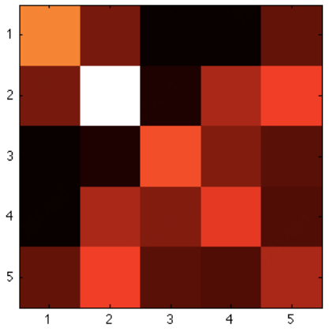
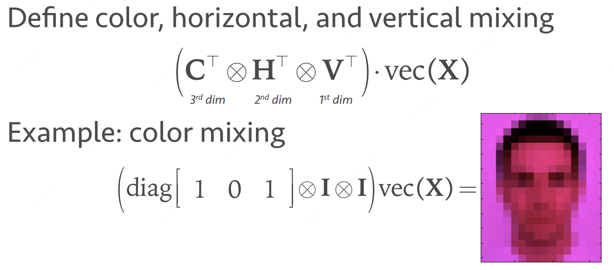

# 线性代数

## 元素运算

### 加/减\(Addition/subtraction\)

                       $$a \pm b = c \to a_i \pm b_i = c_i$$ 

### 乘\(Hadamard product\)

                       $$a \odot b = c \to a_ib_i = c_i$$  or   $$a \circ  b$$    or   $$a.*b$$ 

### 除\(Division\)

                       将乘法反着用

## 矩阵运算

### 转置\(Transpose\)

$$X =  \left[  \begin{matrix}    x_1\\    . \\ . \\ .\\    x_N   \end{matrix}   \right] $$      $$X^T = \left[  \begin{matrix}    x_1\ ... \ x_N   \end{matrix}   \right] $$                         $$X =  \left[  \begin{matrix}    x_1 \ \  x_3\\    x_2  \ \ x_4   \end{matrix}   \right] $$        $$X^T =  \left[  \begin{matrix}    x_1 \ \  x_2\\    x_3  \ \ x_4   \end{matrix}   \right] $$ 

### 重塑\(Reshaping\)

#### vec：回滚回列级（相当于降维度，可帮助避开矩阵或张量）

                         $$vec(X) = vec\left[  \begin{matrix}    \color{green}x_1\ \ \color{red}x_3\\    \color{green}x_2 \ \ \color{red}x_4   \end{matrix}   \right] =\left[  \begin{matrix}    \color{green}x_1\\    \color{green}x_2\\    \color{red}x_3\\    \color{red}x_4   \end{matrix}   \right] $$ 

#### vec-transpose：$$(p)$$ 重塑一个 $$m \times n $$ 的矩阵

####                           $$X^{(2)} = \left[  \begin{matrix}    \color{green}x_{11}\ \ \color{red}x_{12}\\    \color{green}x_{21}\ \ \color{red}x_{22}\\    \color{green}x_{31}\ \ \color{red}x_{32}\\    \color{green}x_{41}\ \ \color{red}x_{42}\\    \color{green}x_{51}\ \ \color{red}x_{52}\\    \color{green}x_{61}\ \ \color{red}x_{62}\\   \end{matrix}   \right]^{(2)} =\left[  \begin{matrix} \color{green}x_{11}\ \ \color{green}x_{31}\ \ \color{green}x_{51}\\ \color{green}x_{21}\ \ \color{green}x_{41}\ \ \color{green}x_{61}\\  \color{red}x_{12}\ \ \color{red}x_{32}\ \ \color{red}x_{52}\\ \color{red}x_{22}\ \ \color{red}x_{42}\ \ \color{red}x_{62}\\   \end{matrix}   \right] $$ 

### 迹\(Trace\)

矩阵主对角线元素之和               $$tr(X)=tr\left[  \begin{matrix}    {\color{red}x_{11}}\ ...\ \ x_{1N}\\     ...\ \ {\color{red}...} \ \ \ ... \\    x_{N1} \ ...\ {\color{red} x_{NN}}   \end{matrix}   \right] =\sum \limits_i x_{ii}$$ 

### 对角矩阵\(Diag\)

       $$diag(X) = diag\left[  \begin{matrix}    x_1\\   x_2    \end{matrix}   \right]  = \left[  \begin{matrix}    x_1\ 0\\ 0\ \  x_2    \end{matrix}   \right] $$                      $$diag^{-1}\left[  \begin{matrix}    x_1\ a\\ b\ \  x_2    \end{matrix}   \right] =\left[  \begin{matrix}    x_1\\   x_2    \end{matrix}   \right]  $$ 

### 点乘\(Dot product\)

            $$x^T \cdot y  =  \sum \limits_i x_i \cdot \ y_i = |x| \cdot |y| cos\ \theta$$ 

### 矩阵-向量乘法\(Matrix-vector prodcut\)

从点乘运算衍生来，矩阵 $$X$$ 的列数必须与向量 $$y$$ 的元素数一致

             $$X \cdot y =\left[  \begin{matrix}    x_1\\   x_2^T\\   x_3^T    \end{matrix}   \right] \cdot y = \left[  \begin{matrix}    x_1^T \cdot y\\   x_2^T \cdot y\\   x_3^T \cdot y   \end{matrix}   \right] = \left[  \begin{matrix}    \sum x_{1,i} \cdot y_i\\   \sum x_{2,i} \cdot y_i\\   \sum x_{3,i} \cdot y_i   \end{matrix}   \right] $$ 

### 矩阵-矩阵乘法\(Matrix-matrix product\)

矩阵 $$X$$ 的列数必须与矩阵 $$Y$$ 的行数一致，即 $$(M \times N) = (M \times K) \cdot (K \times N)$$ 

            $$X \cdot Y =\left[  \begin{matrix}    x_{11}\ \ x_{12}\ \ x_{13}\\   x_{21}\ \ x_{22}\ \ x_{23}    \end{matrix}   \right] \cdot \left[  \begin{matrix}    y_{11}\ \ y_{12}\\ y_{21}\ \ y_{22}\\ y_{31}\ \ y_{32}\\ \end{matrix}   \right]  = \left[  \begin{matrix}    x_{11}\cdot y_{11}+x_{12}\cdot y_{21}+x_{13}\cdot y_{31}\ \ \ \ \ \ x_{11}\cdot y_{12}+x_{12}\cdot y_{22}+x_{13}\cdot y_{32} \\ x_{21}\cdot y_{11}+x_{22}\cdot y_{21}+x_{23}\cdot y_{31}\ \ \ \ \ \ x_{21}\cdot y_{12}+x_{22}\cdot y_{22}+x_{23}\cdot y_{32}  \end{matrix}   \right] $$ 

### 对称矩阵\(Symmetric\)

                                                                         $$X = X^T \to  x_{ij} = x_{ji}$$ 

                                                                        $$X^T \cdot X = X \cdot X^T = I$$ 

### 逆矩阵\[非奇异矩阵\]\(inverse\)

在线性代数中，给定一个 $$n$$ 阶方阵 $$A$$ ，若存在一 $$n$$ 阶方阵 $$B$$ ，使得 $$AB=BA=I_n$$ _，其中_ $$I_n$$ 为 $$n$$ 阶单位矩阵，则称 $$A$$ 是可逆的，且 $$B$$ 是 $$A$$ 的逆矩阵，记作 $$A^{-1}$$ 。

                                                    $$X^{-1} \cdot X = I$$       

$$X^{-1} \cdot X \cdot Y= Y$$               $$Y \cdot X^{-1} \cdot X = Y$$                 $$X^{-1} \cdot Y \cdot X \neq Y$$

只有正方形 $$n \times n$$ 的矩阵，亦即方阵，才可能、但非必然有逆矩阵。若方阵 $$A$$ 的逆矩阵存在，则称 $$A$$ 为非奇异方阵或可逆方阵。

### 伪逆矩阵\[一般化的逆矩阵\]\(pseudoinverse\)

众所周知只有方阵才有逆矩阵，非方阵没有逆矩阵。这个不和谐的问题已在20世纪初被数学家E. H. Moore等人解决掉了，因为他们发明了一般化的逆矩阵\(generalized inverse\)，也称为伪逆矩阵\(Moore–Penrose pseudoinverse\)。

对于任意一个 $$m \times n$$ 的矩阵 $$X$$，$$n \times m$$ 的伪逆矩阵 $$X^{+}$$ 必然存在，且 $$X^{+}$$ 必然满足以下四个条件：

                  $$X \cdot X^+ \cdot X= X$$                   $$X^+ \cdot X \cdot X = X^+$$ 

               $$(X \cdot X^+)^T = X \cdot X^+$$            $$(X^+ \cdot X)^T = X^+ \cdot X$$

在应用中，我们利用其性质进行 $$A \cdot x = y \to x = A^+ \cdot y$$ 

### [特征值和特征向量\(Eigenvalues&Eigenvectors\)](https://blog.csdn.net/u010182633/article/details/45921929)

 1\) 在一般情况下，特征向量矩阵 $$A$$ 的特征向量 $$\mathop{v} \limits^\to$$ 满足下列式子：

                                                                    $$A \mathop{v} \limits^\to = \lambda \mathop{v} \limits^\to$$ 

 其中 $$\lambda$$ 是所谓的“特征值”的一个标量值。这意味着，向量 $$\mathop{v} \limits^\to$$ 上的线性变换 $$A$$ 完全由 $$\lambda$$ 定义。

 我们可以重写式子为：

                                             $$A \mathop{v} \limits^\to - \lambda \mathop{v} \limits^\to = 0  \ \ \ \ \ \    \Rightarrow  \ \ \ \ \ \ \mathop{v} \limits^\to (A - \lambda I)  = 0$$ 

 然而，假定 $$\mathop{v} \limits^\to$$ 不是空向量，等式只能在 $$A - \lambda I$$ 不可逆的时候才能被定义。如果一个方阵是不可逆的，这意味着它的行列式必须等于零。因此，要找到 $$A$$ 的特征向量，我们只需要解决以下公式： 

                                                             $$Det(A - \lambda I)  = 0$$ 

### [奇异值分解\(SVD\)](http://shartoo.github.io/SVD-decomponent/)

从几何层面上去理解二维的SVD：对于任意的 $$2\times 2$$ 矩阵，通过SVD可以将一个相互垂直的网格\(orthogonal grid\)变换到另外一个相互垂直的网格。 我们可以通过向量的方式来描述这个事实: 首先，选择两个相互正交的单位向量 $$v_1$$ 和 $$v_2$$ , 向量 $$Mv_1$$ 和 $$Mv_2$$ 正交。

$$u_1$$ 和 $$u_2$$ 分别表示 $$Mv_1$$ 和 $$Mv_2$$ 的单位向量， $$\sigma_1 \ast u_1 = Mv_1$$ 和 $$\sigma_2 \ast u_2 = Mv_2$$ 。 $$\sigma_1$$ 和 $$\sigma_2$$ 分别表示这不同方向向量上的模，也称作为矩阵 $$M$$ 的奇异值。

这样我们就有了如下关系式：

                                                     $$Mv_1 = \sigma_1u_1$$ 

                                                     $$Mv_2 = \sigma_2u_2$$ 

我们现在可以简单描述下经过 $$M$$ 线性变换后的向量 $$x$$ 的表达形式。由于向量 $$v_1$$ 和 $$v_2$$ 是正交的单位向量，我们可以得到如下式子（单位向量乘以向量即此向量在单位向量方向上的映射）

                                                   $$x=(v_1x)v_1+(v_2x)v_2$$ 

这就意味着：

                                          $$Mx=(v_1x)Mv_1+(v_2x)Mv_2$$ 

                                          $$Mx=(v_1x)σ_1u_1+(v_2x)σ_2u_2$$ 

向量内积可以用向量的转置来表示，如下所示：

                                                                $$V.x=V^Tx$$ 

最终的式子为：

                                             $$Mx=u_1σ_1v^T_1x+u_2σ_2v^T_2x$$ 

                                                 $$M=u_1σ_1v_1^T+u_2σ_2v_2^T$$ 

上述的式子经常表示成：

                                                         $$M=U∑V^T$$ 

$$U$$ 矩阵的列向量分别是 $$u_1,u_2$$ ， $$\sum$$ 是一个对角矩阵，对角元素分别是对应的 $$\sigma_1$$ 和 $$\sigma_2$$ ， $$V$$ 矩阵的列向量分别是 $$v_1,v_2$$ 。上角标 $$T$$ 表示矩阵 $$V$$ 的转置。

### Norms

2-norms:                $$||x|| = \sqrt{\sum x_i^2}$$ 

p-norms:                $$||x||_p = (\sum \limits_i |x_i|^p)^{(1/p)}$$ 

Frobenius norm:    $$||x||_F = \sqrt{tr(X^T\cdot X)} = \sqrt{tr(\left[  \begin{matrix}    x_1^T\\   x_2^T    \end{matrix}   \right]\cdot \left[  \begin{matrix}    x_1\ \  x_2    \end{matrix}   \right])} = \sqrt{tr(\left[  \begin{matrix}    {\color{red}x_1^T\cdot x_1}\ \ \ x_1^T\cdot x_2 \\  x_2^T\cdot x_1\ \ \ {\color{red}x_2^T\cdot x_2}      \end{matrix}   \right])} $$

### Kronecker product

矩阵 $$X$$ 中每个元素作为标量去乘矩阵 $$Y$$ ，其结果对应元素在矩阵 $$X$$ 中位置

        $$\left[  \begin{matrix}    x_{11}\ x_{12}\\ x_{21}\ \  x_{22}    \end{matrix}   \right] \otimes Y = \left[  \begin{matrix}    x_{11} \cdot Y\ \ \ x_{12} \cdot Y\\x_{21} \cdot Y\ \ \ x_{22} \cdot Y    \end{matrix}   \right]$$                 $$vec(X\cdot Y\cdot Z) = (Z^T \otimes X)vec(Y)$$ 

## 张量运算

通过Kronecker products以及vec运算我们可以完成多线性转换

## Source

{% embed url="https://github.com/chmx0929/UIUCclasses/blob/master/598MachLrngforSignalProcessng/Slide/Lecture%201%20-%20Intro%2C%20Linear%20Algebra.pdf" %}





