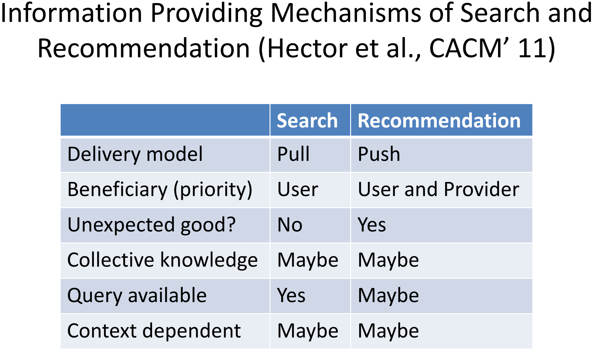
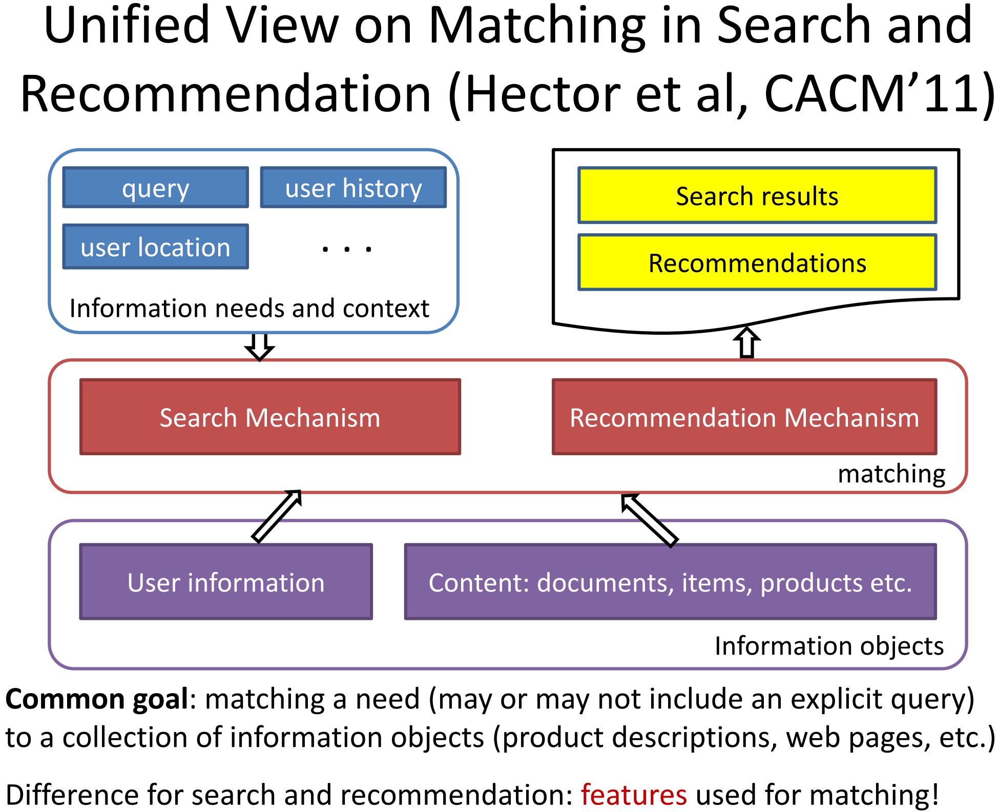
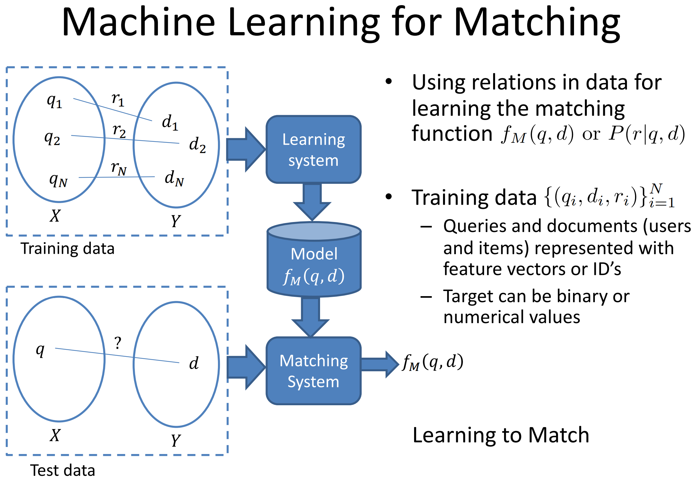

# 搜索推荐广告

流量和变现是互联网公司能否成功的两个关键因素。流量简单来说就是活跃用户量。变现有各种途径，比如滴滴向乘客收取服务费用，美团向商家获取加盟费，京东操作现金流盈利等等，但互联网公司最核心的还是广告变现，自从雅虎开创向广告主收费的互联网盈利模式，企业不再需要像通讯公司那样用户使用一次服务计一次费，这也为互联网行业安上了翅膀，助其腾飞。

互联网人对行业看的很透彻，就是流量和变现，所以策略也就简单了，先砸钱打开市场，培养用户粘性，当然纯砸钱可以带来一定的活跃用户，但真正让用户留存下来，还需要搜索及推荐技术的支撑，简单来说，就是产品要好用。当掌控了一定的流量，盈利就提上日程了，毕竟公司要盈利赚钱才能走向良性循环，不然就变成了韭菜收割机，所以如何变现很重要，广告作为最核心的手段，也是互联网公司变现最根本的一种方式。

因为搜索、推荐、广告如此重要，所以被称为互联网的三驾马车，我在这里单独拿出一个章节来仔细和大家讨论分享一下。由于是互联网的核心，学术界和工业界都做了很多的探索与研究，成果也纷繁。这里做一下对比整理，帮助大家理解互联网核心的工作技术。

## 联系与区别

三者本质都是匹配问题，都用相似的召回-排序-展示的技术框架，但又有很多不同。

|  | 搜索 | 推荐 | 广告 |
| :---: | :---: | :---: | :---: |
| 目标 | 流量 | 流量 | 变现 |
| Query | 有 | 无 | 无 |
| 系统 | 搜索 | 个性化 | 个性化 |

### 目标

互联网产品的搜索、推荐模块大都是为了提高用户体验以达到增加用户黏性或者吸引用户的目的，本质都是获得流量；而广告则是为了变现，要博弈兼顾广告主\(转化\)、用户\(体验\)和平台\(盈利\)，这是本质区别。从优化目标上体现最为明显，搜索推荐大都采用点击率最为主要评价指标，转化率为辅；而广告是以转化率为主，点击率为辅。

### Query

搜索一般都会有用户主动提供的query，不论是文本还是像以图搜图各种类型的query；而推荐和广告大部分没有用户主动提供的query，需要自行提取用户特征。当然也有例外，比如搜索推荐，在头条里搜索个事件，推荐根据内容和query进行排序，list谁第一谁第三都是有依据的。当然，你如果放到百度里去搜，那就是搜索广告，百度搜索留学后出现的留学广告是有query依照，但这只占广告的一小部分。

### 系统

个性化系统和搜索系统都是互联网时代具有挑战性的大规模计算问题。两者的主要差别在于大量的用户特征的使用。这个很好理解，因为搜索有query，带有很强的目的性，且我们为了尽快满足用户的搜索需求，大量的用户特征使用的较少。相较而言，推荐和广告采用个性化系统，为了达到用户感兴趣的目的，会使用大量的用户特征以匹配排序到更贴合用户的内容，怎样获取用户特征，怎样使用用户特征，这也是业界和学界探索的方向。

### 搜索推荐对比

### 最大难点-语义差距

## 机器学习的应用

## Source









