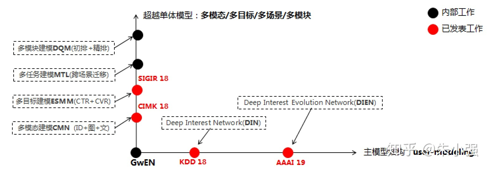

# 发展趋势

广告技术发展的趋势总的来说是从宏观特征、简单模型逐步演进到采用微观特征、复杂模型。

## 技术演化

下图展示里各大公司采用了不同的技术道路，有走宏观特征+复杂模型的Yahoo和Microsoft，也有尝试微观特征+简单模型的Google+Baidu，当然走哪条路决定性因素是各公司的业务，但需要指出的是在2005-2015这十年间，大规模机器学习模型\(特指浅层模型\)一度统治着CTR预估领域，以G/B两家为代表的”大规模离散特征+特征工程+分布式线性LR模型”解法几乎成为了那个时代的标准解。相关的工作相信读者们耳熟能详，甚至据我所知今天业界的不少团队依然采用这样的技术。随着数据量、计算能力和技术的发展，大家殊途同归，都向着微观特征+复杂模型的方向发展。

### [浅层模型](https://zhuanlan.zhihu.com/p/61154299)

在互联网永不停歇的增长需求的驱动下，CTR预估模型（以下简称CTR模型）的发展也可谓一日千里，从2010年之前千篇一律的**逻辑回归**（Logistic Regression，LR），进化到**因子分解机**（Factorization Machine，FM）、**梯度提升树**（Gradient Boosting Decision Tree，GBDT），再到2015年之后深度学习的百花齐放，各种模型架构层出不穷。认真的回顾前深度学习时代的CTR模型仍是非常必要的。原因有两点：

1. 即使是深度学习空前流行的今天，**LR、FM等传统CTR模型仍然凭借其可解释性强、轻量级的训练部署要求、便于在线学习等不可替代的优势，拥有大量适用的应用场景**。模型的应用不分新旧贵贱，熟悉每种模型的优缺点，能够灵活运用和改进不同的算法模型是算法工程师的基本要求。
2. **传统CTR模型是深度学习CTR模型的基础**。深度神经网络（Deep Nerual Network，DNN）从一个神经元生发而来，而LR正是单一神经元的经典结构；此外，影响力很大的FNN，DeepFM，NFM等深度学习模型更是与传统的FM模型有着千丝万缕的联系；更不要说各种梯度下降方法的一脉相承。所以说传统CTR模型是深度学习模型的地基和入口。

### [深度模型](https://zhuanlan.zhihu.com/p/63186101)

随着微软的Deep Crossing，Google的Wide&Deep，以及FNN，PNN等一大批优秀的深度学习CTR预估模型在2016年被提出，**计算广告和推荐系统领域全面进入了深度学习时代**，时至今日，深度学习CTR模型已经成为广告和推荐领域毫无疑问的主流。在进入深度学习时代之后，CTR模型不仅在表达能力、模型效果上有了质的提升，而且大量借鉴并融合了深度学习在图像、语音以及自然语言处理方向的成果，在模型结构上进行了快速的演化。

### 阿里妈妈

以最具代表性的阿里妈妈为例来解释技术趋势怎样从宏观特征+简单模型逐步演进到采用微观特征+复杂模型。自2012年起，阿里妈妈的预估模型演进如下图所示

最经典传统点击率预估方法即大规模特征+逻辑回归模型的组合。通过大规模的 id 和特征能够获得更高分辨率的样本描述。这种方法下，模型结构相对固定，优化方法上讲也更注重系统效率。从效果上看工作重心主要在大量的特征工程，通过人工经验对特征进行组合、运算，解决 LR 无法表达非线性关系的问题。但是很明显这样的迭代模式整体受到人工能力制约，需要对业务理解足够透彻。

2011-2012年左右由盖坤同学创新性地提出了[MLR\(Mixed Logistic Regression\)](https://mp.weixin.qq.com/s/MtnHYmPVoDAid9SNHnlzUw)模型并实际部署到线上系统，其主要思想是将在一个平面线性不可分的数据，分为多片，投影到不同的高维平面，实现线性可分。同类的解决这类问题的常用方法还有 GBDT+LR 的组合。同时期也有如FM模型等工作出现。这些模型试图打破线性LR模型的局限性，向非线性方向推进了一大步。

15年的时候，基于MLR的算法迭代进入瓶颈。当时认识到，要想进一步发挥MLR模型的非线性能力，需要提高模型的分片数——模型的参数相应地会线性增长，需要的训练样本量同样要大幅度增加，这不太现实。期间阿里妈妈做了些妥协，从特征的角度进行优化，比如设计了一些直观的复合特征，典型的如”hit类特征”：用户历史浏览过商品A/B/C，要预估的广告是商品C，通过集合的”与”操作获得”用户历史上浏览过广告商品”这个特征。细心的读者应该很容易联想到后来阿里妈妈进一步发展出来的DIN模型，通过类似attention的技巧拓展了这一方法。后来进一步引入一些高阶泛化特征，如user-item的PLSA分解向量、w2v embedding等。但这些特征引入的代价大、收益低、工程架构复杂。

15年底16年初的时候开始认真地思考突破MLR算法架构的限制，向DL方向迈进。这个时间在业界不算最早的，MLR是DL之前阿里妈妈对大规模非线性建模思路的一个可行解，它助力了业务巨大的腾飞，因此当时够用了——能解决实际问题就是好武器，这很重要。在那个时间点，业界已经有了一些零散的DL建模思路出现，最典型的是B家早期的两阶段建模解法——先用LR/FM等把高维离散特征投影为数千规模的稠密向量，然后再训练一个MLP模型。最初也做过类似的尝试如w2v+MLR/DNN，但是效果不太显著，看不到打败MLR的希望\(不少团队从LR发展过来，这种两阶段建模打败LR应该是可行的\)。这里面关键点认为是端到端的建模范式。

16年5-6月份第一代端到端深度CTR模型网络架构\(内部代号[GwEN, group-wise embedding network](https://zhuanlan.zhihu.com/p/34940250)\)，如上图所示。对于这个网络有多种解释，它也几乎成为了目前业界各个团队使用深度CTR模型最基础和内核的版本。图中给出了思考过程，应该说GwEN网络脱胎换骨于MLR模型，是对互联网尺度离散数据上端到端进行非线性建模的第二次算法尝试。大约同年7月份的时候，Google在arxiv上挂出了WDL\(wide and deep\)那篇文章，网络主体结构与GwEN如出一辙，证明了大家殊途同归都走向深度学习的尝试。客观地讲当时技术圈普遍蔓延着核心技术保密的氛围，因此很多工作都在重复造轮子。16年8月份左右GwEN模型大幅度超越线上重度优化的MLR，后来成为了阿里妈妈第一代生产化deep CTR model。因为WDL的出现阿里没对外主推GwEN模型，只作为DIN论文里的base model亮了相。

16年底的时候，业界绝大部分技术团队都已跨入了个性化时代，尤其在以推荐为主的信息获取方式逐渐超越了以搜索为主的信息获取方式时更是明显，因此在互联网尺度数据上对用户的个性化行为偏好进行研究、建模、预测，变成了这个时期建模技术的主旋律之一。具体来说，关注的问题是：定向广告/推荐及个性化行为丰富的搜索场景中，共性的建模挑战都是互联网尺度个性化用户行为理解，那么适合这种数据的网络结构单元是什么？图像/语音领域有CNN/RNN等基础单元，**这种蕴含着高度非线性的大规模离散用户行为数据上该设计什么样的网络结构？**显然特征工程式的人工代数先验是无法给出满意的解答的，这种先验太底层太低效。这个问题还没有彻底的认知，探索还在继续进行中，但至少在这条路上阿里妈妈目前已经给出了两个阶段性成果：

* DIN模型\(Deep Interest Network，KDD’18\)，知乎王喆同学有一篇实践性较强的解读，推荐参阅：[DIN解读](https://zhuanlan.zhihu.com/p/51623339)
* DIEN模型\(Deep Interest Evolution Network，AAAI’19\)，知乎杨镒铭同学写过详细的解读，推荐阅读：[DIEN解读](https://zhuanlan.zhihu.com/p/50758485)

DIN/DIEN都是围绕着用户兴趣建模进行的探索，切入点是在阿里电商场景观察到的数据特点并针对性地进行了网络结构设计，这是比人工代数先验更高阶的学习范式：DIN捕捉了用户兴趣的多样性以及与预测目标的局部相关性；DIEN进一步强化了兴趣的演化性以及兴趣在不同域之间的投影关系。

因为DL模型强大的刻画能力，我们可以真正端到端地引入很多在大规模浅层模型时代很难引入的信号，比如淘宝用户每一个行为对应的商品原图/详情介绍等。

主模型结构在上一节已经介绍，与其正交的是一个全新的建模套路：跳出上一时代固化的建模信号域，开辟新的赛道——引入多模态/多目标/多场景/多模块信号，端到端地联合建模。注意这里面关键词依然是端到端。两篇工作阿里妈妈正式对外发表了，包括：

* ESMM模型\(Entire-Space Multi-task Model, SIGIR’18\)，知乎@杨旭东同学写过详细的解读并给出了代码实现，推荐参阅: [ESMM解读](https://zhuanlan.zhihu.com/p/37562283)
* CrossMedia模型\(论文里面叫DICM, Deep Image CTR Model, CIKM’18\)，这个工作结合了离散ID特征与用户行为图像两种模态联合学习，模型主体采用的是DIN结构。最大的挑战是工程架构，因此论文详细剖析了开源的X-DeepLearning框架中，超越PS的AMS组件设计。

## 未来展望

### 模型解剖

Deep Learning模型本身更精细化的解剖。16年端到端DL刚起步的时候，我们常把Deep Learning是实验科学挂在嘴边。但是经历了2、3年的高速发展，我们对Deep Learning模型的常见性态已经有了基本的掌握。下一阶段，对Deep Learning模型内在结构更精细的认知，将成为推动下一阶段算法架构升级的起点。

### 表示学习

物料、用户和场景的表示，进一步学习各实体特征的抽象表达，结合知识图谱融入实体间链接关系等。

### 可解释性

Deep Learning内部是黑盒的，中间运算都是数字，可解释性是未来一个重大的研究方向。毕竟大家都不想上线一个完全无法解释的模型，万一出问题，不知道何处的原因。

### 算力优化

算法复杂度持续指数级增长，资源&算力全面告急，algo-system的co-design从口号变成胜负手。Deep Learning下一阶段ODL架构将全面串联”算法建模-离线系统-在线引擎”，形成标配解法。这个阶段技术性价比将纳入严肃讨论的范畴。

### 难点攻破

未来会有更多地精力聚焦到领域问题本身，除了持续的效果提升外，工具的顺手将带来新的业务可能性，诸如冷启动、数据循环、新颖性等硬核问题将会有新的思考和实践。

## Source









