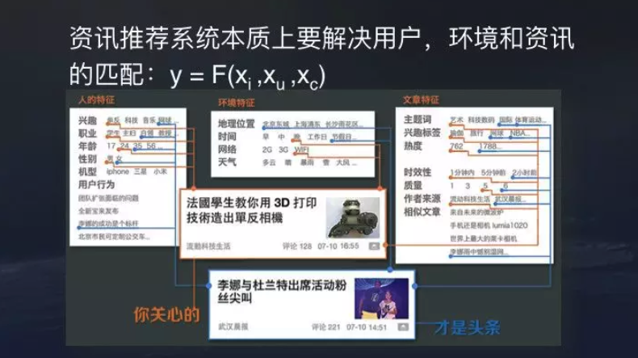
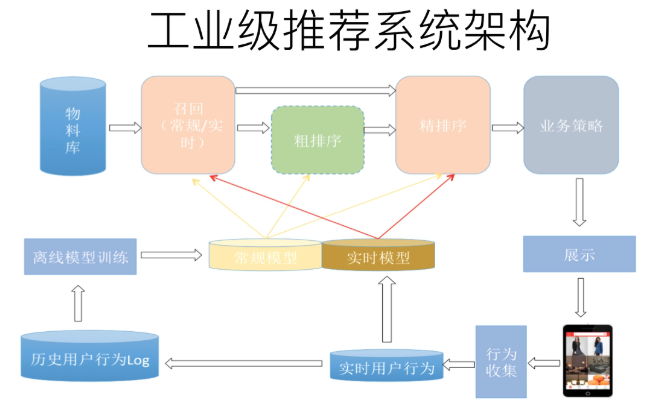
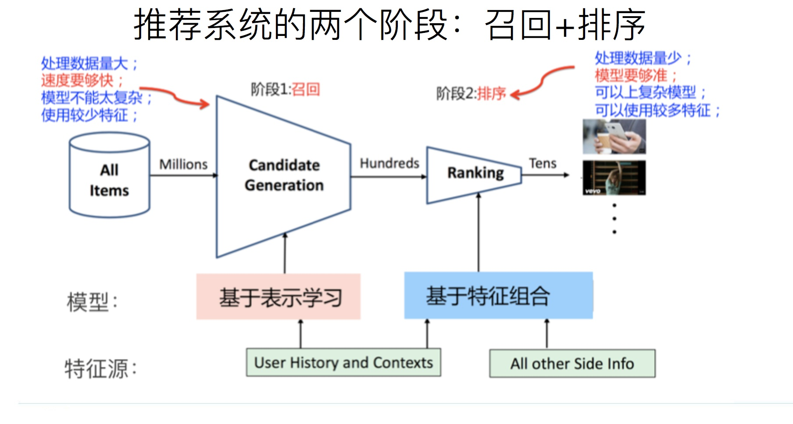
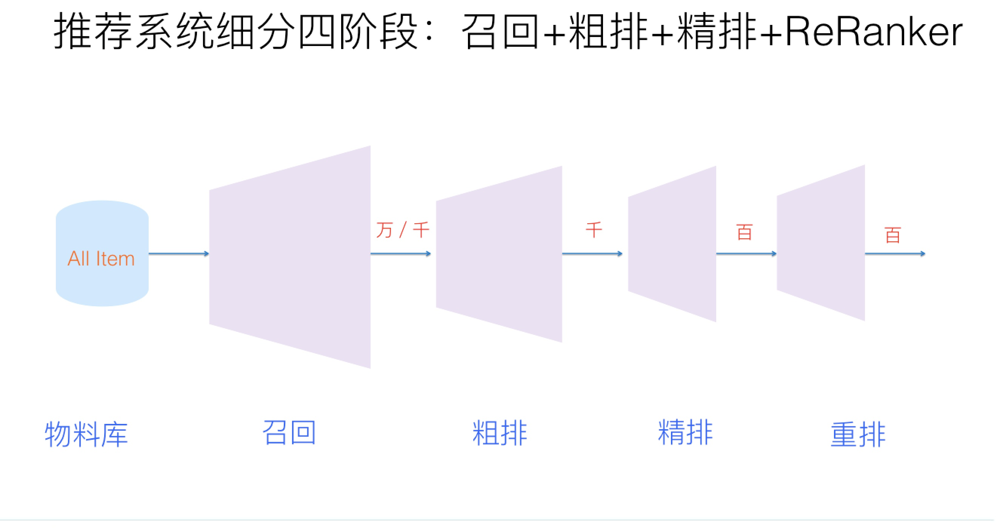
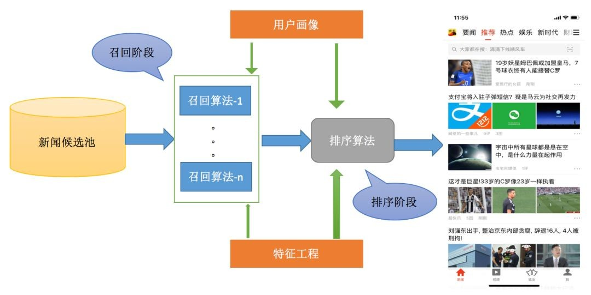
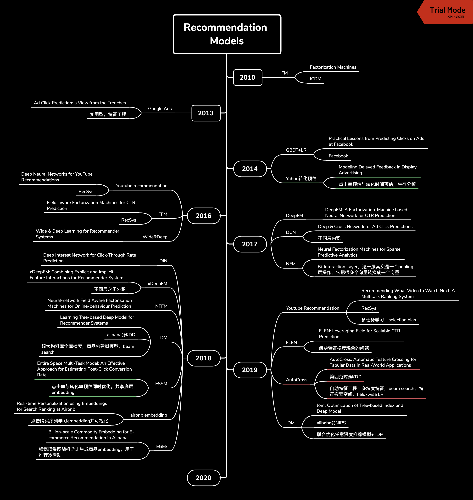

# 推荐

推荐系统技术，总体而言，与NLP和图像领域比，发展速度不算太快。不过最近两年，由于深度学习等一些新技术的引入，总体还是表现出了一些比较明显的技术发展趋势。这篇文章试图从推荐系统几个环节，以及不同的技术角度，来对目前推荐技术的比较彰显的技术趋势做归纳。

## 推荐本质

推荐本质是匹配问题，对用户和物品进行匹配。推荐系统是由系统来根据用户过去的行为、用户的属性（年龄、性别、职业等）、上下文等来猜测用户的兴趣，给用户推送物品（包括电商的宝贝、新闻、电影等）。所以推荐系统，如果用形式化的方式去描述实际上是拟合一个用户对内容满意度的函数，这个函数需要输入三个维度的变量。

第一个维度是内容。头条现在已经是一个综合内容平台，图文、视频、UGC小视频、问答、微头条，每种内容有很多自己的特征，需要考虑怎样提取不同内容类型的特征做好推荐。

第二个维度是用户特征。包括各种兴趣标签，职业、年龄、性别等，还有很多模型刻划出的隐式用户兴趣等。

第三个维度是环境特征。这是移动互联网时代推荐的特点，用户随时随地移动，在工作场合、通勤、旅游等不同的场景，信息偏好有所偏移。

结合三方面的维度，模型会给出一个预估，即推测推荐内容在这一场景下对这一用户是否合适。

推荐一般是非主动触发的，和搜索的主动触发不一样（搜索一般有主动提供的query）；也有小部分情况，用户有提供query：例如用户在电商里搜索一个商品后，结果页最底下推荐给用户的商品，这种情况算是有提供query。直观写成公式，即 $$f(X_{\text{User Feature}},Y_{\text{Item Feature}})\to 0/1$$ 。通过用户特征信息和候选推荐品找到这样一个映射， $$0$$ 表示未点击或未购买等， $$1$$ 表示点击有浏览了或下单购买了。

推荐系统涉及到的两大实体：user和item往往是不同类型的东西，例如user是人，item是电商的宝贝，他们表面上的特征可能是没有任何的重叠的，这不同于搜索引擎里的query和doc都是文本。正是由于user和item不同类型的东西，所以推荐里匹配可能比搜索里的更难。

推荐模型中，点击率、阅读时间、点赞、评论、转发包括点赞都是可以量化的目标，能够用模型直接拟合做预估，看线上提升情况可以知道做的好不好。但一个大体量的推荐系统，服务用户众多，不能完全由指标评估，引入数据指标以外的要素也很重要。比如广告和特型内容频控。像问答卡片就是比较特殊的内容形式，其推荐的目标不完全是让用户浏览，还要考虑吸引用户回答为社区贡献内容。这些内容和普通内容如何混排，怎样控制频控都需要考虑。此外，平台出于内容生态和社会责任的考量，像低俗内容的打压，标题党、低质内容的打压，重要新闻的置顶、加权、强插，低级别账号内容降权都是算法本身无法完成，需要进一步对内容进行干预。

## 工业架构

实际的工业推荐系统，如果粗分的化，经常讲的有两个阶段。首先是召回，主要根据用户部分特征，从海量的物品库里，快速找回一小部分用户潜在感兴趣的物品，然后交给排序环节，排序环节可以融入较多特征，使用复杂模型，来精准地做个性化推荐。召回强调快，排序强调准。当然，这是传统角度看推荐这个事情。一个典型的工业级推荐系统整体架构可以参考下图，一般分为在线部分，近线部分和离线部分。

对于在线部分来说，一般要经历几个阶段。首先通过召回环节，将给用户推荐的物品降到千以下规模；如果召回阶段返回的物品还是太多，可以加入粗排阶段，这个阶段是可选的，粗排可以通过一些简单排序模型进一步减少往后续环节传递的物品；再往后是精排阶段，这里可以使用复杂的模型来对少量物品精准排序。对某个用户来说，即使精排推荐结果出来了，一般并不会直接展示给用户，可能还要上一些业务策略，比如去已读，推荐多样化，加入广告等各种业务策略。之后形成最终推荐结果，将结果展示给用户。

对于近线部分来说，主要目的是实时收集用户行为反馈，并选择训练实例，实时抽取拼接特征，并近乎实时地更新在线推荐模型。这样做的好处是用户的最新兴趣能够近乎实时地体现到推荐结果里。

对于离线部分而言，通过对线上用户点击日志的存储和清理，整理离线训练数据，并周期性地更新推荐模型。对于超大规模数据和机器学习模型来说，往往需要高效地分布式机器学习平台来对离线训练进行支持。

推荐算法的核心主要分为两个阶段：召回阶段（retrieval）和排序阶段（ranking）。之所以分为两个阶段，主要是从性能考虑。召回阶段面临的是百万级别甚至千万级别的文章，单篇文章的性能开销必须要小；而排序阶段的算法则非常消耗资源，不可能对所有文章都算一遍，也没有必要这样做，因为一般来说通不过召回粗选的文章，大部分在排序阶段排名也会很低。

召回阶段，根据用户的历史行为和短期行为，分析用户的兴趣偏好，从千万级的文章库中挑选出一个小的候选集（通常几百到几千篇文章），这些候选集都是用户感兴趣的内容集合。因为个性化推荐需要给每个用户展现不同的信息流或者物品流，而对于每个用户来说，可供推荐的物品，在具备一定规模的公司里，是百万到千万级别，甚至上亿。所以对于每一个用户，如果对于千万级别物品都使用先进的模型挨个进行排序打分，明显速度上是算不过来的，资源投入考虑这么做也不划算。从这里可以看出，召回阶段的主要职责是：从千万量级的候选物品里，采取简单模型将推荐物品候选集合快速筛减到千级别甚至百级别，这样将候选集合数量降下来，之后在排序阶段就可以上一些复杂模型，细致地对候选集进行个性化排序。

排序阶段，在召回集的基础上进行更加精准的个性化计算，给每篇文章进行精确打分，这个分值就是文章与用户的个性化匹配分值，利用该分值进行排序，进而从几千篇文章中选出用户最感兴趣的几篇或者几十篇少量高质量内容。

但是，如果我们更细致地看实用的推荐系统，一般会有四个环节，如下图所示。四个环节分别是：召回、粗排、精排和重排。召回目的如上所述；有时候因为每个用户召回环节返回的物品数量还是太多，怕排序环节速度跟不上，所以可以在召回和精排之间加入一个粗排环节，通过少量用户和物品特征，简单模型，来对召回的结果进行个粗略的排序，在保证一定精准的前提下，进一步减少往后传送的物品数量，粗排往往是可选的，可用可不同，跟场景有关。之后，是精排环节，使用你能想到的任何特征，可以上你能承受速度极限的复杂模型，尽量精准地对物品进行个性化排序。排序完成后，传给重排环节，传统地看，这里往往会上各种技术及业务策略，比如去已读、去重、打散、多样性保证、固定类型物品插入等等，主要是技术产品策略主导或者为了改进用户体验的。

从上面在线推荐两阶段任务的划分，我们可以看出，召回阶段因为需要计算的候选集合太大，所以要想速度快，就只能上简单模型，使用少量特征，保证泛化能力，尽量让用户感兴趣的物品在这个阶段能够找回来；而排序阶段核心目标是要精准，因为它处理的物品数据量小，所以可以采用尽可能多的特征，使用比较复杂的模型，一切以精准为目标。

## 核心工作

推荐算法的核心部分两个阶段组成如图所示，大致包含： 

（1）用户画像：包含用户的人口属性（性别，学历等）、历史行为、短期行为、兴趣内容和个人偏好等多个维度的数据，是给用户做个性化推荐的基础。

（2）特征工程：包含文章的类别属性、主题属性、关键词信息、内容分析、人群偏好和统计特征等比较全面的描述和度量，是新闻内容和质量分析的基础，也是做好用户与文章个性化匹配的基础。

（3）召回算法：包含多个通道的召回模型，例如协同过滤（itemcf、usercf等）、主题模型、内容召回、矩阵分解等。

（4）排序算法：对多个通道召回的内容进行统一的打分排序，选出最优的少量结果，这里常用的模型有lr、gbdt、fm以及DNN的一些模型。

（5）重排逻辑：要兼顾推荐结果的多样性、新鲜度、惊喜度以及部分的人工的产品逻辑等多个维度，更能够满足用户个性化的需求。

## 发展趋势

## Source















