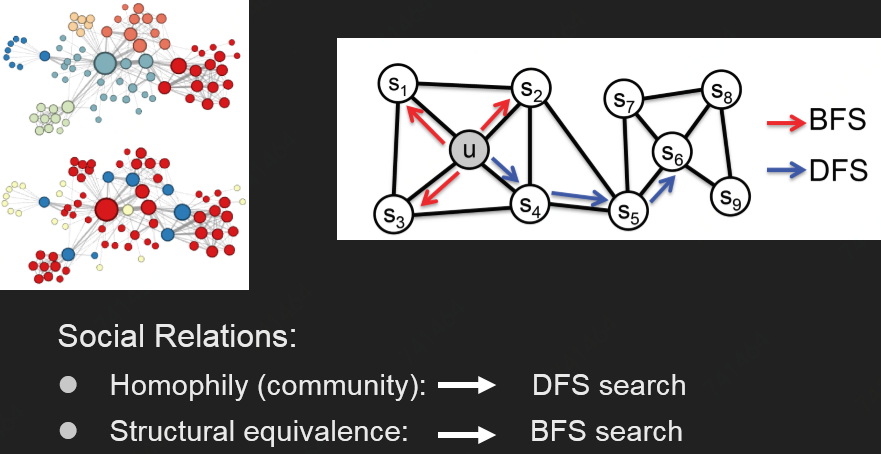
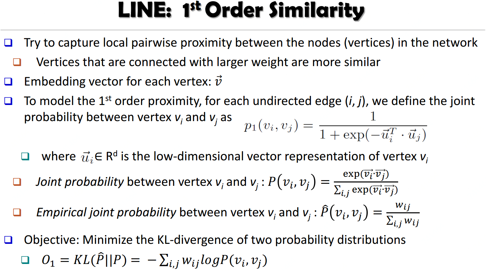
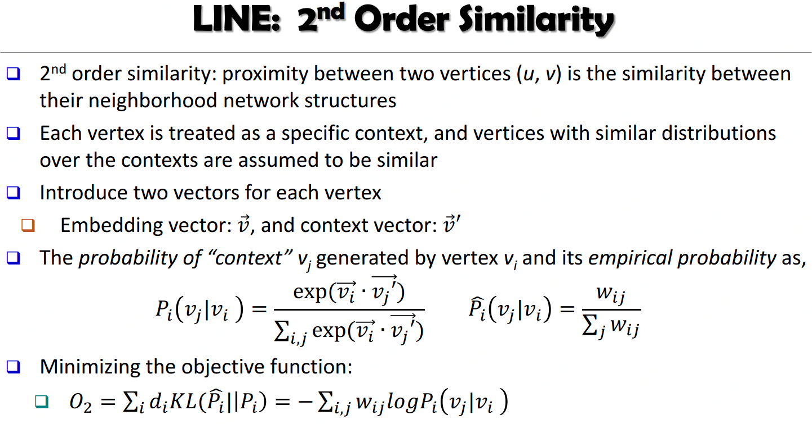
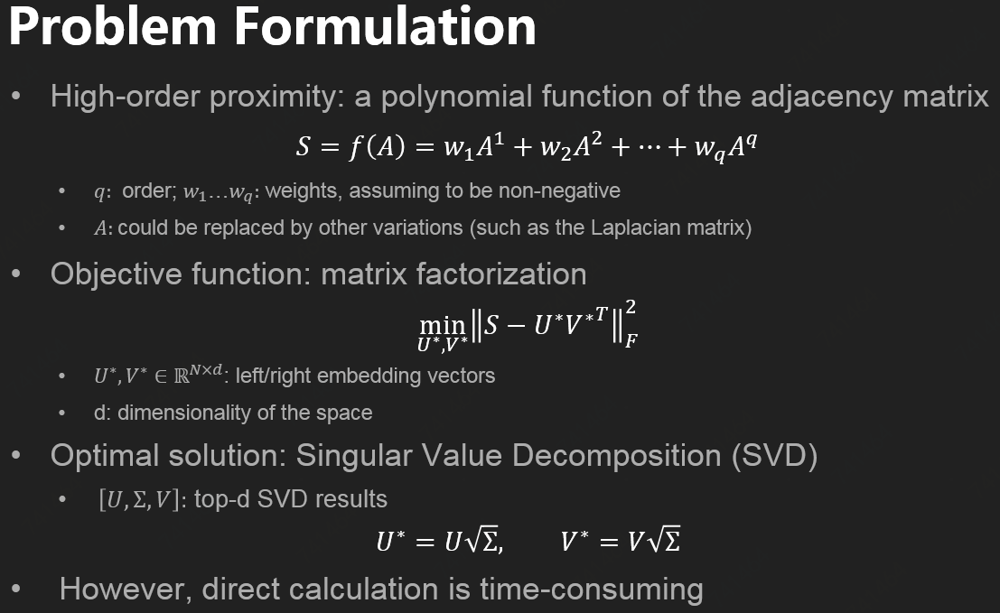
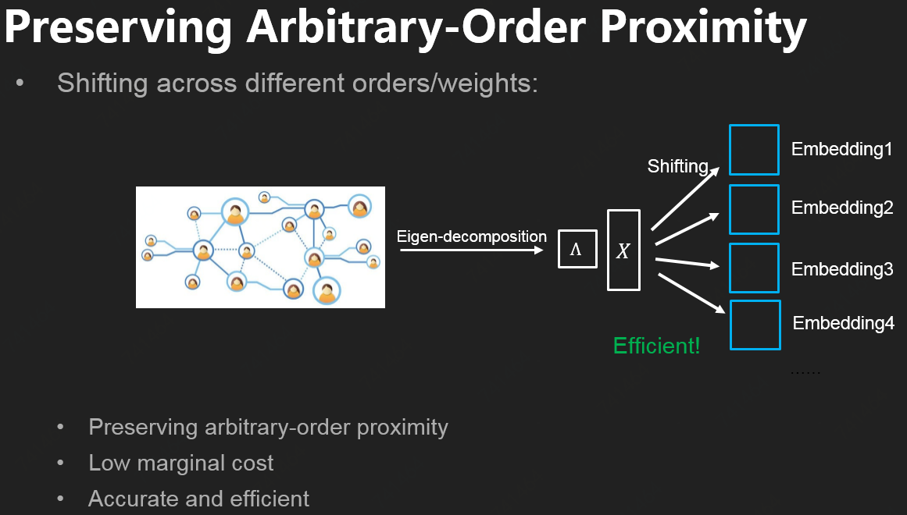
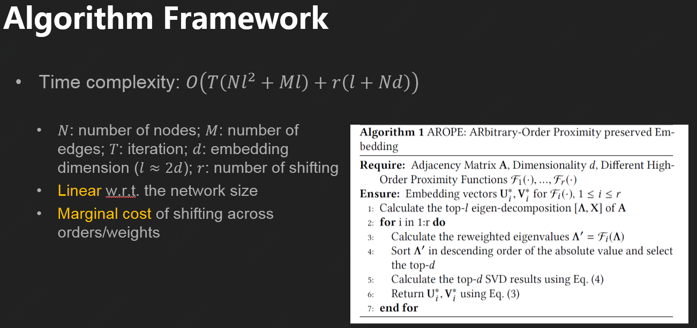
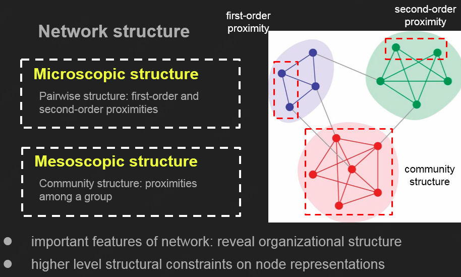
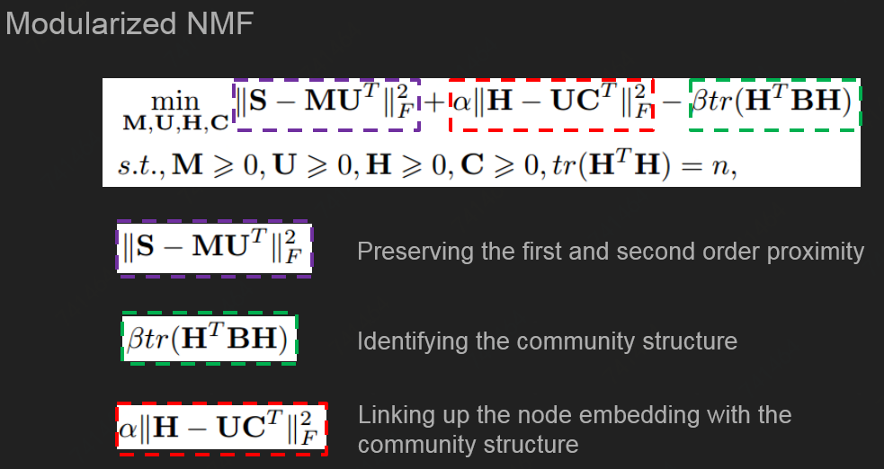
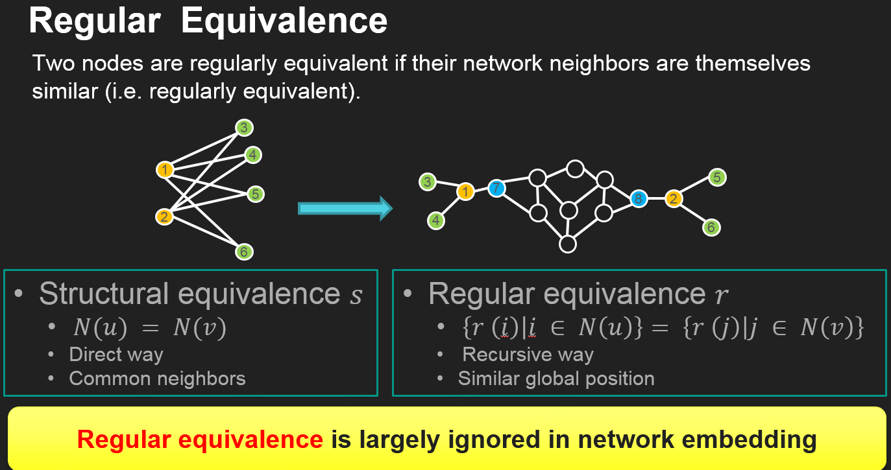

# 结构维持的网络映射

## 网络结构

对于一个网络来说，它的结构又可分为多层：结点&链接\(Nodes&Links\)、结点近邻\(Node Neighborhood\)、成对近似\(Pair-wise Proximity\)、社区结构\(Community Structures\)、超边\(Hyper Edges\)、全局结构\(Global Structure\)。现有的结构维持的网络映射各自着重不同的结构层还进行映射。

## 基于Node Neighborhood

网络中结点的邻居十分重要，所以映射的结果应该能反映出他们的邻居结点信息

### [Deep Walk](http://www.perozzi.net/publications/14_kdd_deepwalk.pdf)

通过截断随机游走对顶点链进行采样，将每个链试做一个句子代入word2vec模型

缺点：只能表达 $$2^{nd}$$ order similarity

### [Node2vec](https://cs.stanford.edu/~jure/pubs/node2vec-kdd16.pdf)

## 基于Pair-wise Proximity

### [LINE](http://www.www2015.it/documents/proceedings/proceedings/p1067.pdf)

强链接的节点应当相似: $$1^{st}$$order similarity；有相同邻居的节点应当相似: $$2^{nd}$$ order similarity

### [SDNE](https://www.kdd.org/kdd2016/papers/files/rfp0191-wangAemb.pdf)

SDNE\(Structural Deep Network Embedding\)

### GraRep

### [AROPE](http://pengcui.thumedialab.com/papers/NE-ArbitraryProximity.pdf)

不同的任务可能需要不同的order的近似，比如[下图](https://arxiv.org/pdf/1605.02115.pdf)。

  

我们直接想到的就是给不同的order赋予权重[\(比如等权重，指数衰减权重\)](https://cs.stanford.edu/~srijan/pubs/wsn-icdm16.pdf)。但是现存方法只能基于fixed high-order proximity，arbitrary-order proximity如何解决，如何保证精度与效率，AROPE\(Arbitrary-Order Proximity Preserved Network Embedding\)模型就是基于此问题提出。

## 基于Community Structures

### [M-NMF](https://www.aaai.org/ocs/index.php/AAAI/AAAI17/paper/download/14589/13763)

## 基于Hyper Edges

### [Structural Deep Embedding for Hyper-Networks](https://arxiv.org/abs/1711.10146)

## 基于Global Structure

结点在网络不同的部分可能扮演相同角色，比如各个公司的经理在整个大的社会网络中扮演的角色相似，我们就是想办法去映射这种扮演角色或者说这个结点的某种重要度。

全局结构的关系不像局部好发掘好处理，比如下图，可以看出左图5，6结点相似，右图1，2结点相似。我们映射时左图局部的相似度可以反映在映射映射结果上，但是放到右图全局，就不那么好处理了。

### [Deep Recursive Network Embedding with Regular Equivalence](http://cuip.thumedialab.com/papers/NE-RegularEquivalence.pdf)

## Source



