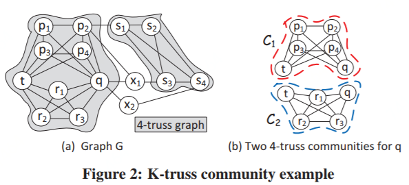

# 社区检测与搜索

|  | Community Detection | Community Search |
| :---: | :---: | :---: |
| Goal | Find all communities with a global criterion |  Find communities for particular persons |
| Cost | Expensive | Less expensive |
| Status | Graphs evolve | Online and dynamic |

## 高频模式子图\(Frequent Pattern Graph\)

### 方法分类

候选集生成方式：Apriori vs. Pattern growth \(FSG vs. gSpan\)

搜索顺序：广度 vs. 深度

重复子图剔除：被动 vs. 主动\(gSpan\)

支持度计算：GASTON, FFSM, MoFa

模式发现顺序：Path-&gt;Tree-&gt;Graph \(GASTON\)

### 基于Apriori的方法

候选集生成 -&gt; 候选集剪枝 -&gt; 支持度计算 -&gt; 候选集剔除  迭代这四步至无法生成候选集或不满足支持度

候选集生成时扩展节点\(AGM算法\)还是扩展边\(FSG算法\)都可以，但是经测试是扩展边更高效

### 基于Pattern-Growth的方法

按深度优先来扩展边，从k边子图-&gt;\(k+1\)边子图-&gt;\(k+2\)边子图...

问题：这样会生成很多重复子图

解决：1、定义一个子图生成顺序  2、DFS生成树，用深度优先搜索扁平图  3、gSpan

#### gSpan

### 闭合图模式挖掘

如果不存在与高频图 $$G$$ 有相同支持度的父图 $$G'$$ ，则 $$G$$ 是闭合的；算法：CloseGraph

## [动态异构网络中的社区演化](http://keg.cs.tsinghua.edu.cn/jietang/publications/TKDE13-Sun-etl-al-co-evolution-of-multi-typed-objects-in-dynamic-networks.pdf)

## [K-Truss](https://arxiv.org/pdf/1205.6693.pdf)

K-truss of graph $$G$$ : the largest subgraph $$H$$  s.t. every edge in $$H$$ is contained in at least $$(k-2)$$ triangles within $$H$$ 

### [K-Truss Community Model\(找Community\)](http://citeseerx.ist.psu.edu/viewdoc/download?doi=10.1.1.722.9193&rep=rep1&type=pdf)

\(1\) K-truss: each edge within at least $$(k-2)$$ triangles

\(2\) Edge Connectivity: common edges shared by triangles

\(3\) Maximal Subgraph

## [K-core](https://arxiv.org/pdf/cs/0504107.pdf)

A k-core $$H$$ is an induced subgraph of $$G$$ where every node in $$H$$ has at least $$k$$ degree in $$H$$

k-core即指一个图中至少有 $$k$$ 条边的点所有子图集合 （可以是非相连的子图）

The maximal k-core $$H$$ is a k-core that no super graph of $$H$$ is a k-core \(The maximal k-core is unique but can be disconnected\)

最大k-core即一个图中边数最多的点的子图 （可以是非相连的，即 $$v_i$$ 与 $$v_j$$ 都有五条边，全图最多边数，$$v_i$$ 与 $$v_j$$ 可以不相连）

### K-Influential Community\(影响力问题\)

Let $$f(H)$$be the influence of a subgraph $$H$$. A K-Influential Community is an induced subgraph $$H$$ of $$G$$ that meets all the following constraints:

\(1\) Connectivity: $$H$$ is connected

\(2\) Cohesiveness: each node in $$H$$ has degree $$\geq k$$ 

\(3\) Maximal structure: there does not exist $$H'(\supseteq H)$$ such that $$f(H) = f(H')$$ 

### K-Core Persistent Community\(随时间变化Community问题\)

Goal: A network changes over time, try to find k-core communities that are persistent most of the time in a temporal network

#### k-Persistent-Core

A subgraph $$G$$ is considered as k-persistent-core if $$G = \cup G_i$$ for every $$G_i$$ appearing in an interval of $$[t_s,t_e]$$ is a connected k-core

## Source

[https://arxiv.org/pdf/1205.6693.pdf](https://arxiv.org/pdf/1205.6693.pdf)

[https://arxiv.org/pdf/cs/0504107.pdf](https://arxiv.org/pdf/cs/0504107.pdf)

[http://citeseerx.ist.psu.edu/viewdoc/download?doi=10.1.1.722.9193&rep=rep1&type=pdf](http://citeseerx.ist.psu.edu/viewdoc/download?doi=10.1.1.722.9193&rep=rep1&type=pdf)

[http://keg.cs.tsinghua.edu.cn/jietang/publications/TKDE13-Sun-etl-al-co-evolution-of-multi-typed-objects-in-dynamic-networks.pdf](http://keg.cs.tsinghua.edu.cn/jietang/publications/TKDE13-Sun-etl-al-co-evolution-of-multi-typed-objects-in-dynamic-networks.pdf)

