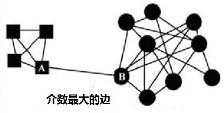
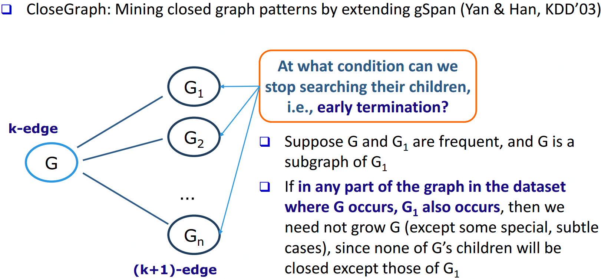
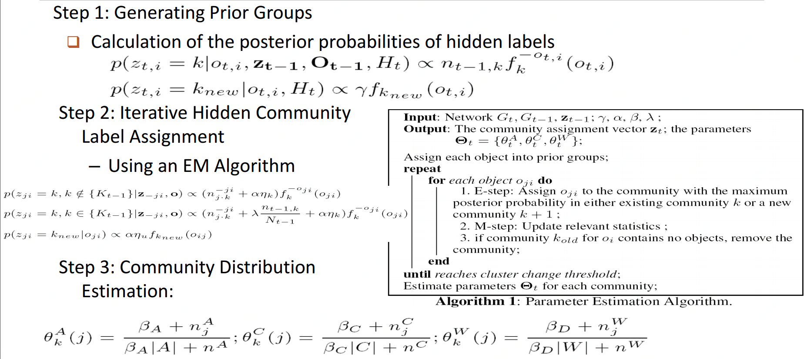

# 社区检测与搜索

## 常规算法比较

度量指标：1、计算时间复杂度 2、精确度（与实际标签比较、计算标准化互信息）3、有效性（聚类系数、模块度、强度） 4、密度敏感性 5、混合社区敏感点 6、离群点检测

可以看到，LPA（标签传播算法）和HANP（基于LPA的改进）效果好且高效。

## 聚类

### 层次化聚类

输入：给以网络（邻接矩阵）

（1）由网络结构计算距离矩阵

（2）距离确定节点相似度（相邻即 $$1$$，隔最少 $$n$$ 个相连即 $$n+1$$ ）

（3）根据相似度从强到弱递归合并节点

（4）根据实际需求横切树状图（如下图要分 $$3$$ 类，可在 $$80$$ 切一刀：分为绿色，样本 $$6$$ ，样本 $$3,4$$ ）

### 谱聚类

将图 $$G(V,E)$$ 切分成相互没有连接的 $$k$$ 个子图： $$A_1,A_2,\dots,A_k$$ ，要求 $$A_i\cap A_j = \varnothing$$ 且 $$A_1\cup A_2\cup \dots \cup A_k= V$$，设 $$W$$ 为边权重，优化目标为

                                         $$\min \text{cut}(A_1,A_2,\dots, A_k)=\frac{1}{2}\sum\limits_{i=1}^kW(A_i,\overline{A}_i)$$ 

将划分问题转化为求解拉普拉斯矩阵的 $$k$$ 个最小特征值问题。

#### 算法过程

（1）构建拉普拉斯矩阵：$$L=D-W$$ ， $$D$$：度矩阵（对角矩阵）    $$W$$：邻接矩阵

（2）标准化： $$D^{-1/2}LD^{-1/2}$$ 

（3）求最小的 $$n$$ 个特征值对应的特征向量（降维）

（4）标准化后再用常规方法（k-means等）聚为 $$k$$ 各类

## 图划分

目标：划分为近似相等的分区，同时边切边最小。（明尼苏达大学的METIS是最权威的图划分工具）

## 分裂算法-GN算法

思想：（1）定义边介数（betweenness）指标： 衡量的是网络里一个边占据 其它节点间捷径的程度

            （2）具有高边介数的边代表了社区的边界

边介数最常见的定义：图中通过该边的所有最短路径数量。如下图 $$A$$和$$B$$ 之间的边即当前最可能切除的

#### 算法过程

（1） 找到网络中具有最大边介数的边

（2） 删除该边

（3） 重复（1）和（2），直到所有边被移除或数量已满足要求 $$k$$ 类

## 模块度优化算法

思想：（1）定义模块度（Modularity）指标： 衡量一个社区的划分好坏

            （2）以模块度为目标进行优化； 例如在层次化聚类中使用贪婪算法

一种模块度的定义： $$Q=$$ 社区内的边占比 $$-$$ 社区的边占比平方

假设网络被划分为 $$k$$ 个社区，那么定义一个 $$k\times k$$ 的对称矩阵 $$e$$ ，它的元素 $$e_{ij}$$ 表示社区 $$i$$ 和社区 $$j$$ 之间的边的数量占比。 $$a_i$$ 表示连接社区 $$i$$ 的边的总数占比。

#### 举例如下

## 标签传播算法

启发式规则：一个节点应该与多数邻居在同一社区内。

特点：适合半监督和无监督、效率很高适合大规模、存在震荡-&gt;采取异步更新、结果可能不稳定

#### 算法过程

（1）给每个节点初始化一个标签

（2）在网络中传播标签

（3）选择邻居的标签中数量最多的进行更新（若有相同数量标签时，选择具有最高ID的标签）

（4） 重复步骤2和3，直到收敛或满足迭代次数

## 随机游走

思想：（1）从节点出发随机游走，停留在社区内的概率高于到达社区外的。

            （2）重复随机游走，强化并逐渐显现社区结构。

#### 算法过程

（1）建立邻接矩阵（含自环）

（2）标准化转移概率矩阵

（3）Expansion操作，对矩阵计算 $$e$$ 次幂方

（4）Inflation操作，对矩阵元素计算 $$r$$ 次幂方并标准化（这一步将强化紧密的点，弱化松散的点）

（5）重复（4）和（5）直到稳定

（6）对结果矩阵进行常规聚类

## [K-Truss](https://arxiv.org/pdf/1205.6693.pdf)

给以图$$G$$，K-truss定义为 : 每个在最大的子图 $$H$$ 中的边至少在 $$(k-2)$$个存在于 $$H$$ 的三角形中，如下

### [K-Truss Community Model\(找Community\)](http://citeseerx.ist.psu.edu/viewdoc/download?doi=10.1.1.722.9193&rep=rep1&type=pdf)

\(1\) K-truss: each edge within at least $$(k-2)$$ triangles

\(2\) Edge Connectivity: common edges shared by triangles

\(3\) Maximal Subgraph

## 其它算法

派系过滤算法（clique percolation algorithm）- 社区的网络

领导力扩张（Leadership expansion）- 类似与kmeans

基于聚类系数的方法（Maximal K-Mutual friends）- 目标函数优化

HANP（Hop attenuation & node preference\)- LPA增加节点传播能力

SLPA（Speak-Listen Propagation Algorithm\)- 记录历史标签序列

Matrix blocking – 根据邻接矩阵列向量的相似性排序

Skeleton clustering – 映射网络到核心连接树后进行检测

算法在实现时通常需要关注：同步/异步，节点遍历方式，平局决胜，迭代终止，超大社区，串行/并行等问题。

## 高频模式子图

### 方法分类

候选集生成方式：Apriori vs. Pattern growth \(FSG vs. gSpan\)

搜索顺序：广度 vs. 深度

重复子图剔除：被动 vs. 主动\(gSpan\)

支持度计算：GASTON, FFSM, MoFa

模式发现顺序：Path-&gt;Tree-&gt;Graph \(GASTON\)

### 基于Apriori的方法

候选集生成 -&gt; 候选集剪枝 -&gt; 支持度计算 -&gt; 候选集剔除  迭代这四步至无法生成候选集或不满足支持度

候选集生成时扩展节点\(AGM算法\)还是扩展边\(FSG算法\)都可以，但是经测试是扩展边更高效

### 基于Pattern-Growth的方法

按深度优先来扩展边，从k边子图-&gt;\(k+1\)边子图-&gt;\(k+2\)边子图...

问题：这样会生成很多重复子图

解决：1、定义一个子图生成顺序  2、DFS生成树，用深度优先搜索扁平图  3、gSpan

#### gSpan

### 闭合图模式挖掘

如果不存在与高频图 $$G$$ 有相同支持度的父图 $$G'$$ ，则 $$G$$ 是闭合的；算法：CloseGraph

## 动态网络中的社区检测

### [动态异构网络中的社区演化](http://keg.cs.tsinghua.edu.cn/jietang/publications/TKDE13-Sun-etl-al-co-evolution-of-multi-typed-objects-in-dynamic-networks.pdf)

### [K-core](https://arxiv.org/pdf/cs/0504107.pdf)

A k-core $$H$$ is an induced subgraph of $$G$$ where every node in $$H$$ has at least $$k$$ degree in $$H$$

k-core即指一个图中至少有 $$k$$ 条边的点所有子图集合 （可以是非相连的子图）

The maximal k-core $$H$$ is a k-core that no super graph of $$H$$ is a k-core \(The maximal k-core is unique but can be disconnected\)

最大k-core即一个图中边数最多的点的子图 （可以是非相连的，即 $$v_i$$ 与 $$v_j$$ 都有五条边，全图最多边数，$$v_i$$ 与 $$v_j$$ 可以不相连）

#### K-Influential Community\(影响力问题\)

Let $$f(H)$$be the influence of a subgraph $$H$$. A K-Influential Community is an induced subgraph $$H$$ of $$G$$ that meets all the following constraints:

\(1\) Connectivity: $$H$$ is connected

\(2\) Cohesiveness: each node in $$H$$ has degree $$\geq k$$ 

\(3\) Maximal structure: there does not exist $$H'(\supseteq H)$$ such that $$f(H) = f(H')$$ 

#### K-Core Persistent Community\(随时间变化Community问题\)

Goal: A network changes over time, try to find k-core communities that are persistent most of the time in a temporal network

#### k-Persistent-Core

A subgraph $$G$$ is considered as k-persistent-core if $$G = \cup G_i$$ for every $$G_i$$ appearing in an interval of $$[t_s,t_e]$$ is a connected k-core

## 社区检测与社区搜索比较

|  | Community Detection | Community Search |
| :---: | :---: | :---: |
| Goal | Find all communities with a global criterion |  Find communities for particular persons |
| Cost | Expensive | Less expensive |
| Status | Graphs evolve | Online and dynamic |

## Source

[https://arxiv.org/pdf/1205.6693.pdf](https://arxiv.org/pdf/1205.6693.pdf)

[https://arxiv.org/pdf/cs/0504107.pdf](https://arxiv.org/pdf/cs/0504107.pdf)

[http://citeseerx.ist.psu.edu/viewdoc/download?doi=10.1.1.722.9193&rep=rep1&type=pdf](http://citeseerx.ist.psu.edu/viewdoc/download?doi=10.1.1.722.9193&rep=rep1&type=pdf)

[http://keg.cs.tsinghua.edu.cn/jietang/publications/TKDE13-Sun-etl-al-co-evolution-of-multi-typed-objects-in-dynamic-networks.pdf](http://keg.cs.tsinghua.edu.cn/jietang/publications/TKDE13-Sun-etl-al-co-evolution-of-multi-typed-objects-in-dynamic-networks.pdf)

