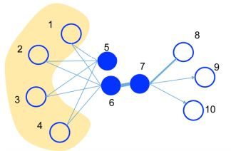
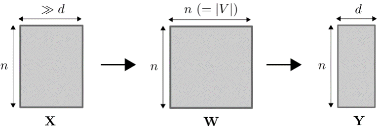
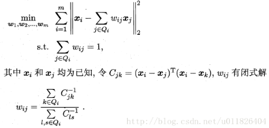
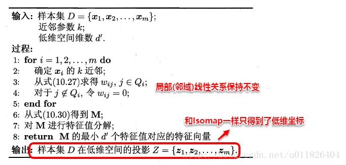

# 网络映射

## 网络映射的目标

### 1. 网络重构性

即原网络依旧可以从映射的空间中再重构生成。

#### 诚然，我们如果只考虑网络重构性，直接用SVD等矩阵分解就可以得到低维度矩阵来表示网络所有的节点及节点间连接关系。

#### 但是这样丧失了很多隐含信息，比如high order的拓扑结构。（如果两个节点并未直接相连，我们并不能说两者之间没有关系，比如下图5与6虽然不相连，但second order approximation很高）

### 2. 映射空间支持网络推断

即依旧可以反应网络结构和保持网络特性，依旧可以进行网络分析（Node importance; Community detection; Network distance; Link prediction; Node classification ...）

## 图映射与网络映射

_**Graphs**_ exist in mathematics. \(Data Structure\)

    Mathematical structures used to model pairwise relations between objects

_**Networks**_ exist in the real word. \(Data\)

    Social networks, logistic networks, biology networks, etc...

#### Network can be represented by graph. Dataset that is not a network can also be represented by a graph

### 图映射

图映射最初被提出是作用于降维的技术，比如MDS，ISOMAP，LLE等流形学习降维方法。基本思想都是基于 $$n$$ 个样本的特征先构造出一个 $$n\times n$$ 的近似矩阵来表示图，然后从这个构造的矩阵中生成低维度的表示方法，如下图所示

#### 多维缩放\(MDS\)

若要求原始空间中样本的距离在低维空间中得以保持，如上图所示，即得到多维缩放\(Multiple Dimensional Scaling, MDS\)。假定 $$m$$ 个样本在原始空间的距离矩阵为 $$D\in \mathbb{R}^{m\times m}$$ ，其第 $$i$$ 行 $$j$$ 列的元素 $$dist_{ij}$$ 为样本 $$x_i$$ 到 $$x_j$$ 的距离。我们的目标是获得样本在 $$d'$$ 维空间的表示 $$Z\in \mathbb{R}^{d'\times m},\ d'\leq d$$ ，且任意两个样本在 $$d'$$ 维空间中欧氏距离等于原始空间中的距离，即 $$||z_i-z_j||=dist_{ij}$$ 

令 $$B=Z^TZ\in \mathbb{R}^{m\times m}$$ ，其中 $$B$$ 为降维后样本的内积矩阵， $$b_{ij}=z_i^Tz_j$$ ，有

                              $$dist_{ij}^2=||z_i||^2+||z_j||^2-2z_i^Tz_j=b_{ii}+b_{jj}-2b_{ij}$$ 

令降维后的样本 $$Z$$ 被中心化，即 $$\sum_{i=1}^mz_i=0$$ 。显然，矩阵 $$B$$ 的行与列之和均为零，即 $$\sum_{i=1}^mb_{ij}=\sum_{j=1}^mb_{ij}=0$$ ，易知

      $$\sum\limits_{i=1}^mdist_{ij}^2=tr(B)+mb_{jj}$$      $$\sum\limits_{j=1}^mdist_{ij}^2=tr(B)+mb_{ii}$$      $$\sum\limits_{i=1}^m\sum\limits_{j=1}^m dist_{ij}^2=2m\ tr(B) $$ 

其中 $$tr(\cdot)$$ 表示矩阵的[迹\(trace\)](https://chmx0929.gitbook.io/machine-learning/shu-xue-ji-chu/untitled/xian-xing-dai-shu)， $$tr(B)=\sum_{i=1}^m||z_i||^2$$ ，令

                 $$dist_{i.}^2=\frac{1}{m}\sum\limits_{j=1}^mdist_{ij}^2$$      $$dist_{.j}^2=\frac{1}{m}\sum\limits_{i=1}^mdist_{ij}^2$$      $$dist{..}^2=\frac{1}{m^2}\sum\limits_{i=1}^m\sum\limits_{j=1}^mdist_{ij}^2$$ 

由上面所有式子可得

                                 $$b_{ij}=-\frac{1}{2}(dist_{ij}^2-dist_{i.}^2-dist_{.j}^2+dist_{..}^2)$$ 

由此即可通过降维前后保持不变的距离矩阵 $$D$$ 求取内积矩阵 $$B$$ 

对矩阵 $$B$$ 做特征值分解， $$B=V\Lambda V^T$$ ，其中 $$\Lambda = diag(\lambda_1,\lambda_2,\dots,\lambda_d)$$ 为特征值构成的对角矩阵， $$\lambda_1\geq \lambda_2\geq \dots \geq \lambda_d$$， $$V$$ 为特征向量矩阵。假定其中有 $$d^*$$ 个非零特征值，它们构成的对角矩阵 $$\Lambda_*=diag(\lambda_1,\lambda_2,\dots,\lambda_{d^*})$$ ，令 $$V_*$$ 表示相应的特征向量矩阵，则 $$Z$$ 可表达为

                                           $$Z=\Lambda_*^{1/2}V_*^T\in\mathbb{R}^{d^*\times m}$$ 

在现实应用中为了有效降维，往往仅需降维后的距离与原始空间中的距离尽可能接近，而不必严格相等。此时可取 $$d'\ll d$$ 个最大特征值构成的对角矩阵 $$\widetilde{\Lambda}=diag(\lambda_1,\lambda_2,\dots,\lambda_{d'})$$ ，令 $$\widetilde{V}$$ 表示相应的特征向量矩阵，则 $$Z$$ 可表达为

                                            $$Z=\widetilde{\Lambda}^{1/2}\widetilde{V}^T\in\mathbb{R}^{d^*\times m}$$ 

#### 算法步骤

1. **输入：**距离矩阵 $$D\in \mathbb{R}^{m\times m}$$，其元素 $$dist_{ij}$$，为样本 $$x_i$$ 到 $$x_j$$ 的距离；低维空间维数 $$d'$$ 
2. **过程：**
3.     ****1：根据上面公式计算 $$dist_{i.}^2$$ ， $$dist_{.j}^2$$ ， $$dist_{..}^2$$ 
4.     2：计算内积矩阵 $$B$$ 
5.     3：对矩阵 $$B$$ 做特征分解
6.     4：取 $$\widetilde{\Lambda}$$ 为 $$d'$$ 个最大特征所构成的对角矩阵， $$\widetilde{V}$$ 为相应的特征向量矩阵
7. **输出：**矩阵 $$\widetilde{V}^T\widetilde{\Lambda}^{1/2}\in\mathbb{R}^{m\times d'}$$ ，每行是一个样本的低维坐标

#### 等度量映射\(ISOMAP\)

等度量映射\(Isometric Mapping, Isomap\)的基本出发点，是认为低维流形嵌入到高维空间之后，直接在高维空间中计算直线距离具有误导性，因为高维空间中的直线距离在低维嵌入流形上是不可达的。我们利用流形在局部上与欧氏空间同胚这个性质，对每个点基于欧氏距离找出其近邻点，然后就能建立一个近邻连接图，图中近邻之间存在连接，而非近邻点之间不存在连接，于是，计算两点之间测地线距离的问题，就转变为计算近邻连接图上两点之间的最短路径问题。

在近邻连接图上计算两点间的最短路径，可采用著名Dijkstra算法或Floyd算法，在得到任意两点的距离之后，就可以通过MDS来获得样本点在低维空间中的坐标。

#### 算法步骤

1. **输入：**样本集 $$D=\{x_1,x_2,\dots,x_m\}$$ ；近邻参数 $$k$$ ；低维空间维数 $$d'$$ 
2. **过程：**
3.     ****for $$i=1,2,\dots,m$$ do
4.         确定 $$x_i$$ 的 $$k$$ 近邻
5.         $$x_i$$ 与 $$k$$ 近邻点之间的距离设置为欧氏距离，与其他店的距离设置为无穷大
6.     end for
7.     调用最短路径算法\(eg. Dijkstra\)计算任意两样本点之间距离 $$dist(x_i,x_j)$$ 
8.     将 $$dist(x_i,x_j)$$ 作为MDS算法的输入
9.     return MDS算法的输出
10. **输出：**样本集 $$D$$ 在低维空间的投影 $$Z=\{z_1,z_2,\dots,z_m\}$$ 

#### [局部线性嵌入\(LLE\)](https://www.cnblogs.com/pinard/p/6266408.html)

局部线性嵌入\(Locally Linear Embedding, LLE\)与Isomap试图保持近邻样本之间的距离不同，LLE试图保持邻域样本之间的线性关系。

即样本点 $$x_i$$ 的坐标能通过它的领域样本 $$x_j$$ ， $$x_k$$ ， $$x_l$$ 的坐标通过线性组合而重构出来，而这里的权值参数在低维和高维空间是一致的，即

                                                $$x_i=w_{ij}x_j+w_{ik}x_k+w_{il}x_l$$ 

第一步，先为每个样本 $$x_i$$ 找到其近邻下标集合 $$Q_i$$，然后计算出基于 $$Q_i$$ 中的所有的样本点对 $$x_i$$ 进行线性重构系数 $$w_i$$ ，也就是找出每一个样本和其领域内的样本之间的线性关系

第二步，在低维空间领域重构系数 $$w_i$$ 不变，去求每个样本在低维空间的坐标

利用M矩阵，可以将问题写成

                                                $$\mathop{min}\limits_Z tr(ZMZ^T)\ \ \ \ s.t.ZZ^T=I$$ 

问题就成了对 $$M$$ 矩阵进行特征分解，然后取最小的 $$d'$$ 个特征值对应的特征向量组成低维空间的坐标 $$Z$$ 

我们确实可以将图映射方法用在网络上，不用从样本特征下手构造，直接用网络拓扑结构就可以

但是图映射技术在网络映射上表现不好，很大原因就是因为一个真实的网络的邻接矩阵并不是一个合适的近似矩阵，矩阵所包含的信息极为有限，比如尽管 $$u$$ 和 $$v$$ 相似，但邻接矩阵中 $$A_{uv}=0$$； $$A_{uv}<A_{uw}$$并不能保证 $$w$$ 比 $$v$$ 更与 $$u$$ 相似。

### 网络映射启发式

通过对比图映射与网络映射，我们找到，关键就是近似矩阵如何构建。对于图映射来说，近似矩阵是已经定义好的，而对于网络映射，需要我们使用合适的方法去定义。

基于不同的原则，我们可以分为三大类网络映射方法：

1、网络结构维持的网络映射

2、网络性质维持的网络映射

3、动态网络映射

## Source

[https://github.com/thunlp/NRLPapers](https://github.com/thunlp/NRLPapers)

[http://pengcui.thumedialab.com/papers/NetworkEmbeddingSurvey.pdf](http://pengcui.thumedialab.com/papers/NetworkEmbeddingSurvey.pdf)

[http://pengcui.thumedialab.com/papers/KDD%20network%20representation%20tutorial-v3.pptx](http://pengcui.thumedialab.com/papers/KDD%20network%20representation%20tutorial-v3.pptx)

