# 结构维持的网络映射

## 网络结构

对于一个网络来说，它的结构又可分为多层：结点&链接\(Nodes&Links\)、结点近邻\(Node Neighborhood\)、成对近似\(Pair-wise Proximity\)、社区结构\(Community Structures\)、超边\(Hyper Edges\)、全局结构\(Global Structure\)。现有的结构维持的网络映射各自着重不同的结构层还进行映射。

## 基于Node Neighborhood

网络中结点的邻居十分重要，所以映射的结果应该能反映出他们的邻居结点信息

### [Deep Walk](http://www.perozzi.net/publications/14_kdd_deepwalk.pdf)

通过截断随机游走对顶点链进行采样（即限定固定长度的随机游走），将每个链试做一个句子代入word2vec模型

下面以SkipGram的方法进行网络中结点的表示学习为例。根据SkipGram的思路，最重要的就是定义Context，也就是Neighborhood。​NLP中，Neighborhood是当前Word周围的字，本文用随机游走得到Graph或者Network中节点的Neighborhood。

* 随机游走随机均匀地选取网络节点，并生成固定长度的随机游走序列，将此序列类比为自然语言中的句子（节点序列=句子，序列中的节点=句子中的单词），应用skip-gram模型学习节点的分布式表示。
* 前提：如果一个网络的节点服从幂律分布，那么节点在随机游走序列中的出现次数也服从幂律分布，并且实证发现NLP中单词的出现频率也服从幂律分布。

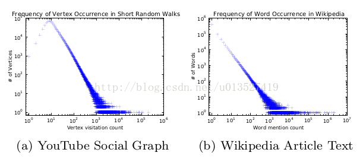

大体步骤：Network/Graph  --&gt;  Random Walk  --&gt;  得到节点序列（representation mapping） --&gt; 放到skip-gram模型中 --&gt;  output：得到representation

以阿里论文为例，基于用户行为序列生成的物品全局关系图为例。在互联网场景下，数据对象之间更多呈现的是图结构。典型的场景是由用户行为数据生成的和物品全局关系图\(下图1\)，以及加入更多属性的物品组成的知识图谱\(下图2\)。

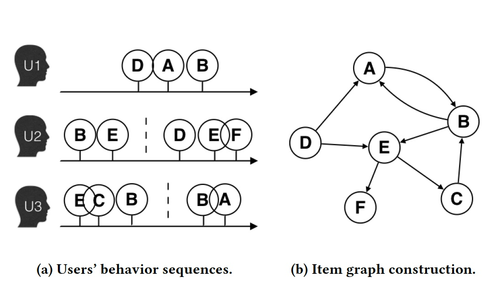

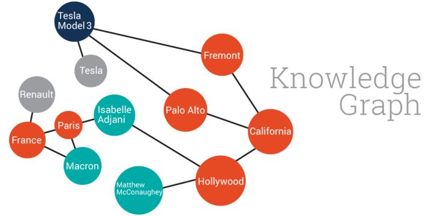

在面对图结构的时候，传统的序列embedding方法就显得力不从心了。在这样的背景下，对图结构中间的节点进行表达的graph embedding成为了新的研究方向，并逐渐在深度学习推荐系统领域流行起来。

阿里的主要思想是在由物品组成的图结构上进行随机游走，产生大量物品序列，然后将这些物品序列作为训练样本输入word2vec进行训练，得到物品的embedding。图3用图示的方法展现了DeepWalk的过程。

如图3，整个DeepWalk的算法流程可以分为四步：

1. 图a展示了原始的用户行为序列
2. 图b基于这些用户行为序列构建了物品相关图，可以看出，物品A，B之间的边产生的原因就是因为用户U1先后购买了物品A和物品B，所以产生了一条由A到B的有向边。如果后续产生了多条相同的有向边，则有向边的权重被加强。在将所有用户行为序列都转换成物品相关图中的边之后，全局的物品相关图就建立起来了。
3. **图c采用随机游走的方式随机选择起始点，重新产生物品序列。**
4. 图d最终将这些物品序列输入word2vec模型，生成最终的物品Embedding向量。

在上述DeepWalk的算法流程中，核心是第三步，其中唯一需要形式化定义的是随机游走的跳转概率，也就是到达节点 $$v_i$$ 后，下一步遍历vi的临接点 $$v_j$$ 的概率。如果物品的相关图是有向有权图，那么从节点 $$v_i$$ 跳转到节点 $$v_j$$ 的概率定义如下：

其中 $$N_+(v_i)$$ 是节点vi所有的出边集合， $$M_{ij}$$ 是节点 $$v_i$$ 到节点 $$v_j$$ 边的权重。

如果物品相关图是无相无权重图，那么跳转概率将是上面公式的一个特例，即权重 $$M_{ij}$$ 将为常数1，且 $$N_+(v_i)$$ 应是节点 $$v_i$$ 所有“边”的集合，而不是所有“出边”的集合。

#### [算法流程](https://zhuanlan.zhihu.com/p/45167021)

整个DeepWalk算法包含两部分，一部分是随机游走的生成，另一部分是参数的更新。

其中第2步是构建Hierarchical Softmax，第3步对每个节点做γ次随机游走，第4步打乱网络中的节点，第5步以每个节点为根节点生成长度为t的随机游走，第7步根据生成的随机游走使用skip-gram模型利用梯度的方法对参数进行更新。

缺点：只能表达 $$2^{nd}$$ order similarity

#### 算法实现



### [Node2vec](https://cs.stanford.edu/~jure/pubs/node2vec-kdd16.pdf)

2016年，斯坦福大学在DeepWalk的基础上更进一步，通过调整随机游走权重的方法使graph embedding的结果在网络的**同质性（homophily）**和**结构性（structural equivalence）**中进行权衡权衡。

具体来讲，网络的“同质性”指的是距离相近节点的embedding应该尽量近似，如下图，节点u与其相连的节点s1、s2、s3、s4的embedding表达应该是接近的，这就是“同质性“的体现。

“结构性”指的是结构上相似的节点的embedding应该尽量接近，图4中节点u和节点s6都是各自局域网络的中心节点，结构上相似，其embedding的表达也应该近似，这是“结构性”的体现。

类似于deepwalk，主要的创新点在于改进了随机游走的策略，定义了两个参数p和q，在BFS和DFS中达到一个平衡，同时考虑到局部和宏观的信息，并且具有很高的适应性。

* BFS，广度优先：微观局部信息
* DFS，深度优先：宏观全局信息

为了使Graph Embedding的结果能够表达网络的**同质性**，在随机游走的过程中，需要让游走的过程更倾向于**宽度优先搜索（BFS）**，因为BFS更喜欢游走到跟当前节点有直接连接的节点上，因此就会有更多同质性信息包含到生成的样本序列中，从而被embedding表达；另一方面，为了抓住网络的**结构性**，就需要随机游走更倾向于**深度优先搜索（DFS）**，因为DFS会更倾向于通过多次跳转，游走到远方的节点上，使得生成的样本序列包含更多网络的整体结构信息。

并且参数控制跳转概率的随机游走，之前完全随机时，p=q=1。

* 返回概率参数（Return parameter）p，对应BFS，p控制回到原来节点的概率，如图中从t跳到v以后，有1/p的概率在节点v处再跳回到t。
* 离开概率参数（In outparameter）q，对应DFS，q控制跳到其他节点的概率。

上图中，刚从 $$\text{edge}(t,v)$$ 过来，现在在节点 $$v$$ 上，要决定下一步 $$(v,x)$$ 怎么走。其中 $$d_{tx}$$ 表示节点 $$t$$ 到节点 $$x$$ 之间的最短路径， $$d_{tx}=0$$ 表示会回到节点 $$t$$ 本身， $$d_{tx}=1$$ 表示节点 $$t$$ 和节点 $$x$$ 直接相连，但是在上一步却选择了节点 $$v$$ ， $$d_{tx}=2$$ 表示节点 $$t$$ 不与 $$x$$ 直接相连，但节点 $$v$$ 与 $$x$$ 直接相连。所以， $$d_{tx}$$ 指的是节点 $$t$$ 到节点 $$x$$ 的距离，参数 $$p$$ 和 $$q$$ 共同控制着随机游走的倾向性。参数 $$p$$ 被称为返回参数（return parameter）， $$p$$ 越小，随机游走回节点 $$t$$ 的可能性越大，node2vec就更注重表达网络的同质性，参数 $$q$$ 被称为进出参数（in-out parameter）， $$q$$ 越小，则随机游走到远方节点的可能性越大，node2vec更注重表达网络的结构性，反之，当前节点更可能在附近节点游走。

node2vec这种灵活表达同质性和结构性的特点也得到了实验的证实。图6的上图就是node2vec更注重同质性的体现，可以看到距离相近的节点颜色更为接近，而下图则是结构特点相近的节点的颜色更为接近。

node2vec所体现的网络的同质性和结构性在推荐系统中也是可以被很直观的解释的。**同质性相同的物品很可能是同品类、同属性、或者经常被一同购买的物品**，而**结构性相同的物品则是各品类的爆款、各品类的最佳凑单商品等拥有类似趋势或者结构性属性的物品**。毫无疑问，二者在推荐系统中都是非常重要的特征表达。由于node2vec的这种灵活性，以及发掘不同特征的能力，甚至可以把不同node2vec生成的embedding融合共同输入后续深度学习网络，以保留物品的不同特征信息

#### 算法实现



### [EGES](https://github.com/wzhe06/Reco-papers/blob/master/Embedding/%5BAlibaba%20Embedding%5D%20Billion-scale%20Commodity%20Embedding%20for%20E-commerce%20Recommendation%20in%20Alibaba%20%28Alibaba%202018%29.pdf)

2018年阿里公布了其在淘宝应用的Embedding方法EGES（Enhanced Graph Embedding with Side Information），其基本思想是在DeepWalk生成的graph embedding基础上引入补充信息。

如果单纯使用用户行为生成的物品相关图，固然可以生成物品的embedding，但是如果遇到新加入的物品，或者没有过多互动信息的长尾物品，推荐系统将出现严重的冷启动问题。**为了使“冷启动”的商品获得“合理”的初始Embedding，阿里团队通过引入了更多补充信息来丰富Embedding信息的来源，从而使没有历史行为记录的商品获得Embedding。**

生成Graph embedding的第一步是生成物品关系图，通过用户行为序列可以生成物品相关图，利用相同属性、相同类别等信息，也可以通过这些相似性建立物品之间的边，从而生成基于内容的knowledge graph。而基于knowledge graph生成的物品向量可以被称为补充信息（side information）embedding向量，当然，根据补充信息类别的不同，可以有多个side information embedding向量。

**那么如何融合一个物品的多个embedding向量，使之形成物品最后的embedding呢？最简单的方法是在深度神经网络中加入average pooling层将不同embedding平均起来，阿里在此基础上进行了加强，对每个embedding加上了权重**，如下图所示，对每类特征对应的Embedding向量，分别赋予了权重 $$a_0,a_1\dots a_n$$ 。图中的Hidden Representation层就是对不同Embedding进行加权平均操作的层，得到加权平均后的Embedding向量后，再直接输入softmax层，这样通过梯度反向传播，就可以求的每个embedding的权重 $$a_i(i=0\dots n)$$ 。

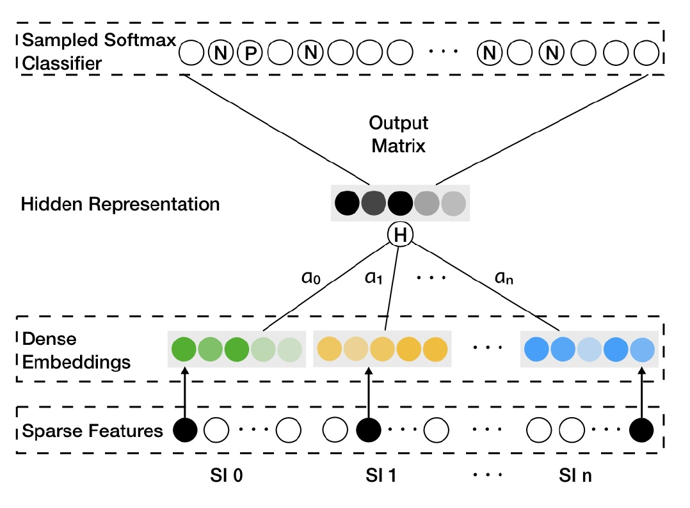

在实际的模型中，阿里采用了 $$e^{a_j}$$ 而不是 $$a_j$$ 作为相应embedding的权重，一是避免权重为0，二是因为 $$e^{a_j}$$ 在梯度下降过程中有良好的数学性质。

阿里的EGES并没有过于复杂的理论创新，但给出一个工程性的结合多种Embedding的方法，降低了某类Embedding缺失造成的冷启动问题，是实用性极强的Embedding方法。

## 基于Pair-wise Proximity

### [LINE](http://www.www2015.it/documents/proceedings/proceedings/p1067.pdf)

相比DeepWalk纯粹随机游走的序列生成方式，LINE可以应用于有向图、无向图以及边有权重的网络，并通过将一阶、二阶的邻近关系引入目标函数，能够使最终学出的node embedding的分布更为均衡平滑，避免DeepWalk容易使node embedding聚集的情况发生。

强链接的节点应当相似: $$1^{st}$$order similarity；有相同邻居的节点应当相似: $$2^{nd}$$ order similarity

一阶相似度：直接相连节点间，例如6与7。定义节点 $$v_i$$ 和 $$v_j$$ 间的联合概率为：

                                                         $$p_1(v_i,v_j)=\frac{1}{1+\exp(-\vec{\mu_i}^T\cdot \vec{\mu_j})}$$ 

二阶相似度：通过其他中介节点相连的节点间例如5与6。用的是一个条件概率

                                                            $$p_2(v_j|v_i)=\frac{\exp(\vec{\mu_j'^T}\cdot \vec{\mu_i})}{\sum_{k=1}^{|V|}\exp(\vec{\mu_k^T}\cdot \vec{\mu_i})}$$ 

目标是让NRL前后节点间相似度不变，也节点表示学习前如果两个节点比较相似，那么embedding后的这两个节点表示向量也要很相似。文中用的是KL散度，度量两个概率分布之间的距离。

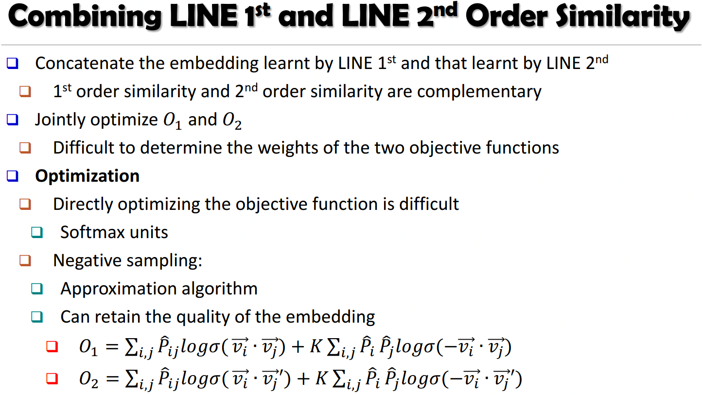

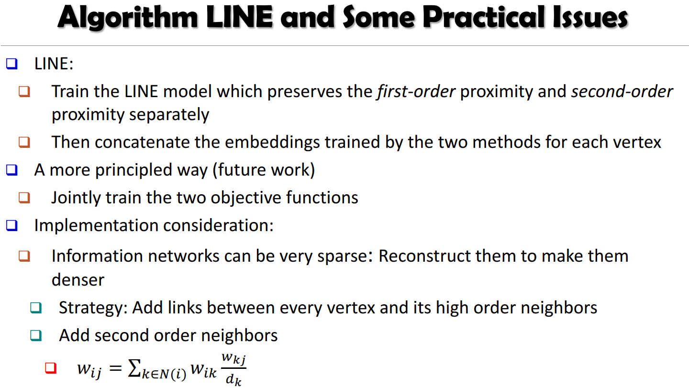

### [SDNE](https://www.kdd.org/kdd2016/papers/files/rfp0191-wangAemb.pdf)

相比于node2vec对游走方式的改进，SDNE模型主要从目标函数的设计上解决embedding网络的局部结构和全局结构的问题。而相比LINE分开学习局部结构和全局结构的做法，SDNE一次性的进行了整体的优化，更有利于获取整体最优的embedding。

SDNE\(Structural Deep Network Embedding\)的一大贡献在于提出了一种新的半监督学习模型，结合一阶估计与二阶估计的优点，用于表示网络的全局结构属性和局部结构属性。

对节点的描述特征向量（比如点的「邻接向量」）使用autoencoder编码，取autoencoder中间层作为向量表示，以此来让获得2ndproximity（相似邻居的点相似度较高，因为两个节点的「邻接向量」相似，说明它们共享了很多邻居，最后映射成的向量y也会更接近）。

目标函数：

### GraRep

### [AROPE](http://pengcui.thumedialab.com/papers/NE-ArbitraryProximity.pdf)

不同的任务可能需要不同的order的近似，比如[下图](https://arxiv.org/pdf/1605.02115.pdf)。

  

我们直接想到的就是给不同的order赋予权重[\(比如等权重，指数衰减权重\)](https://cs.stanford.edu/~srijan/pubs/wsn-icdm16.pdf)。但是现存方法只能基于fixed high-order proximity，arbitrary-order proximity如何解决，如何保证精度与效率，AROPE\(Arbitrary-Order Proximity Preserved Network Embedding\)模型就是基于此问题提出。

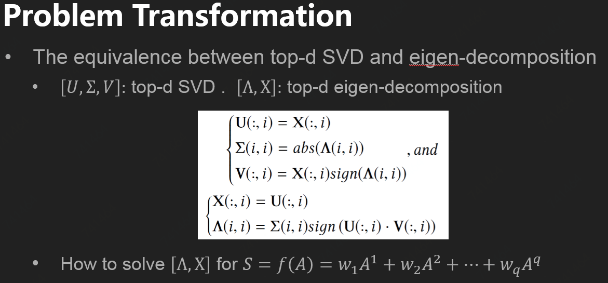

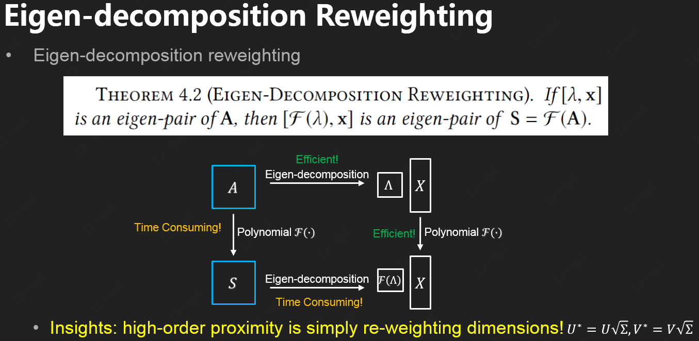

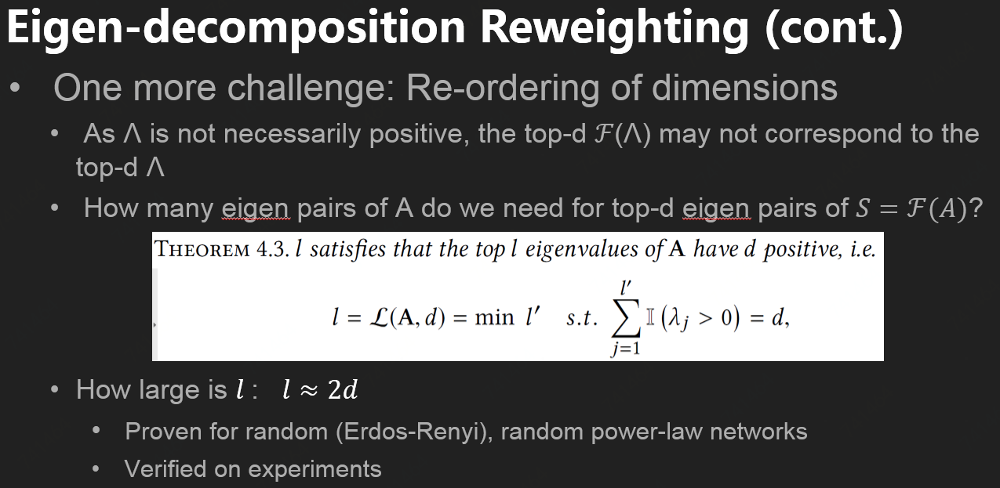

## 基于Community Structures

### [M-NMF](https://www.aaai.org/ocs/index.php/AAAI/AAAI17/paper/download/14589/13763)

## 基于Hyper Edges

### [Structural Deep Embedding for Hyper-Networks](https://arxiv.org/abs/1711.10146)

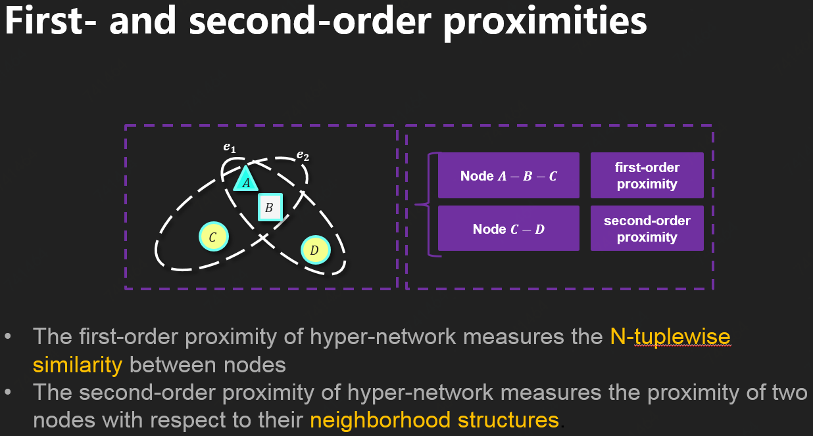

## 基于Global Structure

结点在网络不同的部分可能扮演相同角色，比如各个公司的经理在整个大的社会网络中扮演的角色相似，我们就是想办法去映射这种扮演角色或者说这个结点的某种重要度。

全局结构的关系不像局部好发掘好处理，比如下图，可以看出左图5，6结点相似，右图1，2结点相似。我们映射时左图局部的相似度可以反映在映射映射结果上，但是放到右图全局，就不那么好处理了。

### [Deep Recursive Network Embedding with Regular Equivalence](http://cuip.thumedialab.com/papers/NE-RegularEquivalence.pdf)

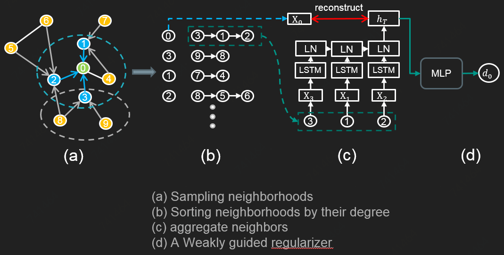

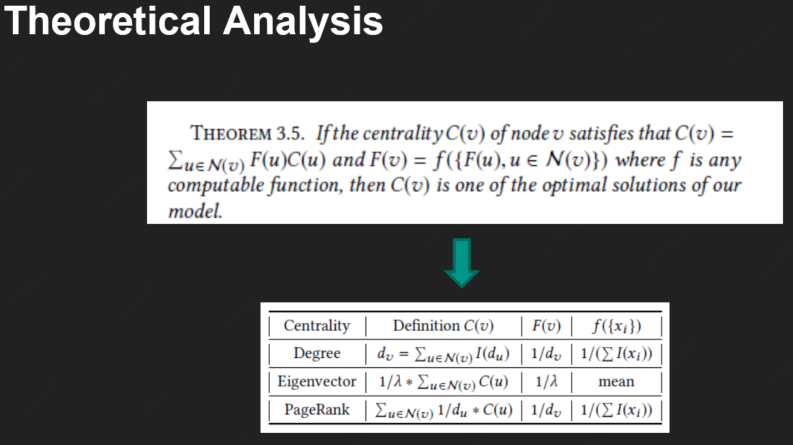

## Source











