# 结构维持的网络映射

## 网络结构

对于一个网络来说，它的结构又可分为多层：结点&链接\(Nodes&Links\)、结点近邻\(Node Neighborhood\)、成对近似\(Pair-wise Proximity\)、社区结构\(Community Structures\)、超边\(Hyper Edges\)、全局结构\(Global Structure\)。现有的结构维持的网络映射各自着重不同的结构层还进行映射。

## 基于Node Neighborhood

网络中结点的邻居十分重要，所以映射的结果应该能反映出他们的邻居结点信息

### [Deep Walk](http://www.perozzi.net/publications/14_kdd_deepwalk.pdf)

通过截断随机游走对顶点链进行采样（即限定固定长度的随机游走），将每个链试做一个句子代入word2vec模型

下面以SkipGram的方法进行网络中结点的表示学习为例。根据SkipGram的思路，最重要的就是定义Context，也就是Neighborhood。​NLP中，Neighborhood是当前Word周围的字，本文用随机游走得到Graph或者Network中节点的Neighborhood。

* 随机游走随机均匀地选取网络节点，并生成固定长度的随机游走序列，将此序列类比为自然语言中的句子（节点序列=句子，序列中的节点=句子中的单词），应用skip-gram模型学习节点的分布式表示。
* 前提：如果一个网络的节点服从幂律分布，那么节点在随机游走序列中的出现次数也服从幂律分布，并且实证发现NLP中单词的出现频率也服从幂律分布。

大体步骤：Network/Graph  --&gt;  Random Walk  --&gt;  得到节点序列（representation mapping） --&gt; 放到skip-gram模型中 --&gt;  output：得到representation

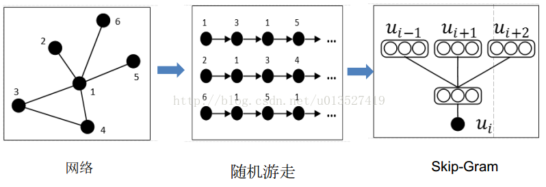

#### [算法流程](https://zhuanlan.zhihu.com/p/45167021)

整个DeepWalk算法包含两部分，一部分是随机游走的生成，另一部分是参数的更新。

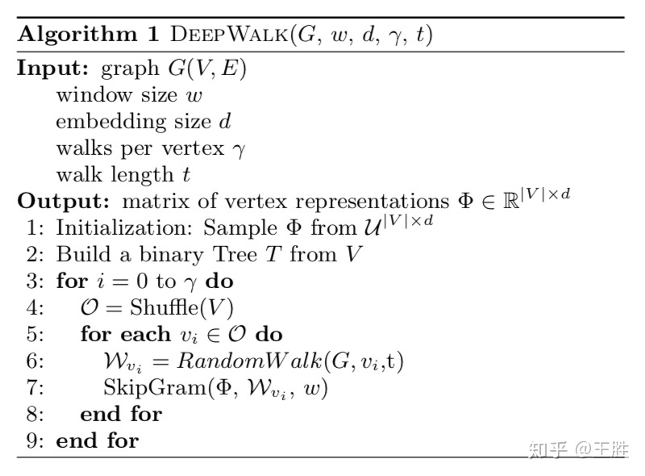

其中第2步是构建Hierarchical Softmax，第3步对每个节点做γ次随机游走，第4步打乱网络中的节点，第5步以每个节点为根节点生成长度为t的随机游走，第7步根据生成的随机游走使用skip-gram模型利用梯度的方法对参数进行更新。

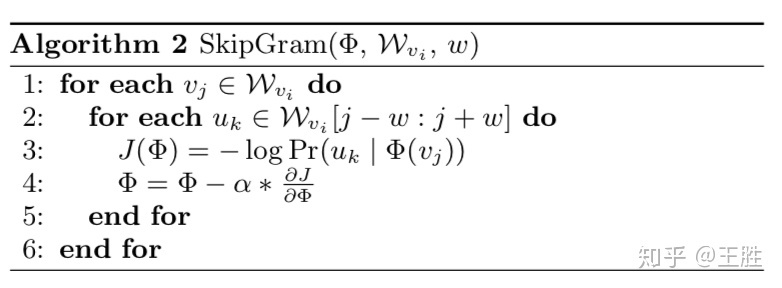

缺点：只能表达 $$2^{nd}$$ order similarity

#### 算法实现



### [Node2vec](https://cs.stanford.edu/~jure/pubs/node2vec-kdd16.pdf)

类似于deepwalk，主要的创新点在于改进了随机游走的策略，定义了两个参数p和q，在BFS和DFS中达到一个平衡，同时考虑到局部和宏观的信息，并且具有很高的适应性。

* BFS，广度优先：微观局部信息
* DFS，深度优先：宏观全局信息

并且参数控制跳转概率的随机游走，之前完全随机时，p=q=1。

* 返回概率参数（Return parameter）p，对应BFS，p控制回到原来节点的概率，如图中从t跳到v以后，有1/p的概率在节点v处再跳回到t。
* 离开概率参数（In outparameter）q，对应DFS，q控制跳到其他节点的概率。

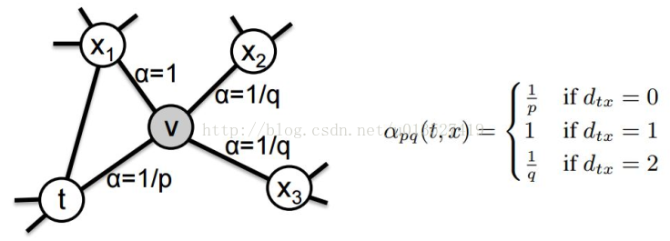

上图中，刚从 $$\text{edge}(t,v)$$ 过来，现在在节点 $$v$$ 上，要决定下一步 $$(v,x)$$ 怎么走。其中 $$d_{tx}$$ 表示节点 $$t$$ 到节点 $$x$$ 之间的最短路径， $$d_{tx}=0$$ 表示会回到节点 $$t$$ 本身， $$d_{tx}=1$$ 表示节点 $$t$$ 和节点 $$x$$ 直接相连，但是在上一步却选择了节点 $$v$$ ， $$d_{tx}=2$$ 表示节点 $$t$$ 不与 $$x$$ 直接相连，但节点 $$v$$ 与 $$x$$ 直接相连。

#### 算法实现



## 基于Pair-wise Proximity

### [LINE](http://www.www2015.it/documents/proceedings/proceedings/p1067.pdf)

强链接的节点应当相似: $$1^{st}$$order similarity；有相同邻居的节点应当相似: $$2^{nd}$$ order similarity

一阶相似度：直接相连节点间，例如6与7。定义节点 $$v_i$$ 和 $$v_j$$ 间的联合概率为：

                                                         $$p_1(v_i,v_j)=\frac{1}{1+\exp(-\vec{\mu_i}^T\cdot \vec{\mu_j})}$$ 

二阶相似度：通过其他中介节点相连的节点间例如5与6。用的是一个条件概率

                                                            $$p_2(v_j|v_i)=\frac{\exp(\vec{\mu_j'^T}\cdot \vec{\mu_i})}{\sum_{k=1}^{|V|}\exp(\vec{\mu_k^T}\cdot \vec{\mu_i})}$$ 

目标是让NRL前后节点间相似度不变，也节点表示学习前如果两个节点比较相似，那么embedding后的这两个节点表示向量也要很相似。文中用的是KL散度，度量两个概率分布之间的距离。

### [SDNE](https://www.kdd.org/kdd2016/papers/files/rfp0191-wangAemb.pdf)

SDNE\(Structural Deep Network Embedding\)的一大贡献在于提出了一种新的半监督学习模型，结合一阶估计与二阶估计的优点，用于表示网络的全局结构属性和局部结构属性。

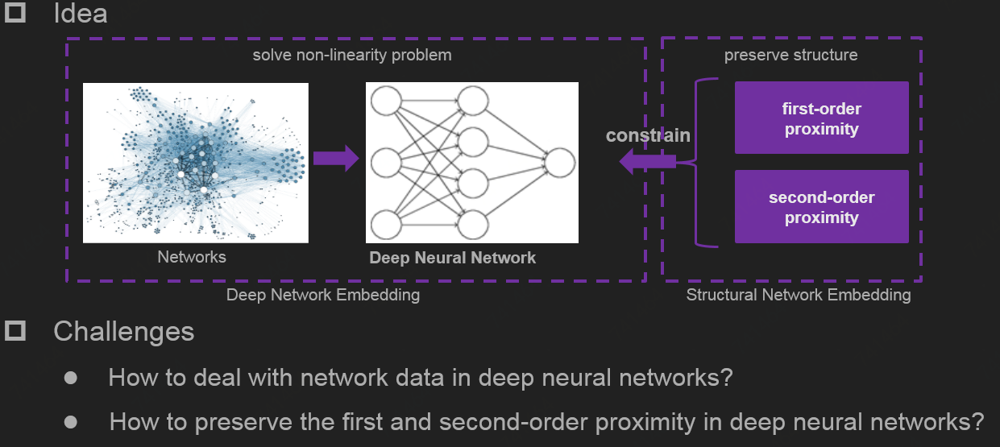

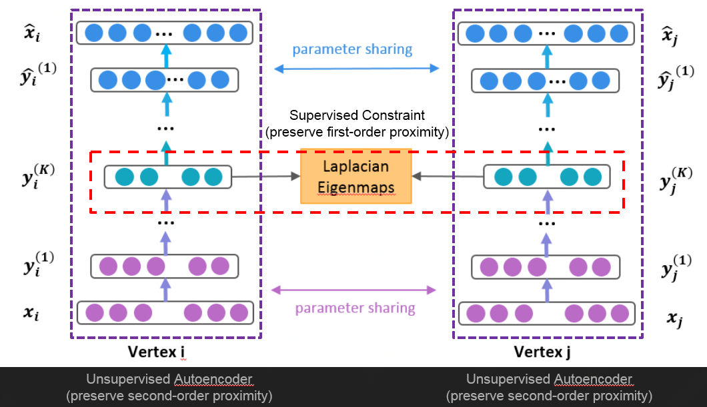

对节点的描述特征向量（比如点的「邻接向量」）使用autoencoder编码，取autoencoder中间层作为向量表示，以此来让获得2ndproximity（相似邻居的点相似度较高，因为两个节点的「邻接向量」相似，说明它们共享了很多邻居，最后映射成的向量y也会更接近）。

目标函数：

### GraRep

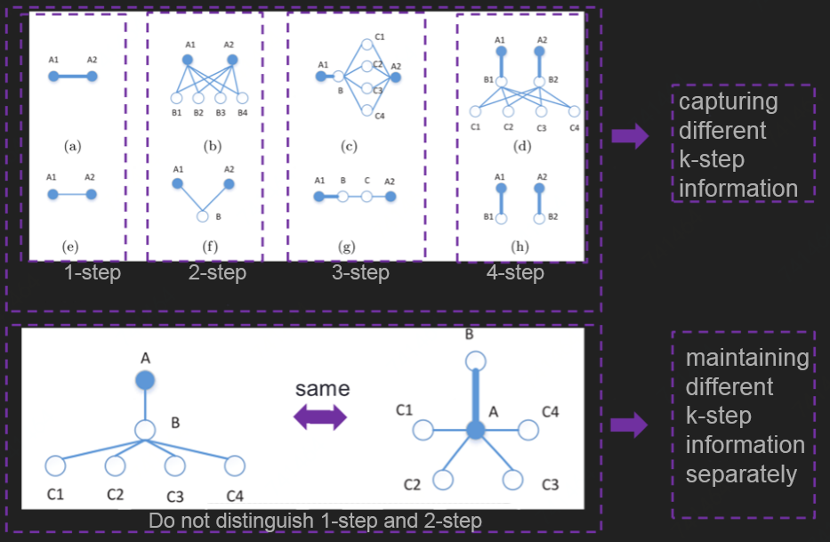

### [AROPE](http://pengcui.thumedialab.com/papers/NE-ArbitraryProximity.pdf)

不同的任务可能需要不同的order的近似，比如[下图](https://arxiv.org/pdf/1605.02115.pdf)。

 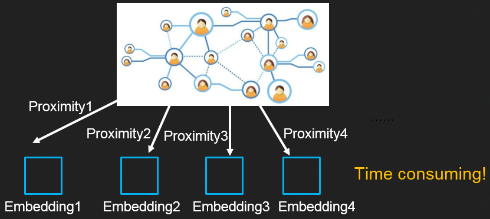 

我们直接想到的就是给不同的order赋予权重[\(比如等权重，指数衰减权重\)](https://cs.stanford.edu/~srijan/pubs/wsn-icdm16.pdf)。但是现存方法只能基于fixed high-order proximity，arbitrary-order proximity如何解决，如何保证精度与效率，AROPE\(Arbitrary-Order Proximity Preserved Network Embedding\)模型就是基于此问题提出。

## 基于Community Structures

### [M-NMF](https://www.aaai.org/ocs/index.php/AAAI/AAAI17/paper/download/14589/13763)

## 基于Hyper Edges

### [Structural Deep Embedding for Hyper-Networks](https://arxiv.org/abs/1711.10146)

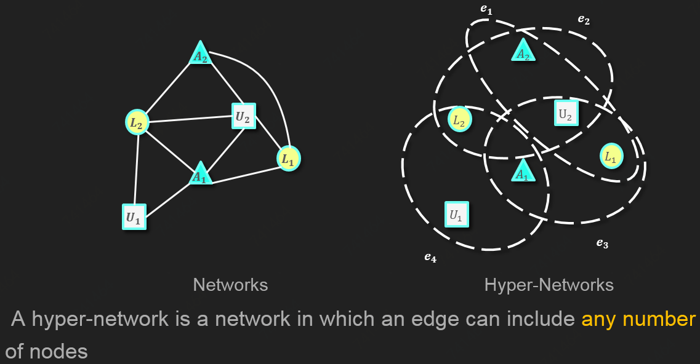

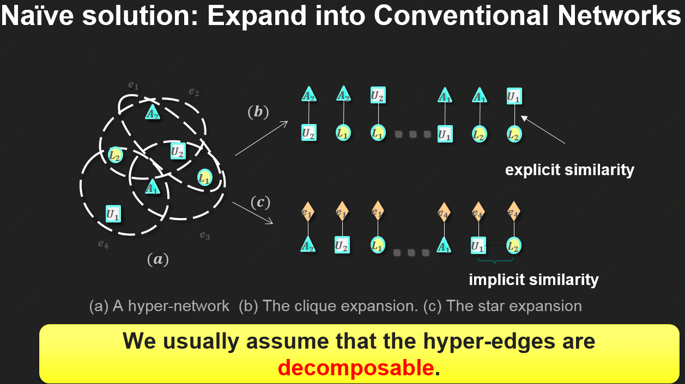

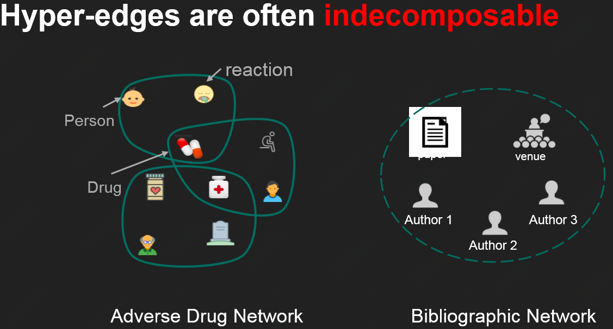

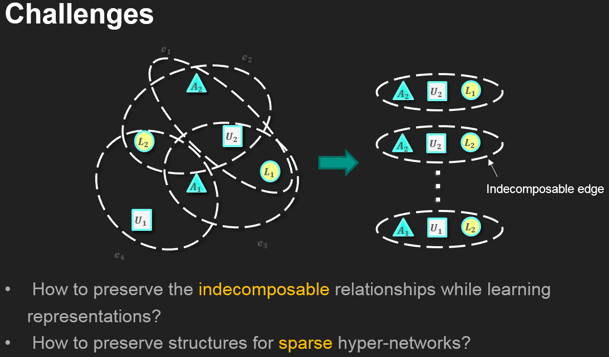

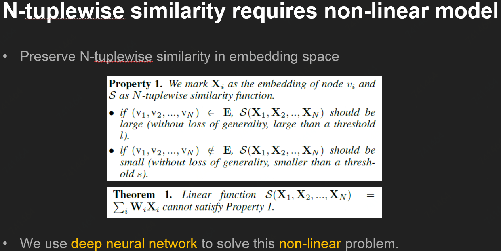

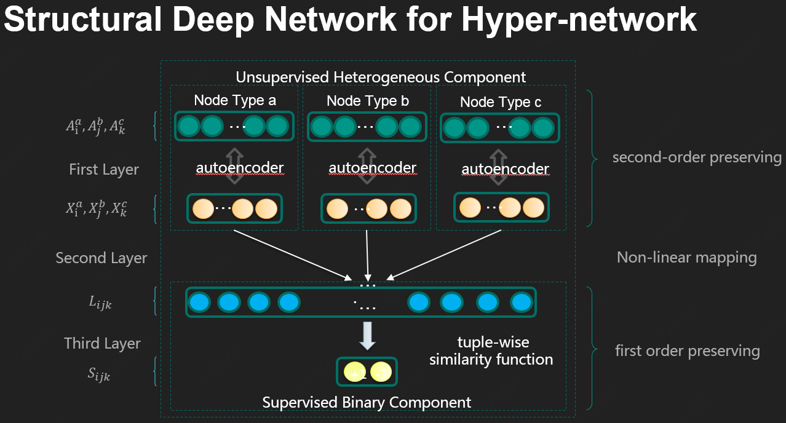

## 基于Global Structure

结点在网络不同的部分可能扮演相同角色，比如各个公司的经理在整个大的社会网络中扮演的角色相似，我们就是想办法去映射这种扮演角色或者说这个结点的某种重要度。

全局结构的关系不像局部好发掘好处理，比如下图，可以看出左图5，6结点相似，右图1，2结点相似。我们映射时左图局部的相似度可以反映在映射映射结果上，但是放到右图全局，就不那么好处理了。

### [Deep Recursive Network Embedding with Regular Equivalence](http://cuip.thumedialab.com/papers/NE-RegularEquivalence.pdf)

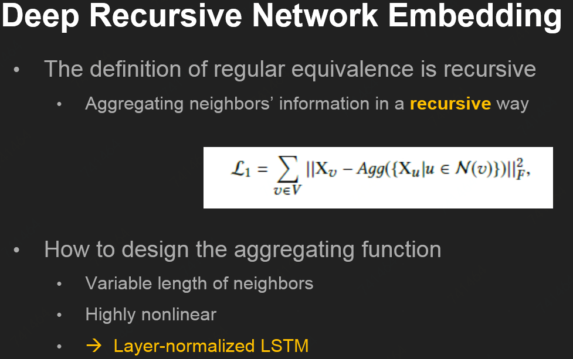

## Source







