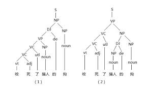

# 句法分析

句法分析\(Parsing\)的主要任务是识别出句子所包含的句法成分以及这些成分之间的关系，一般以句法树来表示句法分析的结果。句法分析是从单词串得到句法结构的过程，实现该过程的工具或程序被称为句法分析器\(Parser\)。基于分析目标可分为完全句法分析和局部句法分析。

句法分析主要有以下两个难点：1、歧义    2、搜索空间

* 歧义：自然语言区别于人工语言的饿一个重要特点就是它存在大量的歧义现象。人类自身可以依靠大量的先验知识有效地消除各种歧义，而机器由于在知识表示和获取方面存在严重不足，很难像人类那样进行句法消歧。
* 搜索空间：句法分析时一个极为复杂的任务，候选数个数随句子增多呈指数级增长，搜索空间巨大。因此，必须设计出合适的解码器，以确保能够在可以容忍的时间内搜索到模型定义最优解。

## 句法分析数据集

## 句法分析测评方法

## 句法分析工具

### SyntaxNet

SyntaxNet是深度神经网络在NLP中的一个应用。

### Stanford Parser

Stanford Parser是斯坦福大学自然语言小组开发的开源句法分析器，是基于概率统计句法分析的一个Java实现。该句法分析器目前提供了5个中文文法的实现。

  

