# Bert

本文的主题是自然语言处理中的预训练过程，会大致说下NLP中的预训练技术是一步一步如何发展到Bert模型的，从中可以很自然地看到Bert的思路是如何逐渐形成的，Bert的历史沿革是什么，继承了什么，创新了什么，为什么效果那么好，主要原因是什么，以及为何说模型创新不算太大，为何说Bert是近年来NLP重大进展的集大成者。我们一步一步来讲，而串起来这个故事的脉络就是自然语言的预训练过程，但是落脚点还是在Bert身上。要讲自然语言的预训练，得先从图像领域的预训练说起。

## 图像领域的预训练

自从深度学习火起来后，预训练过程就是做图像或者视频领域的一种比较常规的做法，有比较长的历史了，而且这种做法很有效，能明显促进应用的效果。

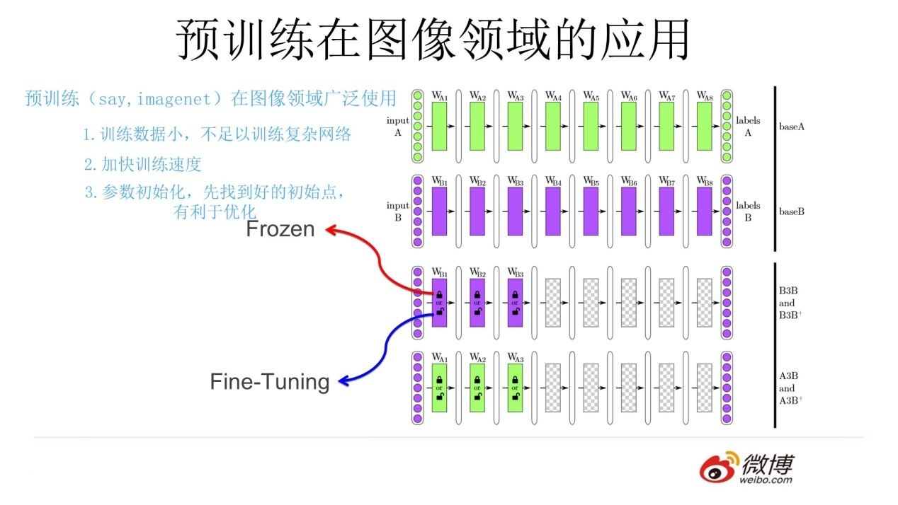

那么图像领域怎么做预训练呢，上图展示了这个过程，我们设计好网络结构以后，对于图像来说一般是CNN的多层叠加网络结构，可以先用某个训练集合比如训练集合A或者训练集合B对这个网络进行预先训练，在A任务上或者B任务上学会网络参数，然后存起来以备后用。假设我们面临第三个任务C，网络结构采取相同的网络结构，在比较浅的几层CNN结构，网络参数初始化的时候可以加载A任务或者B任务学习好的参数，其它CNN高层参数仍然随机初始化。之后我们用C任务的训练数据来训练网络，此时有两种做法，一种是浅层加载的参数在训练C任务过程中不动，这种方法被称为“Frozen”;另外一种是底层网络参数尽管被初始化了，在C任务训练过程中仍然随着训练的进程不断改变，这种一般叫“Fine-Tuning”，顾名思义，就是更好地把参数进行调整使得更适应当前的C任务。一般图像或者视频领域要做预训练一般都这么做。

这么做有几个好处，首先，如果手头任务C的训练集合数据量较少的话，现阶段的好用的CNN比如Resnet/Densenet/Inception等网络结构层数很深，几百万上千万参数量算起步价，上亿参数的也很常见，训练数据少很难很好地训练这么复杂的网络，但是如果其中大量参数通过大的训练集合比如ImageNet预先训练好直接拿来初始化大部分网络结构参数，然后再用C任务手头比较可怜的数据量上Fine-tuning过程去调整参数让它们更适合解决C任务，那事情就好办多了。这样原先训练不了的任务就能解决了，即使手头任务训练数据也不少，加个预训练过程也能极大加快任务训练的收敛速度，所以这种预训练方式是老少皆宜的解决方案，另外疗效又好，所以在做图像处理领域很快就流行开来。

那么新的问题来了，为什么这种预训练的思路是可行的？

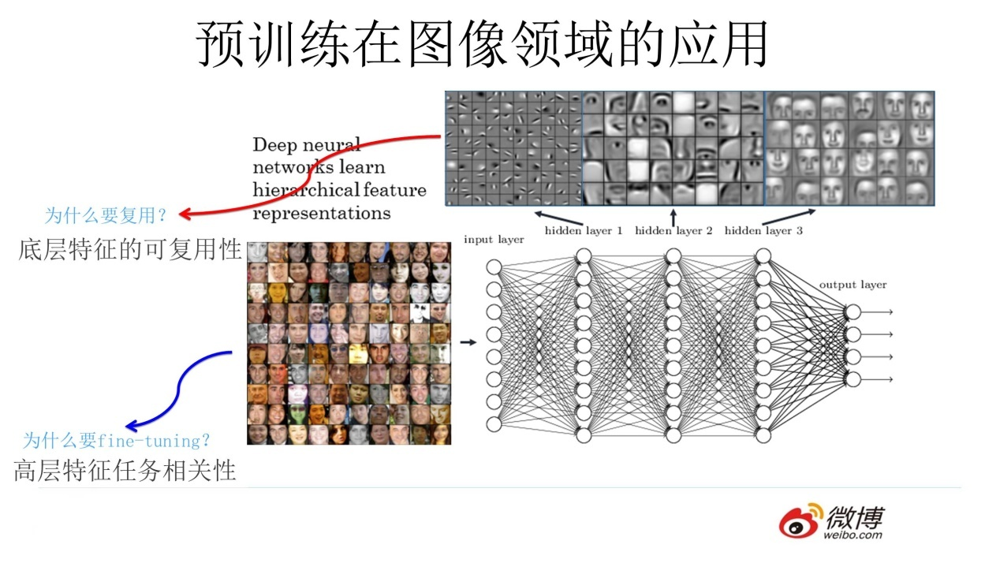

目前我们已经知道，对于层级的CNN结构来说，不同层级的神经元学习到了不同类型的图像特征，由底向上特征形成层级结构，如上图所示，如果我们手头是个人脸识别任务，训练好网络后，把每层神经元学习到的特征可视化肉眼看一看每层学到了啥特征，你会看到最底层的神经元学到的是线段等特征，图示的第二个隐层学到的是人脸五官的轮廓，第三层学到的是人脸的轮廓，通过三步形成了特征的层级结构，越是底层的特征越是所有不论什么领域的图像都会具备的比如边角线弧线等底层基础特征，越往上抽取出的特征越与手头任务相关。正因为此，所以预训练好的网络参数，尤其是底层的网络参数抽取出特征跟具体任务越无关，越具备任务的通用性，所以这是为何一般用底层预训练好的参数初始化新任务网络参数的原因。而高层特征跟任务关联较大，实际可以不用使用，或者采用Fine-tuning用新数据集合清洗掉高层无关的特征抽取器。

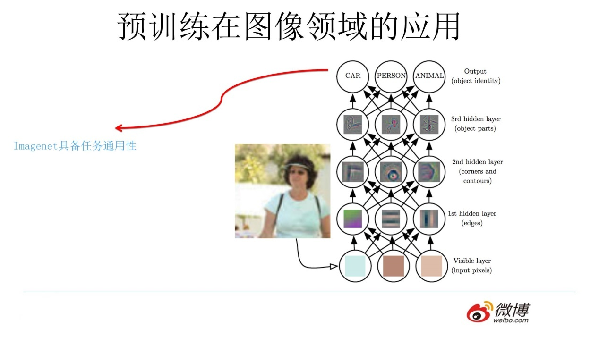

一般我们喜欢用ImageNet来做网络的预训练，主要有两点，一方面ImageNet是图像领域里有超多事先标注好训练数据的数据集合，分量足是个很大的优势，量越大训练出的参数越靠谱；另外一方面因为ImageNet有1000类，类别多，算是通用的图像数据，跟领域没太大关系，所以通用性好，预训练完后哪哪都能用，是个万金油。分量足的万金油当然老少通吃，人人喜爱。

听完上述话，如果你是具备研究素质的人，也就是说具备好奇心，你一定会问下面这个问题：”既然图像领域预训练这么好用，那干嘛自然语言处理不做这个事情呢？是不是搞NLP的人比搞CV的傻啊？就算你傻，你看见人家这么做，有样学样不就行了吗？这不就是创新吗，也许能成，万一成了，你看，你的成功来得就是这么突然!”

嗯，好问题，其实搞NLP的人一点都不比你傻，早就有人尝试过了，不过总体而言不太成功而已。听说过word embedding吗？2003年出品，陈年技术，馥郁芳香。word embedding其实就是NLP里的早期预训练技术。当然也不能说word embedding不成功，一般加到下游任务里，都能有1到2个点的性能提升，只是没有那么耀眼的成功而已。

## Word Embedding历史

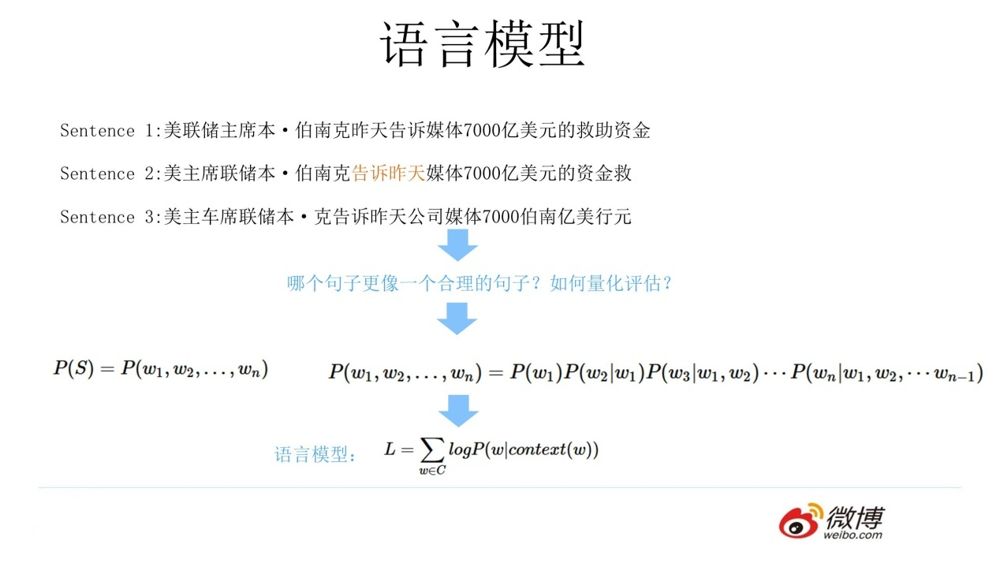

什么是语言模型？其实看上面这张PPT上扣下来的图就明白了，为了能够量化地衡量哪个句子更像一句人话，可以设计如上图所示函数，核心函数P的思想是根据句子里面前面的一系列前导单词预测后面跟哪个单词的概率大小（理论上除了上文之外，也可以引入单词的下文联合起来预测单词出现概率）。句子里面每个单词都有个根据上文预测自己的过程，把所有这些单词的产生概率乘起来，数值越大代表这越像一句人话。

假设现在让你设计一个神经网络结构，去做这个语言模型的任务，就是说给你很多语料做这个事情，训练好一个神经网络，训练好之后，以后输入一句话的前面几个单词，要求这个网络输出后面紧跟的单词应该是哪个，你会怎么做？

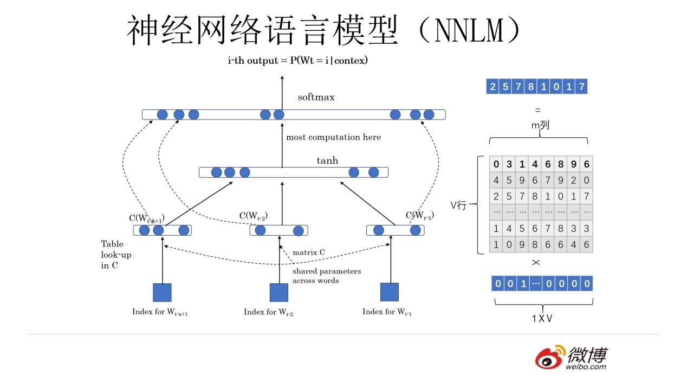

你可以像上图这么设计这个网络结构，这其实就是大名鼎鼎的中文人称“神经网络语言模型”，英文小名NNLM的网络结构，用来做语言模型。这个工作有年头了，是个陈年老工作，是Bengio 在2003年发表在JMLR上的论文。它生于2003，火于2013，以后是否会不朽暂且不知，但是不幸的是出生后应该没有引起太大反响，沉寂十年终于时来运转沉冤得雪，在2013年又被NLP考古工作者从海底湿淋淋地捞出来了祭入神殿。为什么会发生这种技术奇遇记？你要想想2013年是什么年头，是深度学习开始渗透NLP领域的光辉时刻，万里长征第一步，而NNLM可以算是南昌起义第一枪。在深度学习火起来之前，极少有人用神经网络做NLP问题，如果你10年前坚持用神经网络做NLP，估计别人会认为你这人神经有问题。所谓红尘滚滚，谁也挡不住历史发展趋势的车轮，这就是个很好的例子。

上面是闲话，闲言碎语不要讲，我们回来讲一讲NNLM的思路。先说训练过程，现在看其实很简单，见过RNN、LSTM、CNN后的你们回头再看这个网络甚至显得有些简陋。学习任务是输入某个句中单词 $$W_t="Bert"$$ 前面句子的 $$t-1$$ 个单词，要求网络正确预测单词Bert，即最大化：

                                              $$P(W_t="Bert"|W_1,W_2,\dots,W_{t-1};\theta)$$ 

前面任意单词 $$W_i$$ 用Onehot编码（比如：0001000）作为原始单词输入，之后乘以矩阵 $$Q$$ 后获得向量 $$C(W_i)$$ ，每个单词的 $$C(W_i)$$ 拼接，上接隐层，然后接softmax去预测后面应该后续接哪个单词。这个 $$C(W_i)$$ 是什么？这其实就是单词对应的Word Embedding值，那个矩阵 $$Q$$ 包含 $$V$$ 行， $$V$$ 代表词典大小，每一行内容代表对应单词的Word embedding值。只不过 $$Q$$ 的内容也是网络参数，需要学习获得，训练刚开始用随机值初始化矩阵 $$Q$$ ，当这个网络训练好之后，矩阵 $$Q$$ 的内容被正确赋值，每一行代表一个单词对应的Word embedding值。所以你看，通过这个网络学习语言模型任务，这个网络不仅自己能够根据上文预测后接单词是什么，同时获得一个副产品，就是那个矩阵 $$Q$$ ，这就是单词的Word Embedding是被如何学会的。

2013年最火的用语言模型做Word Embedding的工具是Word2Vec，后来又出了Glove，Word2Vec是怎么工作的呢？看下图。

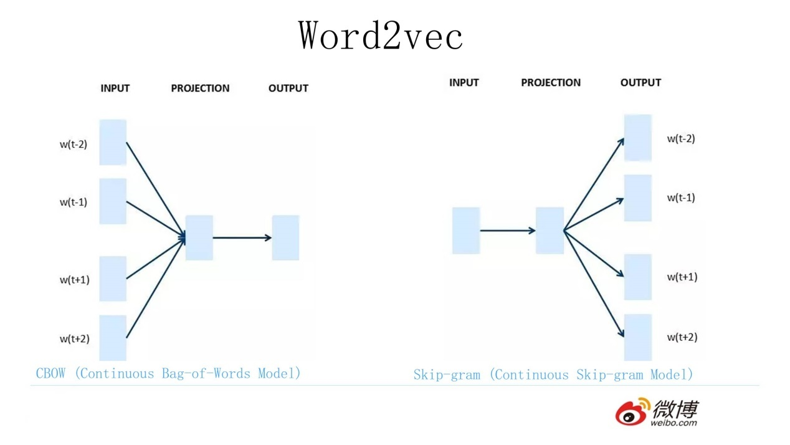

Word2Vec的网络结构其实和NNLM是基本类似的，只是这个图长得清晰度差了点，看上去不像，其实它们是亲兄弟。不过这里需要指出：尽管网络结构相近，而且也是做语言模型任务，但是其训练方法不太一样。Word2Vec有两种训练方法，一种叫CBOW，核心思想是从一个句子里面把一个词抠掉，用这个词的上文和下文去预测被抠掉的这个词；第二种叫做Skip-gram，和CBOW正好反过来，输入某个单词，要求网络预测它的上下文单词。而你回头看看，NNLM是怎么训练的？是输入一个单词的上文，去预测这个单词。这是有显著差异的。为什么Word2Vec这么处理？原因很简单，因为Word2Vec和NNLM不一样，NNLM的主要任务是要学习一个解决语言模型任务的网络结构，语言模型就是要看到上文预测下文，而word embedding只是无心插柳的一个副产品。但是Word2Vec目标不一样，它单纯就是要word embedding的，这是主产品，所以它完全可以随性地这么去训练网络。

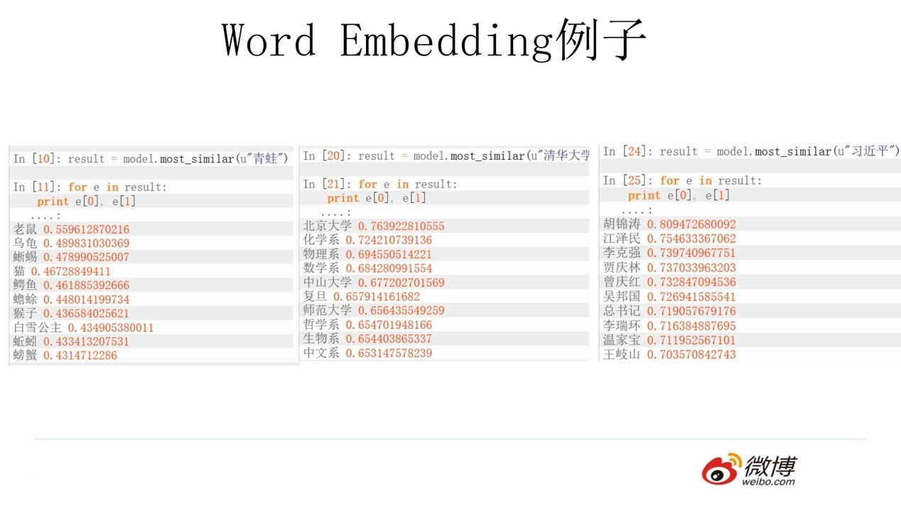

使用Word2Vec或者Glove，通过做语言模型任务，就可以获得每个单词的Word Embedding，那么这种方法的效果如何呢？上图给了网上找的几个例子，可以看出有些例子效果还是很不错的，一个单词表达成Word Embedding后，很容易找出语义相近的其它词汇。

我们的主题是预训练，那么问题是Word Embedding这种做法能算是预训练吗？这其实就是标准的预训练过程。要理解这一点要看看学会Word Embedding后下游任务是怎么用它的。

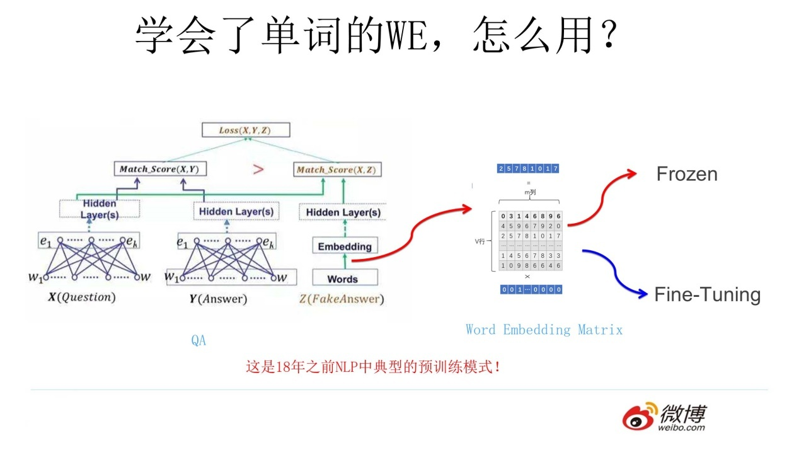

假设如上图所示，我们有个NLP的下游任务，比如QA，就是问答问题，所谓问答问题，指的是给定一个问题X，给定另外一个句子Y,要判断句子Y是否是问题X的正确答案。问答问题假设设计的网络结构如上图所示，这里不展开讲了，懂得自然懂，不懂的也没关系，因为这点对于本文主旨来说不关键，关键是网络如何使用训练好的Word Embedding的。它的使用方法其实和前面讲的NNLM是一样的，句子中每个单词以Onehot形式作为输入，然后乘以学好的Word Embedding矩阵 $$Q$$ ，就直接取出单词对应的Word Embedding了。这乍看上去好像是个查表操作，不像是预训练的做法是吧？其实不然，那个Word Embedding矩阵 $$Q$$ 其实就是网络Onehot层到embedding层映射的网络参数矩阵。所以你看到了，使用Word Embedding等价于什么？等价于把Onehot层到embedding层的网络用预训练好的参数矩阵 $$Q$$ 初始化了。这跟前面讲的图像领域的低层预训练过程其实是一样的，区别无非Word Embedding只能初始化第一层网络参数，再高层的参数就无能为力了。下游NLP任务在使用Word Embedding的时候也类似图像有两种做法，一种是Frozen，就是Word Embedding那层网络参数固定不动；另外一种是Fine-Tuning，就是Word Embedding这层参数使用新的训练集合训练也需要跟着训练过程更新掉。

上面这种做法就是18年之前NLP领域里面采用预训练的典型做法，之前说过，Word Embedding其实对于很多下游NLP任务是有帮助的，只是帮助没有大到闪瞎忘记戴墨镜的围观群众的双眼而已。那么新问题来了，为什么这样训练及使用Word Embedding的效果没有期待中那么好呢？答案很简单，因为Word Embedding有问题呗。这貌似是个比较弱智的答案，关键是Word Embedding存在什么问题？这其实是个好问题。

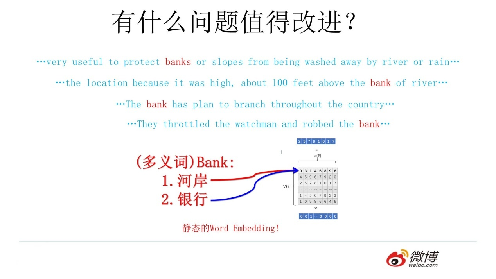

这片在Word Embedding头上笼罩了好几年的乌云是什么？是多义词问题。我们知道，多义词是自然语言中经常出现的现象，也是语言灵活性和高效性的一种体现。多义词对Word Embedding来说有什么负面影响？如上图所示，比如多义词Bank，有两个常用含义，但是Word Embedding在对bank这个单词进行编码的时候，是区分不开这两个含义的，因为它们尽管上下文环境中出现的单词不同，但是在用语言模型训练的时候，不论什么上下文的句子经过word2vec，都是预测相同的单词bank，而同一个单词占的是同一行的参数空间，这导致两种不同的上下文信息都会编码到相同的word embedding空间里去。所以word embedding无法区分多义词的不同语义，这就是它的一个比较严重的问题。ELMO提供了一种简洁优雅的解决方案。

## 从Word Embedding到ELMO

ELMO是“Embedding from Language Models”的简称，其实这个名字并没有反应它的本质思想，提出ELMO的论文题目：“Deep contextualized word representation”更能体现其精髓，而精髓在哪里？在deep contextualized这个短语，一个是deep，一个是context，其中context更关键。在此之前的Word Embedding本质上是个静态的方式，所谓静态指的是训练好之后每个单词的表达就固定住了，以后使用的时候，不论新句子上下文单词是什么，这个单词的Word Embedding不会跟着上下文场景的变化而改变，所以对于比如Bank这个词，它事先学好的Word Embedding中混合了几种语义 ，在应用中来了个新句子，即使从上下文中（比如句子包含money等词）明显可以看出它代表的是“银行”的含义，但是对应的Word Embedding内容也不会变，它还是混合了多种语义。这是为何说它是静态的，这也是问题所在。ELMO的本质思想是：我事先用语言模型学好一个单词的Word Embedding，此时多义词无法区分，不过这没关系。在我实际使用Word Embedding的时候，单词已经具备了特定的上下文了，这个时候我可以根据上下文单词的语义去调整单词的Word Embedding表示，这样经过调整后的Word Embedding更能表达在这个上下文中的具体含义，自然也就解决了多义词的问题了。所以ELMO本身是个根据当前上下文对Word Embedding动态调整的思路。

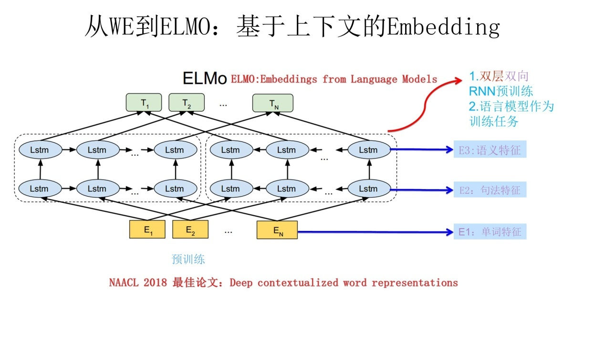

 ELMO采用了典型的两阶段过程，第一个阶段是利用语言模型进行预训练；第二个阶段是在做下游任务时，从预训练网络中提取对应单词的网络各层的Word Embedding作为新特征补充到下游任务中。上图展示的是其预训练过程，它的网络结构采用了双层双向LSTM，目前语言模型训练的任务目标是根据单词 $$W_i$$ 的上下文去正确预测单词 $$W_i$$ ， $$W_i$$  之前的单词序列Context-before称为上文，之后的单词序列Context-after称为下文。图中左端的前向双层LSTM代表正方向编码器，输入的是从左到右顺序的除了预测单词外 $$W_i$$ 的上文Context-before；右端的逆向双层LSTM代表反方向编码器，输入的是从右到左的逆序的句子下文Context-after；每个编码器的深度都是两层LSTM叠加。这个网络结构其实在NLP中是很常用的。使用这个网络结构利用大量语料做语言模型任务就能预先训练好这个网络，如果训练好这个网络后，输入一个新句子 $$S_{\text{new}}$$ ，句子中每个单词都能得到对应的三个Embedding:最底层是单词的Word Embedding，往上走是第一层双向LSTM中对应单词位置的Embedding，这层编码单词的句法信息更多一些；再往上走是第二层LSTM中对应单词位置的Embedding，这层编码单词的语义信息更多一些。也就是说，ELMO的预训练过程不仅仅学会单词的Word Embedding，还学会了一个双层双向的LSTM网络结构，而这两者后面都有用。

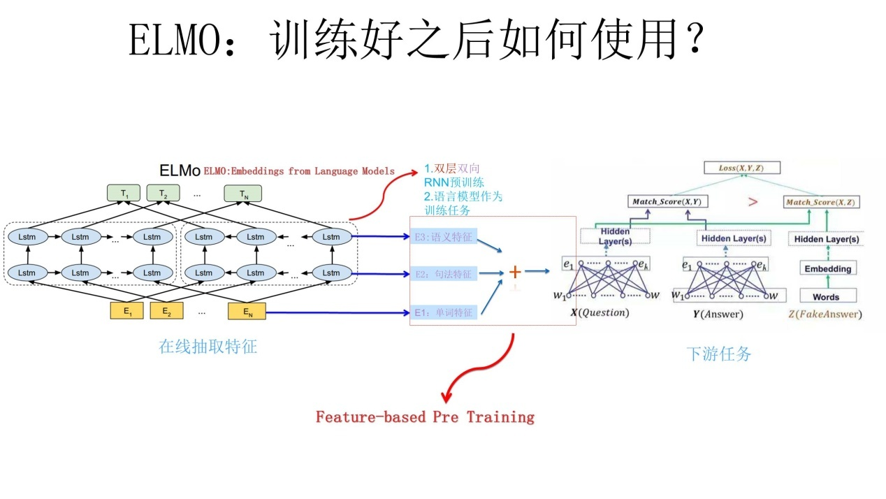

上面介绍的是ELMO的第一阶段：预训练阶段。那么预训练好网络结构后，如何给下游任务使用呢？上图展示了下游任务的使用过程，比如我们的下游任务仍然是QA问题，此时对于问句X，我们可以先将句子X作为预训练好的ELMO网络的输入，这样句子X中每个单词在ELMO网络中都能获得对应的三个Embedding，之后给予这三个Embedding中的每一个Embedding一个权重a，这个权重可以学习得来，根据各自权重累加求和，将三个Embedding整合成一个。然后将整合后的这个Embedding作为X句在自己任务的那个网络结构中对应单词的输入，以此作为补充的新特征给下游任务使用。对于上图所示下游任务QA中的回答句子Y来说也是如此处理。因为ELMO给下游提供的是每个单词的特征形式，所以这一类预训练的方法被称为“Feature-based Pre-Training”。至于为何这么做能够达到区分多义词的效果，你可以想一想，其实比较容易想明白原因。

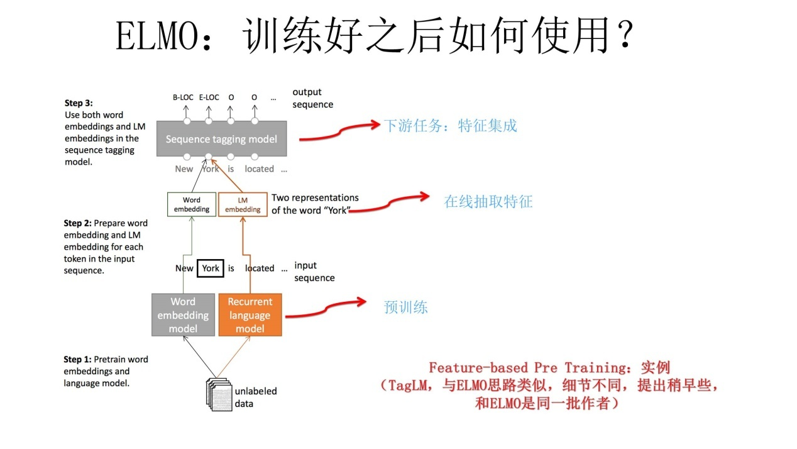

上面这个图是TagLM采用类似ELMO的思路做命名实体识别任务的过程，其步骤基本如上述ELMO的思路，所以此处不展开说了。TagLM的论文发表在2017年的ACL会议上，作者就是AllenAI里做ELMO的那些人，所以可以将TagLM看做ELMO的一个前导工作。前几天这个PPT发出去后有人质疑说FastAI的在18年4月提出的ULMFiT才是抛弃传统Word Embedding引入新模式的开山之作，我深不以为然。首先TagLM出现的更早而且模式基本就是ELMO的思路；另外ULMFiT使用的是三阶段模式，在通用语言模型训练之后，加入了一个领域语言模型预训练过程，而且论文重点工作在这块，方法还相对比较繁杂，这并不是一个特别好的主意，因为领域语言模型的限制是它的规模往往不可能特别大，精力放在这里不太合适，放在通用语言模型上感觉更合理；再者，尽管ULFMiT实验做了6个任务，但是都集中在分类问题相对比较窄，不如ELMO验证的问题领域广，我觉得这就是因为第二步那个领域语言模型带来的限制。所以综合看，尽管ULFMiT也是个不错的工作，但是重要性跟ELMO比至少还是要差一档，当然这是我个人看法。每个人的学术审美口味不同，我个人一直比较赞赏要么简洁有效体现问题本质要么思想特别游离现有框架脑洞开得异常大的工作，所以ULFMiT我看论文的时候就感觉看着有点难受，觉得这工作没抓住重点而且特别麻烦，但是看ELMO论文感觉就赏心悦目，觉得思路特别清晰顺畅，看完暗暗点赞，心里说这样的文章获得NAACL2018最佳论文当之无愧，比ACL很多最佳论文也好得不是一点半点，这就是好工作带给一个有经验人士的一种在读论文时候就能产生的本能的感觉，也就是所谓的这道菜对上了食客的审美口味。

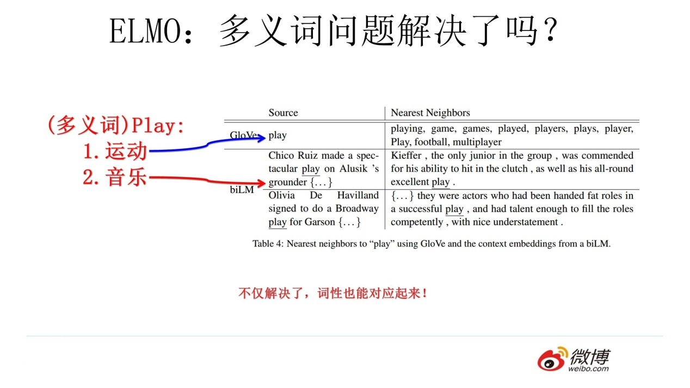

前面我们提到静态Word Embedding无法解决多义词的问题，那么ELMO引入上下文动态调整单词的embedding后多义词问题解决了吗？解决了，而且比我们期待的解决得还要好。上图给了个例子，对于Glove训练出的Word Embedding来说，多义词比如play，根据它的embedding找出的最接近的其它单词大多数集中在体育领域，这很明显是因为训练数据中包含play的句子中体育领域的数量明显占优导致；而使用ELMO，根据上下文动态调整后的embedding不仅能够找出对应的“演出”的相同语义的句子，而且还可以保证找出的句子中的play对应的词性也是相同的，这是超出期待之处。之所以会这样，是因为我们上面提到过，第一层LSTM编码了很多句法信息，这在这里起到了重要作用。

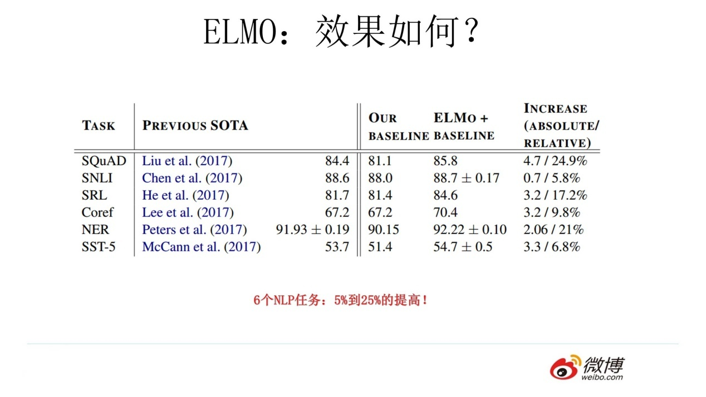

ELMO经过这般操作，效果如何呢？实验效果见上图，6个NLP任务中性能都有幅度不同的提升，最高的提升达到25%左右，而且这6个任务的覆盖范围比较广，包含句子语义关系判断，分类任务，阅读理解等多个领域，这说明其适用范围是非常广的，普适性强，这是一个非常好的优点。

那么站在现在这个时间节点看，ELMO有什么值得改进的缺点呢？首先，一个非常明显的缺点在特征抽取器选择方面，ELMO使用了LSTM而不是新贵Transformer，Transformer是谷歌在17年做机器翻译任务的“Attention is all you need”的论文中提出的，引起了相当大的反响，很多研究已经证明了Transformer提取特征的能力是要远强于LSTM的。如果ELMO采取Transformer作为特征提取器，那么估计Bert的反响远不如现在的这种火爆场面。另外一点，ELMO采取双向拼接这种融合特征的能力可能比Bert一体化的融合特征方式弱，但是，这只是一种从道理推断产生的怀疑，目前并没有具体实验说明这一点。

我们如果把ELMO这种预训练方法和图像领域的预训练方法对比，发现两者模式看上去还是有很大差异的。除了以ELMO为代表的这种基于特征融合的预训练方法外，NLP里还有一种典型做法，这种做法和图像领域的方式就是看上去一致的了，一般将这种方法称为“基于Fine-tuning的模式”，而GPT就是这一模式的典型开创者。

## **从Word Embedding到GPT**

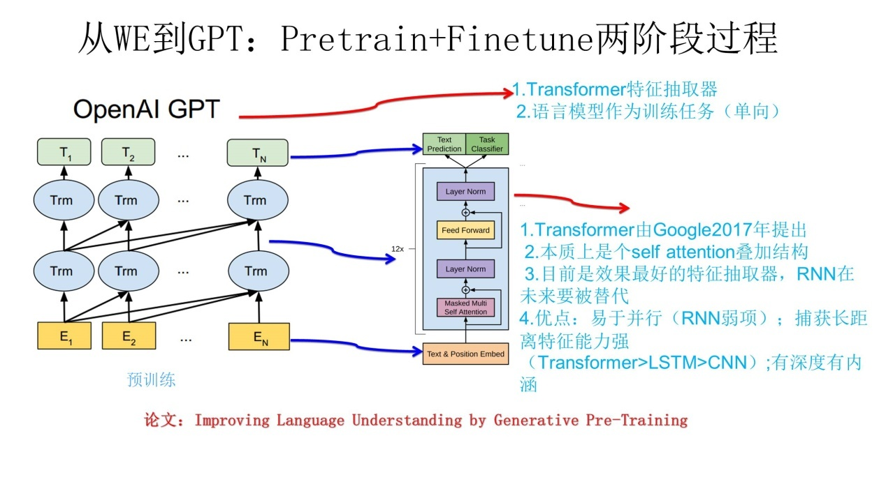

 GPT是“Generative Pre-Training”的简称，从名字看其含义是指的生成式的预训练。GPT也采用两阶段过程，第一个阶段是利用语言模型进行预训练，第二阶段通过Fine-tuning的模式解决下游任务。上图展示了GPT的预训练过程，其实和ELMO是类似的，主要不同在于两点：首先，特征抽取器不是用的RNN，而是用的Transformer，上面提到过它的特征抽取能力要强于RNN，这个选择很明显是很明智的；其次，GPT的预训练虽然仍然是以语言模型作为目标任务，但是采用的是单向的语言模型，所谓“单向”的含义是指：语言模型训练的任务目标是根据 ****$$W_i$$ 单词的上下文去正确预测单词 ****$$W_i$$ ， ****$$W_i$$ 之前的单词序列Context-before称为上文，之后的单词序列Context-after称为下文。ELMO在做语言模型预训练的时候，预测单词 ****$$W_i$$ 同时使用了上文和下文，而GPT则只采用Context-before这个单词的上文来进行预测，而抛开了下文。这个选择现在看不是个太好的选择，原因很简单，它没有把单词的下文融合进来，这限制了其在更多应用场景的效果，比如阅读理解这种任务，在做任务的时候是可以允许同时看到上文和下文一起做决策的。如果预训练时候不把单词的下文嵌入到Word Embedding中，是很吃亏的，白白丢掉了很多信息。

 这里强行插入一段简单提下Transformer，尽管上面提到了，但是说的还不完整，补充两句。首先，Transformer是个叠加的“自注意力机制（Self Attention）”构成的深度网络，是目前NLP里最强的特征提取器，注意力这个机制在此被发扬光大，从任务的配角不断抢戏，直到Transformer一跃成为踢开RNN和CNN传统特征提取器，荣升头牌，大红大紫。你问了：什么是注意力机制？这里再插个广告，对注意力不了解的可以参考鄙人16年出品17年修正的下文：“[深度学习中的注意力模型](https://zhuanlan.zhihu.com/p/37601161)”，补充下相关基础知识，如果不了解注意力机制你肯定会落后时代的发展。而介绍Transformer比较好的文章可以参考以下两篇文章：一个是Jay Alammar可视化地介绍Transformer的博客文章[The Illustrated Transformer](http://link.zhihu.com/?target=https%3A//jalammar.github.io/illustrated-transformer/) ，非常容易理解整个机制，建议先从这篇看起；然后可以参考哈佛大学NLP研究组写的“[The Annotated Transformer.](http://link.zhihu.com/?target=http%3A//nlp.seas.harvard.edu/2018/04/03/attention.html) ”，代码原理双管齐下，讲得非常清楚。我相信上面两个文章足以让你了解Transformer了，所以这里不展开介绍。

其次，我的判断是Transformer在未来会逐渐替代掉RNN成为主流的NLP工具，RNN一直受困于其并行计算能力，这是因为它本身结构的序列性依赖导致的，尽管很多人在试图通过修正RNN结构来修正这一点，但是我不看好这种模式，因为给马车换轮胎不如把它升级到汽车，这个道理很好懂，更何况目前汽车的雏形已经出现了，干嘛还要执着在换轮胎这个事情呢？是吧？再说CNN，CNN在NLP里一直没有形成主流，CNN的最大优点是易于做并行计算，所以速度快，但是在捕获NLP的序列关系尤其是长距离特征方面天然有缺陷，不是做不到而是做不好，目前也有很多改进模型，但是特别成功的不多。综合各方面情况，很明显Transformer同时具备并行性好，又适合捕获长距离特征，没有理由不在赛跑比赛中跑不过RNN和CNN。

好了，题外话结束，我们再回到主题，接着说GPT。上面讲的是GPT如何进行第一阶段的预训练，那么假设预训练好了网络模型，后面下游任务怎么用？它有自己的个性，和ELMO的方式大有不同。

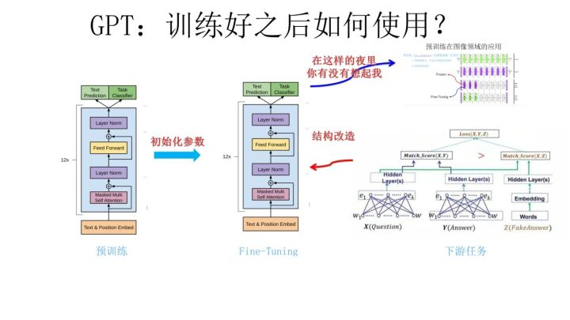

上图展示了GPT在第二阶段如何使用。首先，对于不同的下游任务来说，本来你可以任意设计自己的网络结构，现在不行了，你要向GPT的网络结构看齐，把任务的网络结构改造成和GPT的网络结构是一样的。然后，在做下游任务的时候，利用第一步预训练好的参数初始化GPT的网络结构，这样通过预训练学到的语言学知识就被引入到你手头的任务里来了，这是个非常好的事情。再次，你可以用手头的任务去训练这个网络，对网络参数进行Fine-tuning，使得这个网络更适合解决手头的问题。就是这样。看到了么？这有没有让你想起最开始提到的图像领域如何做预训练的过程（请参考上图那句非常容易暴露年龄的歌词）？对，这跟那个模式是一模一样的。

这里引入了一个新问题：对于NLP各种花样的不同任务，怎么改造才能靠近GPT的网络结构呢？

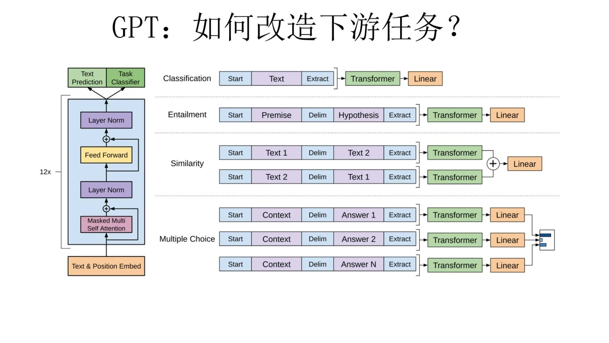

GPT论文给了一个改造施工图如上，其实也很简单：对于分类问题，不用怎么动，加上一个起始和终结符号即可；对于句子关系判断问题，比如Entailment，两个句子中间再加个分隔符即可；对文本相似性判断问题，把两个句子顺序颠倒下做出两个输入即可，这是为了告诉模型句子顺序不重要；对于多项选择问题，则多路输入，每一路把文章和答案选项拼接作为输入即可。从上图可看出，这种改造还是很方便的，不同任务只需要在输入部分施工即可。

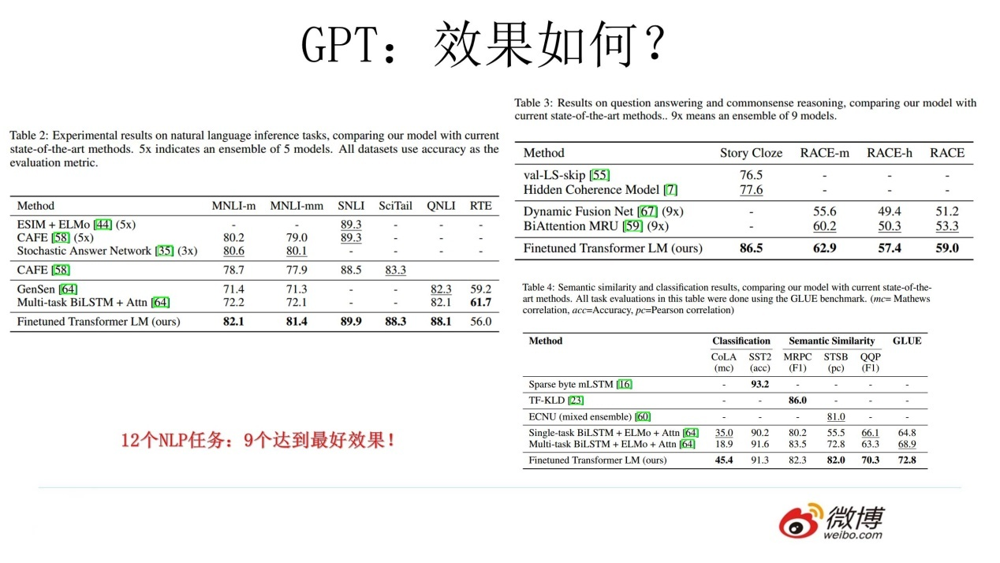

GPT的效果是非常令人惊艳的，在12个任务里，9个达到了最好的效果，有些任务性能提升非常明显。

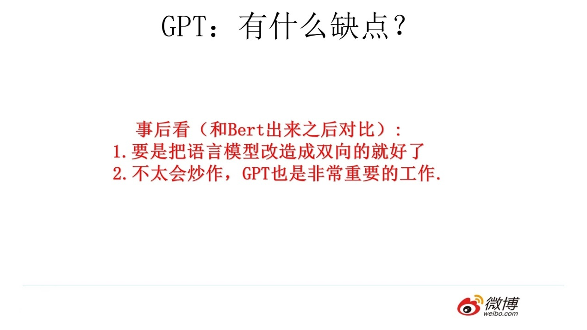

那么站在现在的时间节点看，GPT有什么值得改进的地方呢？其实最主要的就是那个单向语言模型，如果改造成双向的语言模型任务估计也没有Bert太多事了。当然，即使如此GPT也是非常非常好的一个工作，跟Bert比，其作者炒作能力亟待提升。

## Bert

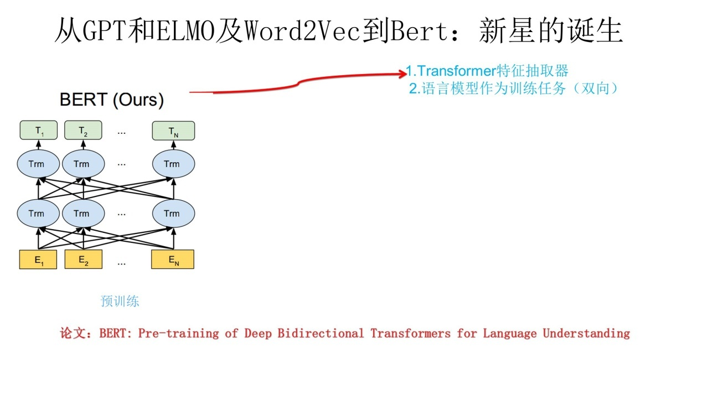

## Source



