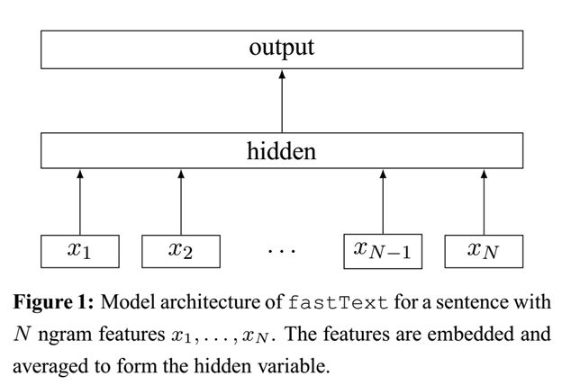

# fastText

word2vec是一种无监督模型，而fastText则是对应的有监督模型，都属于Tomas Mikolov的杰作。fastText由Facebook在2016年[开源](https://github.com/facebookresearch/fastText)，学习的目标不再是词语内在的共现，而是人工标注的label。

## n-gram的label

word2vec把语料库中的每个单词当成原子的，它会为每个单词生成一个向量。这忽略了单词内部的形态特征，比如：“apple” 和“apples”，两个单词都有较多公共字符，即它们的内部形态类似，但是在传统的word2vec中，这种单词内部形态信息因为它们被转换成不同的id丢失了。为了克服这个问题，fastText使用了字符级别的n-grams来表示一个单词。对于单词“apple”，假设n的取值为3，则它的trigram有“&lt;ap”，"app"，"ppl"，"ple"，"le&gt;"。

其中，&lt;表示前缀，&gt;表示后缀。于是，我们可以用这些trigram来表示“apple”这个单词，进一步，我们可以用这5个trigram的向量叠加来表示“apple”的词向量。这带来两点好处：

* 对于低频词生成的词向量效果会更好。因为它们的n-gram可以和其它词共享。
* 对于训练词库之外的单词，仍然可以构建它们的词向量。我们可以叠加它们的字符级n-gram向量。

## 模型架构

fastText模型架构如下所示，与word2vec中的CBOW模型类似， 也只有三层：输入层、隐含层、输出层（Hierarchical Softmax），输入都是多个经向量表示的单词，输出都是一个特定的target，隐含层都是对多个词向量的叠加平均。不同的是，CBOW的输入是目标单词的上下文，fastText的输入是多个单词及其n-gram特征，这些特征用来表示单个文档；CBOW的输入单词被oneHot编码过，fastText的输入特征是被embedding过；CBOW的输出是目标词汇，fastText的输出是文档对应的类标。

值得注意的是，fastText在输入时，将单词的字符级别的n-gram向量作为额外的特征（其中 $$x_1,x_2,\dots,x_{N-1},x_N$$ 表示一个句子对应的n-gram特征，相比词袋模型，n-gram特征会关注词语的顺序，这些特征被转化为词向量并进行平均从而形成隐层变量）；在输出时，fastText采用了分层Softmax，大大降低了模型训练时间。

对于 $$N$$ 个文档的集合，fastText对应的损失函数为：

                                                         $$-\frac{1}{N}\sum\limits_{n=1}^Ny_n\log(f(BAx_n))$$ 

其中 $$x_n$$ 是第 $$n$$ 个文档对应的归一化统计特征， $$A$$ 和 $$B$$ 是权重矩阵，这个模型可以在多个CPU上使用梯度下降方法并行计算。

与word2vec类似，fastText也采用了层次式的分类器，只是word2vec是针对单词的，fastText则针对label

## 核心思想

仔细观察模型的后半部分，即从隐含层输出到输出层输出，会发现它就是一个softmax线性多类别分类器，分类器的输入是一个用来表征当前文档的向量；模型的前半部分，即从输入层输入到隐含层输出部分，主要在做一件事情：生成用来表征文档的向量。那么它是如何做的呢？叠加构成这篇文档的所有词及n-gram的词向量，然后取平均。叠加词向量背后的思想就是传统的词袋法，即将文档看成一个由词构成的集合。

于是fastText的核心思想就是：将整篇文档的词及n-gram向量叠加平均得到文档向量，然后使用文档向量做softmax多分类。这中间涉及到两个技巧：字符级n-gram特征的引入以及分层Softmax分类。

## Source





