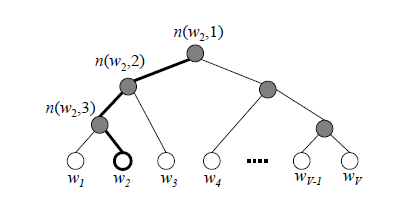

# word2vec

 word2vec为什么不用现成的DNN模型，要继续优化出新方法呢？最主要的问题是DNN模型的这个处理过程非常耗时。我们的词汇表一般在百万级别以上，这意味着我们DNN的输出层需要进行softmax计算各个词的输出概率的的计算量很大。

word2vec转换的向量相比于one-hot编码是低维稠密的。我们称其为Dristributed representation，这可以解决one-hot representation的问题，它的思路是通过训练，将每个词都映射到一个较短的词向量上来。所有的这些词向量就构成了向量空间，进而可以用普通的统计学的方法来研究词与词之间的关系。这个较短的词向量维度我们可以在训练时自己来指定。有了用Dristributed representation表示的较短的词向量，我们就可以较容易的分析词之间的关系了，比如我们将词的维度降维到2维，有一个有趣的研究表明，用下图的词向量表示我们的词时，我们可以发现：

                                                    $$\vec{King}-\vec{Man}+\vec{Woman}=\vec{Queen}$$ 

为了加速训练过程，Google论文里真实实现的word2vec对模型提出了两种改进思路，即Hierarchical Softmax模型和Negative Sampling模型。Hierarchical Softmax是用输出值的霍夫曼编码代替原本的one-hot向量，用霍夫曼树替代Softmax的计算过程。Negative Sampling（简称NEG）使用随机采用替代Softmax计算概率，它是另一种更严谨的抽样模型NCE的简化版本。将这两种算法与前面的两个模型组合，在Google的论文里一共包含了4种Word2Vec的实现：

* Hierarchical Softmax CBOW 模型
* Hierarchical Softmax Skip-Gram 模型
* Negative Sampling CBOW 模型
* Negative Sampling Skip-Gram 模型

## 霍夫曼树

我们已经知道word2vec也使用了CBOW与Skip-Gram来训练模型与得到词向量，但是并没有使用传统的DNN模型。在Hierarchical Softmax中，使用的数据结构是用霍夫曼树来代替隐藏层和输出层的神经元，霍夫曼树的叶子节点起到输出层神经元的作用，叶子节点的个数即为词汇表的小大。 而内部节点则起到隐藏层神经元的作用。霍夫曼树建立过程如下：

输入：权值为 $$(w_1,w_2,\dots,w_n)$$ 的 $$n$$ 个节点

输出：对应的霍夫曼树

* （1）将 $$(w_1,w_2,\dots,w_n)$$ 看作是有 $$n$$ 颗树的森林，每个树仅有一个节点。
* （2）在森林中选择根节点权值最小的两棵树进行合并，得到一个新的树，这两颗树分布作为新树的左右子树。新树的根节点权重为左右子树的根节点权重之和。
* （3）将之前的根节点权值最小的两棵树从森林删除，并把新树加入森林。
* （4）重复步骤（2）和（3）直到森林里只有一颗树为止。

#### 举例如下

我们有\(a,b,c,d,e,f\)共6个节点，节点的权值分布是\(16,4,8,6,20,3\)。

首先是最小的b和f合并，得到的新树根节点权重是7.此时森林里5棵树，根节点权重分别是16,8,6,20,7。此时根节点权重最小的6,7合并，得到新子树，依次类推，最终得到下面的霍夫曼树：

霍夫曼树的好处是，一般得到霍夫曼树后我们会对叶子节点进行霍夫曼编码，由于权重高的叶子节点越靠近根节点，而权重低的叶子节点会远离根节点，这样我们的高权重节点编码值较短，而低权重值编码值较长。这保证的树的带权路径最短，也符合我们的信息论，即我们希望越常用的词拥有更短的编码。如何编码呢？一般对于一个霍夫曼树的节点（根节点除外），可以约定左子树编码为0，右子树编码为1.如上图，则可以得到c的编码是00。

在word2vec中，约定编码方式和上面的例子相反，即约定左子树的编码为 $$1$$ ，右子树的编码为 $$0$$ 。同时约定左子树的权重不小于右子树的权重。

## 基于Hierarchical Softmax的模型

### 基于Hierarchical Softmax的模型概述

我们先回顾下传统的神经网络词向量语言模型，里面一般有三层，输入层（词向量），隐藏层和输出层（softmax层）。里面最大的问题在于从隐藏层到输出的softmax层的计算量很大，因为要计算所有词的softmax概率，再去找概率最大的值。这个模型如下图所示。其中 $$V$$ 是词汇表的大小

word2vec对这个模型做了改进，首先，对于从输入层到隐藏层的映射，没有采取神经网络的线性变换加激活函数的方法，而是采用简单的对所有输入词向量求和并取平均的方法。比如输入的是三个4维词向量：\(1,2,3,4\),\(9,6,11,8\),\(5,10,7,12\),那么我们word2vec映射后的词向量就是\(5,6,7,8\)。由于这里是从多个词向量变成了一个词向量。

第二个改进就是从隐藏层到输出的softmax层这里的计算量改进。为了避免要计算所有词的softmax概率，word2vec采样了霍夫曼树来代替从隐藏层到输出softmax层的映射。理解如何映射就是理解word2vec的关键所在了。

由于我们把之前所有都要计算的从输出softmax层的概率计算变成了一颗二叉霍夫曼树，那么我们的softmax概率计算只需要沿着树形结构进行就可以了。如下图所示，我们可以沿着霍夫曼树从根节点一直走到我们的叶子节点的词 $$w_2$$ 。

和之前的神经网络语言模型相比，我们的霍夫曼树的所有内部节点就类似之前神经网络隐藏层的神经元，其中，根节点的词向量对应我们的投影后的词向量，而所有叶子节点就类似于之前神经网络softmax输出层的神经元，叶子节点的个数就是词汇表的大小。在霍夫曼树中，隐藏层到输出层的softmax映射不是一下子完成的，而是沿着霍夫曼树一步步完成的，因此这种softmax取名为"Hierarchical Softmax"。

如何“沿着霍夫曼树一步步完成”呢？在word2vec中，我们采用了二元逻辑回归的方法，即规定沿着左子树走，那么就是负类\(霍夫曼树编码1\)，沿着右子树走，那么就是正类\(霍夫曼树编码0\)。判别正类和负类的方法是使用sigmoid函数，即：

                                                        $$P(+)=\sigma(x^T_w\theta)=\frac{1}{1+e^{-x^T_w\theta}}$$ 

其中 $$x_w$$ 是当前内部节点的词向量，而 $$\theta$$ 则是我们需要从训练样本求出的逻辑回归的模型参数。

使用霍夫曼树有什么好处呢？首先，由于是二叉树，之前计算量为 $$V$$ 现在变成了 $$\log_2 V$$ 。第二，由于使用霍夫曼树是高频的词靠近树根，这样高频词需要更少的时间会被找到，这符合我们的贪心优化思想。

容易理解，被划分为左子树而成为负类的概率为 $$P(-)=1-P(+)$$ 。在某一个内部节点，要判断是沿左子树还是右子树走的标准就是看 $$P(-)$$ 和 $$P(+)$$ 谁的概率值大。而控制 $$P(-)$$ 和 $$P(+)$$ 谁的概率值大的因素一个是当前节点的词向量，另一个是当前节点的模型参数 $$\theta$$ 。

### 基于Hierarchical Softmax的模型梯度计算

### 基于Hierarchical Softmax的CBOW模型

### 基于Hierarchical Softmax的Skip-Gram模型

## 基于Negative Sampling的模型

### Hierarchical Softmax的缺点与改进

### 基于Negative Sampling的模型概述

### 基于Negative Sampling的模型梯度计算

### Negative Sampling负采样方法

### 基于Negative Sampling的CBOW模型

### 基于Negative Sampling的Skip-Gram模型

## Hierarchical Softmax和Negative Sampling的一些细节

## Source









